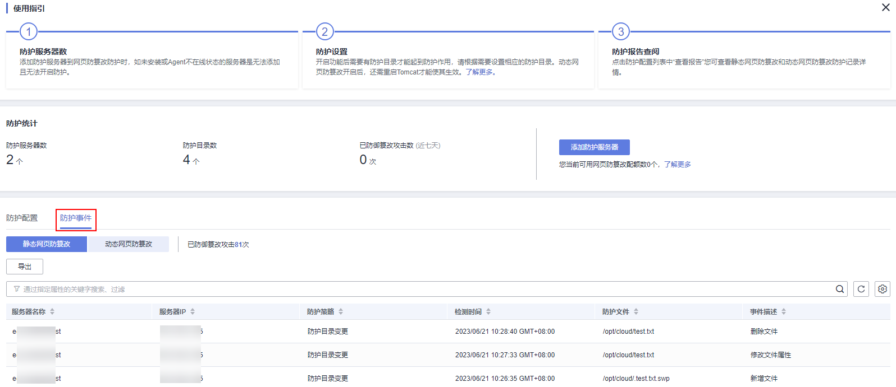

# 查看网页防篡改防护事件

开启静态网页防篡改防护后，主机安全服务将立即对您添加的防护目录执行全面的安全检测。您可以查看所有主机防护文件被非法篡改的记录。

## 约束限制

仅开启网页防篡改版防护后才支持防篡改相关操作。

## 前提条件

-   云服务器的“Agent状态“为“在线“且“防护状态“为“开启“。
-   已开启静态网页防篡改。

## 操作步骤

1.  [登录管理控制台](https://console.huaweicloud.com/?locale=zh-cn)。
2.  在页面左上角选择“区域“，单击，选择“安全与合规 \> 主机安全服务”，进入主机安全平台界面。

    **图 1**  进入主机安全  
    

3.  在“主动防御  \>  网页防篡改  \>  防护事件“页面，查看主机防护文件被篡改记录。

    **图 2**  防护事件  
    

