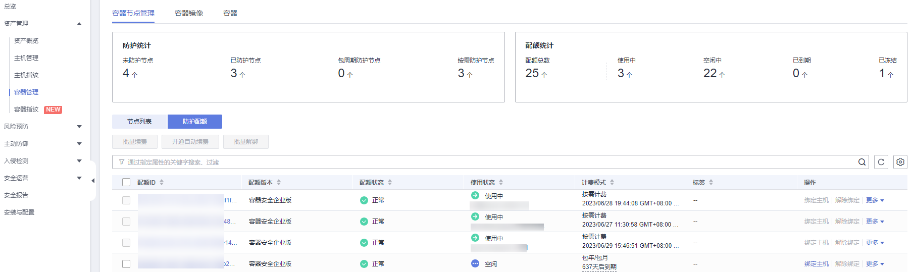

# 查看配额

您可以在防护配额页面查看配额的使用情况、配额的状态，及时为即将到期的配额进行续费，或对没有使用额配额执行退订操作。

配额列表仅显示在所选区域购买的配额，若未找到您的配额，请切换到正确的区域后再进行查找。

## 查看主机配额

1.  [登录管理控制台](https://console.huaweicloud.com/?locale=zh-cn)。
2.  在页面左上角选择“区域“，单击，选择“安全与合规 \> 主机安全服务”，进入主机安全平台界面。

    **图 1**  进入主机安全  
    

3.  在左侧选择“资产管理  \>  主机管理“页面，选择“防护配额“页签，进入防护配额列表页面，点击目标选项可进行筛选查看。

    > **说明：** 
    >如果您的服务器已通过企业项目的模式进行管理，您可选择目标“企业项目“后查看或操作目标企业项目内的资产和检测信息。

4.  在防护配额页面，查看主机安全防护配额，参数详情请参见[表1](#table12752433112311)。

    **表 1**  主机防护配额参数说明

    
    <table><thead align="left"><tr id="row575183352310"><th class="cellrowborder" valign="top" width="16.650000000000002%" id="mcps1.2.3.1.1">
参数名称

    </th>
    <th class="cellrowborder" valign="top" width="83.35000000000001%" id="mcps1.2.3.1.2">
参数说明

    </th>
    </tr>
    </thead>
    <tbody><tr id="row199069618495"><td class="cellrowborder" valign="top" width="16.650000000000002%" headers="mcps1.2.3.1.1 ">
配额ID

    </td>
    <td class="cellrowborder" valign="top" width="83.35000000000001%" headers="mcps1.2.3.1.2 ">
配额的唯一标识ID。

    </td>
    </tr>
    <tr id="row20751833192318"><td class="cellrowborder" valign="top" width="16.650000000000002%" headers="mcps1.2.3.1.1 ">
版本类型

    </td>
    <td class="cellrowborder" valign="top" width="83.35000000000001%" headers="mcps1.2.3.1.2 "><ul id="ul1233018253513"><li>基础版</li><li>专业版</li><li>企业版</li><li>旗舰版</li><li>网页防篡改版</li></ul>
    </td>
    </tr>
    <tr id="row10284104174916"><td class="cellrowborder" valign="top" width="16.650000000000002%" headers="mcps1.2.3.1.1 ">
使用状态

    </td>
    <td class="cellrowborder" valign="top" width="83.35000000000001%" headers="mcps1.2.3.1.2 "><ul id="ul975133319232"><li>使用中：该配额已被使用，下方显示“使用该配额的服务器名称”。</li><li>空闲：该配额未被使用。</li></ul>
    </td>
    </tr>
    <tr id="row285016106495"><td class="cellrowborder" valign="top" width="16.650000000000002%" headers="mcps1.2.3.1.1 ">
配额状态

    </td>
    <td class="cellrowborder" valign="top" width="83.35000000000001%" headers="mcps1.2.3.1.2 "><ul id="ul207511033152312"><li>正常：您购买的服务配额未到期，且能正常使用。</li><li>已过期：配额已到期，在此期间您仍然可以正常使用配额。</li><li>已冻结：冻结期间，HSS将不再防护您的主机；冻结期满，该配额将被彻底删除。</li></ul>
    </td>
    </tr>
    <tr id="row675143362320"><td class="cellrowborder" valign="top" width="16.650000000000002%" headers="mcps1.2.3.1.1 ">
计费模式

    </td>
    <td class="cellrowborder" valign="top" width="83.35000000000001%" headers="mcps1.2.3.1.2 "><ul id="ul1241014020399"><li>包年/包月</li><li>按需计费</li></ul>
    </td>
    </tr>
    <tr id="row10538730194417"><td class="cellrowborder" valign="top" width="16.650000000000002%" headers="mcps1.2.3.1.1 ">
企业项目名称

    </td>
    <td class="cellrowborder" valign="top" width="83.35000000000001%" headers="mcps1.2.3.1.2 ">
目标配额所属的企业项目名称。

    </td>
    </tr>
    <tr id="row175163352317"><td class="cellrowborder" valign="top" width="16.650000000000002%" headers="mcps1.2.3.1.1 ">
标签

    </td>
    <td class="cellrowborder" valign="top" width="83.35000000000001%" headers="mcps1.2.3.1.2 ">
资源分类标签。

    </td>
    </tr>
    </tbody>
    </table>

    > **说明：** 
    >-   绑定主机
    >    您也可以通过在“资产管理  \>  主机管理  \>  防护配额“页面的“操作”列中，单击“绑定主机“，为主机绑定防护配额，HSS自动为主机开启防护。
    >    一个配额只能绑定一个主机，且只能绑定agent在线的主机。
    >-   解除绑定
    >    您也可以在“资产管理  \>  主机管理  \>  防护配额“页面的“操作”列中，单击“解除绑定“，解除绑定后，HSS将自动关闭关联主机的防护，该配额的使用状态变更为“空闲“状态。
    >-   导出列表
    >    单击配额列表右上角的按钮。可将当前页列表的配额信息进行导出。

## 查看容器配额

1.  [登录管理控制台](https://console.huaweicloud.com/?locale=zh-cn)。
2.  在页面左上角选择“区域“，单击，选择“安全与合规 \> 主机安全服务”，进入主机安全平台界面。

    **图 2**  进入主机安全  
    

3.  在左侧导航栏中，选择“资产管理  \>  容器管理“，在“容器节点管理“界面，选择“防护配额“页签，进入防护配额列表页面。

    **图 3**  进入容器防护配额页面  
    

4.  在防护配额页面，查看容器安全防护配额，参数详情请参见[表2](#table64182113318)。

    **表 2**  容器配额参数说明

    
    <table><thead align="left"><tr id="row94181712319"><th class="cellrowborder" valign="top" width="16.63%" id="mcps1.2.3.1.1">
参数名称

    </th>
    <th class="cellrowborder" valign="top" width="83.37%" id="mcps1.2.3.1.2">
参数说明

    </th>
    </tr>
    </thead>
    <tbody><tr id="row64188112318"><td class="cellrowborder" valign="top" width="16.63%" headers="mcps1.2.3.1.1 ">
配额ID

    </td>
    <td class="cellrowborder" valign="top" width="83.37%" headers="mcps1.2.3.1.2 ">
配额的ID。

    </td>
    </tr>
    <tr id="row194897364591"><td class="cellrowborder" valign="top" width="16.63%" headers="mcps1.2.3.1.1 ">
配额版本

    </td>
    <td class="cellrowborder" valign="top" width="83.37%" headers="mcps1.2.3.1.2 ">
企业版。

    </td>
    </tr>
    <tr id="row2418121203119"><td class="cellrowborder" valign="top" width="16.63%" headers="mcps1.2.3.1.1 ">
配额状态

    </td>
    <td class="cellrowborder" valign="top" width="83.37%" headers="mcps1.2.3.1.2 "><ul id="ul12936152312318"><li>正常：配额状态。</li><li>已过期：配额已到期，在此期间您仍然可以正常使用配额。</li><li>已冻结：冻结期间，HSS将不再防护您的容器；冻结期满，该配额将被彻底删除。</li></ul>
    </td>
    </tr>
    <tr id="row184194123113"><td class="cellrowborder" valign="top" width="16.63%" headers="mcps1.2.3.1.1 ">
使用状态

    </td>
    <td class="cellrowborder" valign="top" width="83.37%" headers="mcps1.2.3.1.2 "><ul id="ul1412161203111"><li>使用中：该配额已被使用，下方显示“使用该配额的服务器名称”。</li><li>空闲：该配额未被使用。</li></ul>
    </td>
    </tr>
    <tr id="row2188944155910"><td class="cellrowborder" valign="top" width="16.63%" headers="mcps1.2.3.1.1 ">
计费模式

    </td>
    <td class="cellrowborder" valign="top" width="83.37%" headers="mcps1.2.3.1.2 "><ul id="ul1587594081518"><li>包年/包月</li><li>按需计费</li></ul>
    </td>
    </tr>
    <tr id="row16577632165912"><td class="cellrowborder" valign="top" width="16.63%" headers="mcps1.2.3.1.1 ">
标签

    </td>
    <td class="cellrowborder" valign="top" width="83.37%" headers="mcps1.2.3.1.2 ">
资源分类标签。

    </td>
    </tr>
    </tbody>
    </table>

    > **说明：** 
    >-   续费
    >    您可以在需要续费的资源所在行的“操作”列，单击“续费“，为购买的容器安全续费，详细操作请参见[如何续费](https://support.huaweicloud.com/hss2.0_faq/hss_01_0456.html)。
    >-   退订
    >    您可以在需要退订的资源所在行的“操作”列，单击“退订“，退订不需要使用的配额，详细操作请参见[如何退订](https://support.huaweicloud.com/hss2.0_faq/hss_01_0457.html)。

