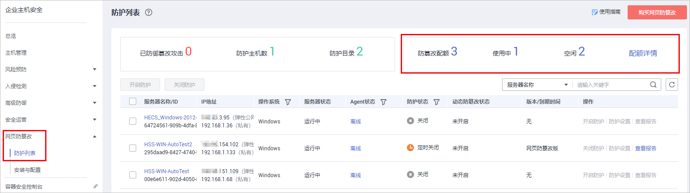
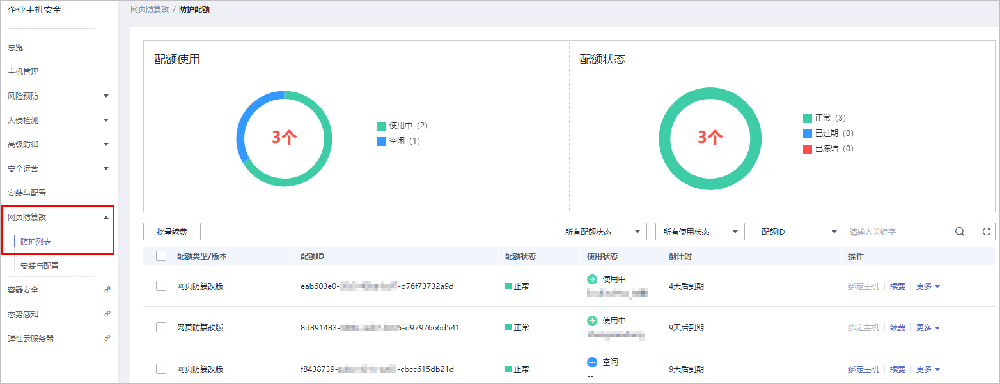

# 查看配额

您可以在防护配额页面查看配额的使用情况、配额的状态，及时为即将到期的配额进行续费，或对没有使用额配额执行退订操作。

配额列表仅显示在所选区域购买的配额，若未找到您的配额，请切换到正确的区域后再进行查找。

## 基础版/企业版/旗舰版配额

1.  [登录管理控制台](https://console.huaweicloud.com)。
2.  在页面左上角选择“区域“，单击，选择“安全  \>  企业主机安全“，进入企业主机安全页面。

    **图 1**  企业主机安全  
    

3.  在“主机管理“页面，选择“防护配额“页签，进入防护配额列表页面。

    **图 2**  查看主机安全防护配额  
    

4.  在防护配额页面，查看主机安全防护配额，以及使用该配额的服务器名称。

    **表 1**  参数说明

    
    <table><thead align="left"><tr id="row74177580549"><th class="cellrowborder" valign="top" width="16.650000000000002%" id="mcps1.2.3.1.1">
参数名称

    </th>
    <th class="cellrowborder" valign="top" width="83.35000000000001%" id="mcps1.2.3.1.2">
说明

    </th>
    </tr>
    </thead>
    <tbody><tr id="row7621158164411"><td class="cellrowborder" valign="top" width="16.650000000000002%" headers="mcps1.2.3.1.1 ">
配额类型/版本

    </td>
    <td class="cellrowborder" valign="top" width="83.35000000000001%" headers="mcps1.2.3.1.2 ">
配额的版本类型。

    </td>
    </tr>
    <tr id="row1067855817437"><td class="cellrowborder" valign="top" width="16.650000000000002%" headers="mcps1.2.3.1.1 ">
配额ID

    </td>
    <td class="cellrowborder" valign="top" width="83.35000000000001%" headers="mcps1.2.3.1.2 ">
配额的ID。

    </td>
    </tr>
    <tr id="row6435142195520"><td class="cellrowborder" valign="top" width="16.650000000000002%" headers="mcps1.2.3.1.1 ">
配额状态

    </td>
    <td class="cellrowborder" valign="top" width="83.35000000000001%" headers="mcps1.2.3.1.2 "><ul id="ul1440283835512"><li>正常：您购买的服务配额未到期，且能正常使用。</li><li>已过期：您购买的服务配额已到期，在此期间您仍然可以正常使用配额。</li><li>已冻结：冻结期间，HSS将不再防护您的主机；冻结期满，该配额将被彻底删除。</li></ul>
    </td>
    </tr>
    <tr id="row134171258105412"><td class="cellrowborder" valign="top" width="16.650000000000002%" headers="mcps1.2.3.1.1 ">
使用状态

    </td>
    <td class="cellrowborder" valign="top" width="83.35000000000001%" headers="mcps1.2.3.1.2 "><ul id="ul16997164045511"><li>使用中：该配额已被使用，下方显示“使用该配额的服务器名称”。</li><li>空闲：该配额未被使用。</li></ul>
    </td>
    </tr>
    </tbody>
    </table>

    > **说明：** 
    >-   绑定主机
    >    您也可以通过在“主机管理  \>  防护配额“页面的“操作“列中，单击“绑定主机“，为主机绑定防护配额，HSS自动为主机开启防护。
    >    一个配额只能绑定一个主机，且只能绑定agent在线的主机。
    >-   续费
    >    您可以在需要续费的资源所在行的操作列，单击“续费“，为购买的企业主机安全续费。详细操作请参见[如何续费](https://support.huaweicloud.com/hss_faq/hss_01_0171.html)。
    >-   退订
    >    您可以在需要退订的资源所在行的操作列，单击“退订“，退订不需要使用的配额。详细操作请参见[如何退订](https://support.huaweicloud.com/hss_faq/hss_01_0172.html)。
    >-   解绑配额
    >    您也可以在“主机管理  \>  防护配额“页面的“操作“列中，选择“更多  \>  解绑配额“，解绑配额后，HSS将自动关闭关联主机的防护，该配额的使用状态变更为“空闲“状态。

## 网页防篡改配额

1.  [登录管理控制台](https://console.huaweicloud.com)。
2.  在页面左上角选择“区域“，单击，选择“安全  \>  企业主机安全“，进入企业主机安全页面。

    **图 3**  企业主机安全  
    

3.  在左侧导航树中，选择“网页防篡改”，进入网页防篡改的防护列表界面。

    **图 4**  查看企业主机安全“网页防篡改版“防护配额  
    

4.  单击“配额详情“，进入网页防篡改防护配额详细信息页面。

    **图 5**  配额详情  
    

5.  在网页防篡改防护配额页面，查看防护配额详细信息。

    **表 2**  参数说明

    
    <table><thead align="left"><tr id="row138296153381"><th class="cellrowborder" valign="top" width="27.35%" id="mcps1.2.3.1.1">
参数名称

    </th>
    <th class="cellrowborder" valign="top" width="72.65%" id="mcps1.2.3.1.2">
说明

    </th>
    </tr>
    </thead>
    <tbody><tr id="row10829101503812"><td class="cellrowborder" valign="top" width="27.35%" headers="mcps1.2.3.1.1 ">
配额状态

    </td>
    <td class="cellrowborder" valign="top" width="72.65%" headers="mcps1.2.3.1.2 "><ul id="ul2829141510383"><li>正常：您购买的服务配额未到期，且能正常使用。</li><li>已过期：您购买的服务配额已到期，在此期间您仍然可以正常使用配额。</li><li>已冻结：冻结期间，HSS将不再防护您的主机；冻结期满，该配额将被彻底删除。</li></ul>
    </td>
    </tr>
    <tr id="row1982920152388"><td class="cellrowborder" valign="top" width="27.35%" headers="mcps1.2.3.1.1 ">
使用状态

    </td>
    <td class="cellrowborder" valign="top" width="72.65%" headers="mcps1.2.3.1.2 "><ul id="ul48299159389"><li>使用中：该配额已被使用，下方显示使用该配额的服务器名称。</li><li>空闲：该配额未被使用。</li></ul>
    </td>
    </tr>
    </tbody>
    </table>

    > **说明：** 
    >-   绑定主机
    >    您也可以通过在“网页防篡改  \>  防护列表  \>  配额详情“页面的“操作“列中，单击“绑定主机“，为主机绑定防护配额，HSS自动为主机开启防护。
    >    一个配额只能绑定一个主机，且只能绑定Agent在线的主机。
    >-   续费
    >    您可以在需要续费的网页防篡改配额所在行的操作列，单击“续费“，为购买的网页防篡改续费。详细操作请参见[如何续费](https://support.huaweicloud.com/hss_faq/hss_01_0171.html)。
    >-   退订
    >    您可以在需要退订的网页防篡改配额所在行的操作列，单击“退订“，退订购买的网页防篡改。详细操作请参见[如何退订](https://support.huaweicloud.com/hss_faq/hss_01_0172.html)。
    >-   解绑配额
    >    您也可以在“网页防篡改  \>  防护列表  \>  配额详情“页面的“操作“列中，选择“更多  \>  解绑配额“，解绑配额后，HSS将自动关闭关联主机的防护，该配额的使用状态变更为“空闲“状态。

