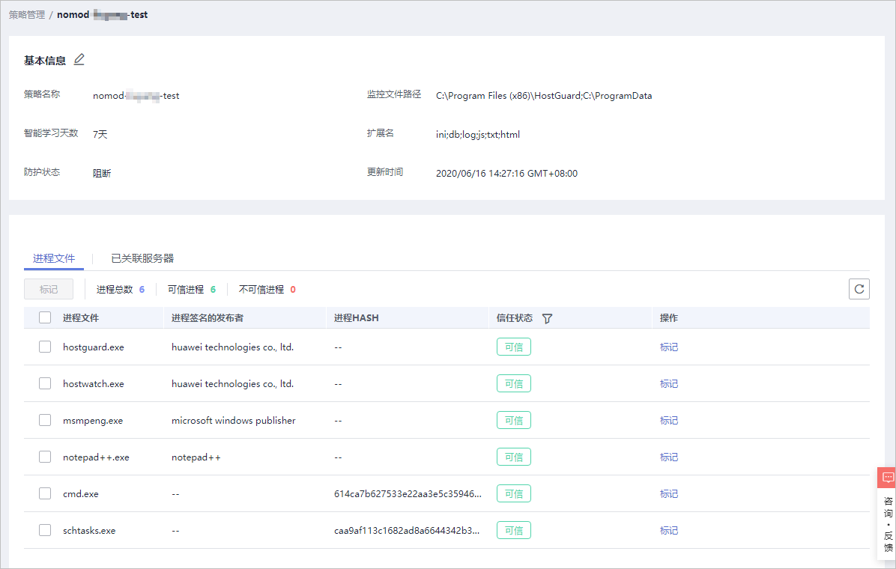
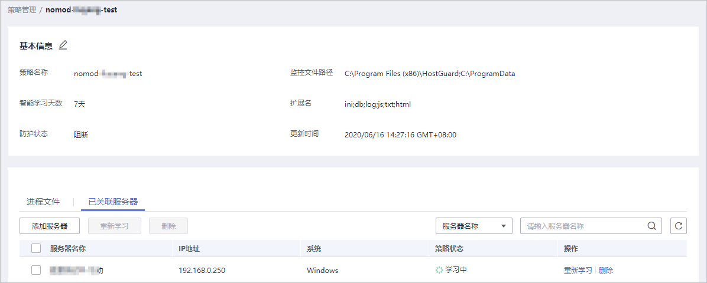

# 查看防护策略列表

企业主机安全支持勒索病毒防护功能，可有效监控您云主机上存储的重要文件，防止未经过认证或授权的进程文件对监控文件的加密或修改操作，保障您的主机不被勒索病毒侵害。

您可以通过创建勒索病毒防护策略，并为策略配置防护状态、监控的文件路径与关联服务器。策略通过机器学习引擎学习服务器上的进程修改文件的行为。策略学习完成后，自动应用于关联服务器。

策略通过对服务器运行状态的自动学习和管理端智能分析，完成可信程序的判定，在防护阶段对非可信程序的操作进行告警或阻断。

仅旗舰版支持勒索病毒防护功能。

## 前提条件

-   仅支持防护Windows操作系统。
-   “服务器状态“为“运行中“，已安装HSS的Agent，且“Agent状态“为“在线“。

## 查看策略管理列表

1.  [登录管理控制台](https://console.huaweicloud.com)。
2.  在页面左上角选择“区域“，单击，选择“安全  \>  企业主机安全“，进入企业主机安全页面。

    **图 1**  企业主机安全  
    

3.  进入“勒索病毒防护“页面，单击“策略管理“，进入勒索病毒防护策略管理列表页面，如[图2](#fig73801835154711)所示。

    **图 2**  策略管理列表  
    

    **表 1**  防护策略列表说明

    
    <table><thead align="left"><tr id="row1966093215283"><th class="cellrowborder" valign="top" width="26.740000000000002%" id="mcps1.2.3.1.1">
参数

    </th>
    <th class="cellrowborder" valign="top" width="73.26%" id="mcps1.2.3.1.2">
参数说明

    </th>
    </tr>
    </thead>
    <tbody><tr id="row176608322287"><td class="cellrowborder" valign="top" width="26.740000000000002%" headers="mcps1.2.3.1.1 ">
策略名称

    </td>
    <td class="cellrowborder" valign="top" width="73.26%" headers="mcps1.2.3.1.2 ">
创建的防护策略的策略名称。

    </td>
    </tr>
    <tr id="row19660153252817"><td class="cellrowborder" valign="top" width="26.740000000000002%" headers="mcps1.2.3.1.1 ">
已生效服务器

    </td>
    <td class="cellrowborder" valign="top" width="73.26%" headers="mcps1.2.3.1.2 ">
应用防护策略生效的服务器数量。

    </td>
    </tr>
    <tr id="row156601532132810"><td class="cellrowborder" valign="top" width="26.740000000000002%" headers="mcps1.2.3.1.1 ">
学习中服务器

    </td>
    <td class="cellrowborder" valign="top" width="73.26%" headers="mcps1.2.3.1.2 ">
智能学习进行中，自动对关联服务器执行智能学习。新创建的策略状态都为“学习中”。

    </td>
    </tr>
    <tr id="row4660432132818"><td class="cellrowborder" valign="top" width="26.740000000000002%" headers="mcps1.2.3.1.1 ">
可信进程数

    </td>
    <td class="cellrowborder" valign="top" width="73.26%" headers="mcps1.2.3.1.2 ">
HSS自动识别关联服务器中的可信进程的数量。

    </td>
    </tr>
    <tr id="row66601232102814"><td class="cellrowborder" valign="top" width="26.740000000000002%" headers="mcps1.2.3.1.1 ">
监控文件路径

    </td>
    <td class="cellrowborder" valign="top" width="73.26%" headers="mcps1.2.3.1.2 ">
监控的文件的路径，多个文件以分号分隔。监控填写的路径下的文件操作。

    
如果不填写监控文件路径，HSS会监控主机上所有的文件路径。

    </td>
    </tr>
    <tr id="row1366093214287"><td class="cellrowborder" valign="top" width="26.740000000000002%" headers="mcps1.2.3.1.1 ">
扩展名

    </td>
    <td class="cellrowborder" valign="top" width="73.26%" headers="mcps1.2.3.1.2 ">
检测监控路径下包含文件扩展名的所有文件。

    </td>
    </tr>
    <tr id="row1660732192819"><td class="cellrowborder" valign="top" width="26.740000000000002%" headers="mcps1.2.3.1.1 ">
防护状态

    </td>
    <td class="cellrowborder" valign="top" width="73.26%" headers="mcps1.2.3.1.2 ">
检测到进程文件对监控路径文件扩展名的文件的不可信操作，触发进行告警。

    </td>
    </tr>
    </tbody>
    </table>

4.  单击策略名称，进入策略详细信息页面，您可以查看策略的“基本信息“和“进程文件“信息，如[图3](#fig20405102425217)所示。
    -   您可以查看策略的名称、智能学习天数、防护状态、监控文件路径、扩展名和更新时间。
    -   您也可以查看进程文件的“进程总数“、“可信进程“和“不可信进程“，以及“进程文件“、“进程签名的发布者“、“进程HASH“和“信任状态“。
    -   您也可以根据进程文件的实际情况为进程文件标记“可信“和“不可信“状态。标记为不可信状态的进程启动时，根据策略防护状态，进行告警。

        **图 3**  防护策略详情  
        

5.  单击“已关联服务器“，查看关联服务器，如[图4](#fig192011163412)所示。

    **图 4**  查看关联服务器  
    

    **表 2**  已关联服务器列表

    
    <table><thead align="left"><tr id="row185381516172910"><th class="cellrowborder" valign="top" width="17.43%" id="mcps1.2.3.1.1">
参数

    </th>
    <th class="cellrowborder" valign="top" width="82.57%" id="mcps1.2.3.1.2">
参数说明

    </th>
    </tr>
    </thead>
    <tbody><tr id="row12538121622912"><td class="cellrowborder" valign="top" width="17.43%" headers="mcps1.2.3.1.1 ">
服务器名称

    </td>
    <td class="cellrowborder" valign="top" width="82.57%" headers="mcps1.2.3.1.2 ">
服务器的名称。

    </td>
    </tr>
    <tr id="row195385165296"><td class="cellrowborder" valign="top" width="17.43%" headers="mcps1.2.3.1.1 ">
IP地址

    </td>
    <td class="cellrowborder" valign="top" width="82.57%" headers="mcps1.2.3.1.2 ">
服务器的IP地址。

    </td>
    </tr>
    <tr id="row1853811682912"><td class="cellrowborder" valign="top" width="17.43%" headers="mcps1.2.3.1.1 ">
系统

    </td>
    <td class="cellrowborder" valign="top" width="82.57%" headers="mcps1.2.3.1.2 ">
服务器的操作系统，仅支持防护Windows操作系统。

    </td>
    </tr>
    <tr id="row353891610291"><td class="cellrowborder" valign="top" width="17.43%" headers="mcps1.2.3.1.1 ">
策略状态

    </td>
    <td class="cellrowborder" valign="top" width="82.57%" headers="mcps1.2.3.1.2 ">
策略的生效状态。包含以下状态：

    <ul id="ul6719112413298"><li>学习中
智能学习进行中。

    
策略创建完成后，自动对关联服务器执行智能学习。新创建的策略状态都为“学习中”。

    </li><li>学习完成，策略已生效
该策略已完成智能学习，并且已应用到关联服务器中。

    </li></ul>
    </td>
    </tr>
    <tr id="row10538171672911"><td class="cellrowborder" valign="top" width="17.43%" headers="mcps1.2.3.1.1 ">
操作

    </td>
    <td class="cellrowborder" valign="top" width="82.57%" headers="mcps1.2.3.1.2 ">
可对该策略执行的操作。支持以下操作：

    <ul id="ul147191724182913"><li>重新学习<ul id="ul1871913243293"><li>若软件出现重大改版，需要对关联服务器进行重新学习。
请单击“重新学习”，重新对关联服务器进行智能学习。

    </li><li>若设置的智能学习天数不够，不能完成机器的智能学习，或者策略学习的时间已超过设置的“智能学习天数”，仍然处于“学习中”状态。
请根据业务场景重新设置“智能学习天数”后，单击“重新学习”，重新对关联服务器进行智能学习。

    </li><li>若学习过程中，服务器处于“关机”或者“故障”状态、Agent处于“离线”状态、或者服务器关闭旗舰版防护，学习将会已中断，但策略仍然处于“学习中”，单击“重新学习”，无法对Agent下发任务。
请检查并恢复以上场景，满足服务器“运行中”、Agent“在线”和开启旗舰版防护后，单击“重新学习”，重新对关联服务器进行学习。

    </li></ul>
    </li><li>删除
删除关联服务器，关联服务器删除后，关联服务器的文件将不再受到该策略的保护。

    </li></ul>
    </td>
    </tr>
    </tbody>
    </table>

