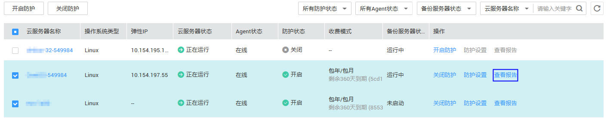
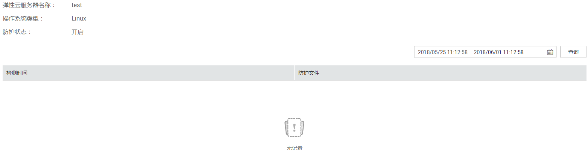

# 查看防护记录

该章节指导用户通过企业主机安全服务查看防护记录。

## 前提条件

-   已获取管理控制台的登录账号与密码。
-   弹性云服务器的“Agent状态“为“在线“且“防护状态“为“关闭“。

## 操作步骤

1.  登录管理控制台。
2.  在页面上方，单击“服务列表“，选择“安全  \>  企业主机安全“。
3.  在左侧导航树中，选择“网页防篡改“，进入网页防篡改界面。
4.  在“网页防篡改“界面，选择“主机列表“页签，进入云服务列表页面。
5.  在需要查看防护记录的弹性云服务器所在行的“操作“列，单击“查看报告“。

    **图 1**  查看防护记录  
    

6.  在防护记录界面，查看防护记录详情，如[图2](#fig5723623511130)所示，各参数说明如[表1](#table5061128511130)所示。

    > **说明：**   
    >用户可单击选择防护记录起止时间后，单击“查询“，查看目标时间段内的防护记录。  

    **图 2**  防护记录  
    

    **表 1**  防护目录参数说明

    
    <table><thead align="left"><tr id="row1476584211130"><th class="cellrowborder" valign="top" width="23.49%" id="mcps1.2.3.1.1">
参数名称

    </th>
    <th class="cellrowborder" valign="top" width="76.51%" id="mcps1.2.3.1.2">
说明

    </th>
    </tr>
    </thead>
    <tbody><tr id="row66894511130"><td class="cellrowborder" valign="top" width="23.49%" headers="mcps1.2.3.1.1 ">
检测时间

    </td>
    <td class="cellrowborder" valign="top" width="76.51%" headers="mcps1.2.3.1.2 ">
检测到文件正被篡改的时间。

    </td>
    </tr>
    <tr id="row4054722211130"><td class="cellrowborder" valign="top" width="23.49%" headers="mcps1.2.3.1.1 ">
防护文件

    </td>
    <td class="cellrowborder" valign="top" width="76.51%" headers="mcps1.2.3.1.2 ">
被防护文件的名称。

    </td>
    </tr>
    </tbody>
    </table>

