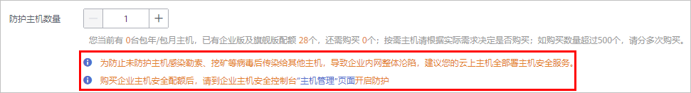

# 步骤一：购买防护配额

通过本节介绍，您将了解如何购买防护配额。

## 购买说明

-   配额只能在购买时所选择的区域使用。
-   企业版需要全部主机部署，不支持只为部分主机开通企业版功能。

    为了保证云上主机的安全性，您需要为您账号下的所有主机同时开通企业版功能，**即企业版的配额数量需等于您所拥有的ECS/BMS数量**。

## 购买场景

**表 1**  配额购买场景

<table><thead align="left"><tr id="row9255112210189"><th class="cellrowborder" valign="top" width="24.29%" id="mcps1.2.4.1.1">
主机类型

</th>
<th class="cellrowborder" valign="top" width="19.13%" id="mcps1.2.4.1.2">
主机所在区域

</th>
<th class="cellrowborder" valign="top" width="56.58%" id="mcps1.2.4.1.3">
如何购买配额

</th>
</tr>
</thead>
<tbody><tr id="row16255122141813"><td class="cellrowborder" rowspan="2" valign="top" width="24.29%" headers="mcps1.2.4.1.1 ">
华为云弹性云服务器ECS

华为云裸金属服务器BMS

</td>
<td class="cellrowborder" valign="top" width="19.13%" headers="mcps1.2.4.1.2 ">
在HSS支持的区域（支持的区域请参见：<a href="https://support.huaweicloud.com/hss_faq/hss_01_0158.html" target="_blank" rel="noopener noreferrer">哪些区域提供HSS服务？</a>）

</td>
<td class="cellrowborder" valign="top" width="56.58%" headers="mcps1.2.4.1.3 ">
请在ECS/BMS所在区域购买HSS配额。

</td>
</tr>
<tr id="row1898984131818"><td class="cellrowborder" valign="top" headers="mcps1.2.4.1.1 ">
不在HSS支持的区域

</td>
<td class="cellrowborder" valign="top" headers="mcps1.2.4.1.2 ">
请在“华北-北京一”、“华东-上海二”、“华南-广州”、“华北-北京四”这四个区域购买HSS配额，然后使用非华为云主机的安装方式，将主机接入配额所在区域。

</td>
</tr>
<tr id="row1325512225189"><td class="cellrowborder" valign="top" width="24.29%" headers="mcps1.2.4.1.1 ">
第三方云主机

</td>
<td class="cellrowborder" valign="top" width="19.13%" headers="mcps1.2.4.1.2 ">
-

</td>
<td class="cellrowborder" rowspan="2" valign="top" width="56.58%" headers="mcps1.2.4.1.3 ">
请在“华北-北京一”、“华东-上海二”、“华南-广州”、“华北-北京四”这四个区域购买HSS配额，然后使用非华为云主机的安装方式，将主机接入配额所在区域。

</td>
</tr>
<tr id="row12561122161813"><td class="cellrowborder" valign="top" headers="mcps1.2.4.1.1 ">
线下主机

</td>
<td class="cellrowborder" valign="top" headers="mcps1.2.4.1.2 ">
-

</td>
</tr>
</tbody>
</table>

## 前提条件

已获取管理控制台的登录账号（拥有HSS Administrator与BSS Administrator权限）与密码。

## 操作步骤

1.  [登录管理控制台](https://console.huaweicloud.com)。
2.  在页面上方选择区域后，单击，选择“安全  \>  企业主机安全“。

    **图 1**  企业主机安全  
    

3.  在界面右上角，单击“购买主机安全“，进入“购买主机安全配额“界面。
4.  在“购买主机安全配额“界面，设置配额的规格。
    1.  选择区域。
        -   配额的“区域“建议与主机的“区域“相同，若不相同，请将主机通过“非华为云主机“的配置方式接入配额所在区域。
        -   仅在“华北-北京一“、“华东-上海二“、“华南-广州“、“华北-北京四“可接入非华为云的主机，请在以上区域内购买防护配额，并使用以上区域内的安装包或安装命令为非华为云主机安装客户端。

    2.  选择版本。

        支持“基础版“、“企业版“和“网页防篡改版“。版本之间的差异请参见[服务版本](https://support.huaweicloud.com/productdesc-hss/hss_01_0136.html)。

        -   若您购买的是基础版/企业版配额，请在“企业主机安全  \>  防护列表“页面开启防护，详细操作请参见[基础版/企业版](https://support.huaweicloud.com/usermanual-hss/hss_01_0230.html)。
        -   若您购买的网页防篡改版配额，请在“网页防篡改  \>  防护列表“页面开启防护，详细操作请参见[网页防篡改版](https://support.huaweicloud.com/usermanual-hss/hss_01_0214.html)。

    3.  选择购买时长。

        为避免因服务到期未及时续费导致您的主机遭受攻击，建议勾选“自动续费“。

        勾选“自动续费“后，当购买的企业主机安全到期时，如果账号余额充足，系统将自动为购买的企业主机安全续费，续费周期与购买时长保持一致。

        若未勾选自动“自动续费“，在即将到期时，请[手动续费](https://support.huaweicloud.com/hss_faq/hss_01_0171.html)。

    4.  设置防护主机数量。

        购买成功后不支持增加配额，如需增加配额，请重新购买。

        -   基础版

            无数量限制

        -   企业版

            **图 2**  企业版  
            

            > **须知：**   
            >为防止未防护主机感染勒索、挖矿等病毒后传染给其他主机，导致企业内网整体沦陷，**您的云上主机应该全部署主机安全服务**。若您希望只防护部分主机并承担因此带来的整网风险，可以联系您的服务经理或销售人员进行配置。  

        -   网页防篡改版

            无数量限制

5.  在页面右下角，单击“立即购买“，进入“订单确认“界面。

    费率标准请参见[产品价格详情](https://www.huaweicloud.com/price_detail.html#/hss_detail)。

6.  确认订单无误后，请阅读《企业主机安全免责声明》并勾选“我已阅读并同意《企业主机安全免责声明》“。
7.  单击“去支付“，进入“付款“页面，付款后，完成购买防护配额的操作。

## 相关操作

**退订**

当您购买的配额版本或区域有误时，您可以退订已购买配额，再重新购买正确的配额。详细操作请参见[如何退订](https://support.huaweicloud.com/hss_faq/hss_01_0172.html)。

