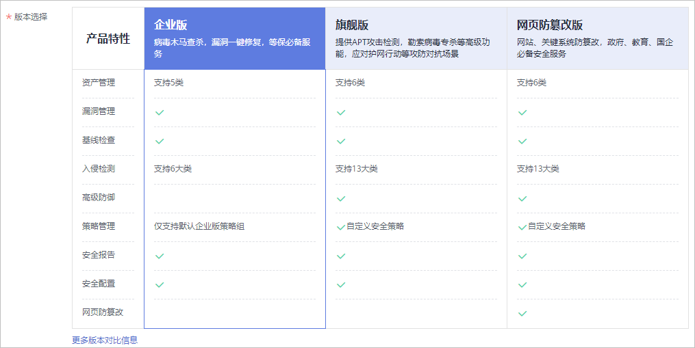
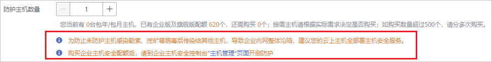

# 步骤一：购买防护配额

通过本节介绍，您将了解如何购买防护配额。购买网页防篡改赠送旗舰版，包含旗舰版所有功能。

## 版本推荐说明

HSS提供基础版、企业版、旗舰版和网页防篡改版四种服务版本，各版本适用场景如[表1](#table42551329143914)所示，详细的服务版本功能差异，请参见[服务版本差异](https://support.huaweicloud.com/productdesc-hss/hss_01_0136.html)。

> **须知：** 
>为防止未防护主机感染勒索、挖矿等病毒后传染给其他主机，导致企业内网整体沦陷，**建议您的云上主机全部署主机安全服务**。

**表 1**  版本推荐说明

<table><thead align="left"><tr id="row425532963918"><th class="cellrowborder" valign="top" width="12.1012101210121%" id="mcps1.2.4.1.1">
版本

</th>
<th class="cellrowborder" valign="top" width="19.14191419141914%" id="mcps1.2.4.1.2">
计费模式

</th>
<th class="cellrowborder" valign="top" width="68.75687568756875%" id="mcps1.2.4.1.3">
推荐场景

</th>
</tr>
</thead>
<tbody><tr id="row192564295394"><td class="cellrowborder" valign="top" width="12.1012101210121%" headers="mcps1.2.4.1.1 ">
基础版

</td>
<td class="cellrowborder" valign="top" width="19.14191419141914%" headers="mcps1.2.4.1.2 "><ul id="ul1015224912402"><li>按需计费（免费）</li><li>包年/包月</li></ul>
</td>
<td class="cellrowborder" valign="top" width="68.75687568756875%" headers="mcps1.2.4.1.3 ">
用于测试、个人用户防护主机账户安全。

HSS暂不支持购买“基础版”，购买ECS/HECS后，即可<strong id="b106215151429">免费体验</strong>基础版（按需）。如何开启基础版（按需）防护，请参见<a href="https://support.huaweicloud.com/hss_faq/hss_01_0170.html" target="_blank" rel="noopener noreferrer">开启HSS基础版（免费）防护</a>。

基础版仅提供<strong id="b11621151554211">基线检查</strong>和<strong id="b2621171510428">入侵检测</strong>的部分功能，呈现一定云上资产安全风险总览。

</td>
</tr>
<tr id="row112561629183910"><td class="cellrowborder" valign="top" width="12.1012101210121%" headers="mcps1.2.4.1.1 ">
企业版

</td>
<td class="cellrowborder" valign="top" width="19.14191419141914%" headers="mcps1.2.4.1.2 "><ul id="ul937617911419"><li>按需计费</li><li>包年/包月</li></ul>
</td>
<td class="cellrowborder" valign="top" width="68.75687568756875%" headers="mcps1.2.4.1.3 ">
需要满足<strong id="b128175361443">等保合规</strong>基本要求（例如：病毒木马查杀、漏洞一键修复、入侵检测）的主机。

</td>
</tr>
<tr id="row13431423134016"><td class="cellrowborder" valign="top" width="12.1012101210121%" headers="mcps1.2.4.1.1 ">
旗舰版

</td>
<td class="cellrowborder" valign="top" width="19.14191419141914%" headers="mcps1.2.4.1.2 ">
包年/包月

</td>
<td class="cellrowborder" valign="top" width="68.75687568756875%" headers="mcps1.2.4.1.3 ">
对主机有高安全要求的用户（例如：应对护网行动、业务重要），<strong id="b111115734511">推荐使用旗舰版或者网页防篡改版</strong>。

若预算有限，您可以将“旗舰版”或者“网页防篡改版”部署在关键或者高风险主机上，例如：对外暴露EIP的主机、保存关键资产的应用主机、以及数据库主机等。

</td>
</tr>
<tr id="row825632993914"><td class="cellrowborder" valign="top" width="12.1012101210121%" headers="mcps1.2.4.1.1 ">
网页防篡改版

</td>
<td class="cellrowborder" valign="top" width="19.14191419141914%" headers="mcps1.2.4.1.2 ">
包年/包月

</td>
<td class="cellrowborder" valign="top" width="68.75687568756875%" headers="mcps1.2.4.1.3 ">
有网站或者关键系统防篡改需求，以及有应用安全防护需求的主机，主要部署在网站或者应用的主机上，<strong id="b1011657154510">推荐使用网页防篡改版</strong>。

购买网页防篡改，即赠送旗舰版。

</td>
</tr>
</tbody>
</table>

## 约束与限制

-   一个配额只能绑定一个主机，且只能绑定Agent在线的主机。
-   **华为云主机：**HSS**不支持**跨区域使用，主机与HSS配额**不在同一区域**时，请退订配额，重新购买主机所在区域的配额。支持的区域请参见：[哪些区域提供HSS服务？](https://support.huaweicloud.com/hss_faq/hss_01_0158.html)
-   **非华为云主机：**请在“华北-北京一“、“华东-上海二“、“华南-广州“、“华北-北京四“这四个区域购买HSS配额，然后使用非华为云主机的安装方式，将主机接入配额所在区域。

## 前提条件

已获取管理控制台的登录帐号（拥有HSS Administrator与BSS Administrator权限）与密码。

## 购买防护配额（华为云主机）

1.  [登录管理控制台](https://console.huaweicloud.com)。
2.  在页面左上角选择“区域“，单击，选择“安全与合规  \>  企业主机安全“，进入企业主机安全页面。

    **图 1**  企业主机安全  
    

3.  在界面右上角，单击“购买主机安全“，进入“购买主机安全配额“界面。
4.  在“购买主机安全配额“界面，设置配额的规格。
    1.  选择计费类型，选择“包年/包月“。

        支持“包年/包月“和“按需“。

        > **说明：** 
        >-   选择“按需“时，不需要购买企业主机安全防护配额，直接在当前页面右下角单击“立即开通“，可跳转到云服务器列表页面。
        >-   在云服务器列表的“操作列“中，单击“开启防护“，“计费模式“选择“按需计费“，“主机安全版本“选择“基础版“或者“企业版“，可开启“基础版“或者“企业版“防护。

    2.  选择区域。

        HSS不支持跨区域使用，如果您购买了与主机不在同一区域的配额，请退订配额后重新购买主机所在区域的配额。

    3.  选择版本。

        支持“企业版“、“旗舰版“和“网页防篡改版“。版本之间的差异请参见[服务版本差异](https://support.huaweicloud.com/productdesc-hss/hss_01_0136.html)。

        -   若您购买的是企业版/旗舰版配额，请在“企业主机安全  \>  主机管理  \>  云服务器“页面开启防护，详细操作请参见[基础版/企业版/旗舰版](https://support.huaweicloud.com/usermanual-hss/hss_01_0230.html)。
        -   若您购买的网页防篡改版配额，请在“网页防篡改  \>  防护列表“页面开启防护，详细操作请参见[网页防篡改版](https://support.huaweicloud.com/usermanual-hss/hss_01_0214.html)。

            **图 2**  版本选择  
            

    4.  选择企业项目。

        从下拉列表中选择所在的企业项目。

        企业项目针对企业用户使用，只有开通了企业项目的客户，或者权限为企业主帐号的客户才可见。如需使用该功能，请联系您的客户经理申请开通。企业项目是一种云资源管理方式，企业项目管理服务提供统一的云资源按项目管理，以及项目内的资源管理、成员管理。

        > **说明：** 
        >-   “default“为默认企业项目，帐号下原有资源和未选择企业项目的资源均在默认企业项目内。
        >-   只有注册的华为云帐号购买HSS时，“企业项目“下拉列表中才可以选择到“default“。

    5.  选择购买时长。

        为避免因服务到期未及时续费导致您的主机遭受攻击，建议勾选“自动续费“。

        勾选“自动续费“后，当购买的企业主机安全到期时，如果账号余额充足，系统将自动为购买的企业主机安全续费，续费周期与购买时长保持一致。

        若未勾选自动“自动续费“，在即将到期时，请[手动续费](https://support.huaweicloud.com/hss_faq/hss_01_0171.html)。

    6.  设置防护主机数量。

        购买成功后**不支持**增加配额，如需增加配额，请重新购买。无数量限制。

        **图 3**  防护主机数量（企业版）  
        

        > **说明：** 
        >如果您已开通企业项目，您只需要为您所在的企业项目的主机购买防护配额。

5.  在页面右下角，单击“立即购买“，进入“订单确认“界面。

    费率标准请参见[产品价格详情](https://www.huaweicloud.com/price_detail.html#/hss_detail)。

6.  确认订单无误后，请阅读《企业主机安全免责声明》并勾选“我已阅读并同意《企业主机安全免责声明》“。
7.  单击“去支付“，进入“付款“页面，付款后，完成购买防护配额的操作。

## 购买防护配额（非华为云主机）

HSS仅支持“华北-北京一“、“华东-上海二“、“华南-广州“、“华北-北京四“这四个区域使用非华为云主机的安装方式，将主机接入配额所在区域，防护主机安全。

1.  [登录管理控制台](https://console.huaweicloud.com)。
2.  在页面左上角选择“区域“，单击，选择“安全与合规  \>  企业主机安全“，进入企业主机安全页面。

    **图 4**  企业主机安全  
    

3.  在界面右上角，单击“购买主机安全“，进入“购买主机安全配额“界面。
4.  在“购买主机安全配额“界面，设置配额的规格。
    1.  选择计费类型，选择“包年/包月“。

        支持“包年/包月“和“按需“。

        > **说明：** 
        >-   选择“按需“时，不需要购买企业主机安全防护配额，直接在当前页面右下角单击“立即开通“，可跳转到云服务器列表页面。
        >-   在云服务器列表的“操作列“中，单击“开启防护“，“计费模式“选择“按需计费“，“主机安全版本“选择“基础版“或者“企业版“，可开启“基础版“或者“企业版“防护。

    2.  选择区域。

        当前仅“华北-北京一“、“华东-上海二“、“华南-广州“、“华北-北京四“可接入**非华为云**的主机，请在以上区域内购买防护配额，并使用以上区域内的安装包或安装命令为非华为云主机安装Agent。

    3.  选择版本。

        支持“企业版“、“旗舰版“和“网页防篡改版“。版本之间的差异请参见[服务版本差异](https://support.huaweicloud.com/productdesc-hss/hss_01_0136.html)。

        -   若您购买的是企业版/旗舰版配额，请在“企业主机安全  \>  主机管理  \>  云服务器“页面开启防护，详细操作请参见[基础版/企业版/旗舰版](https://support.huaweicloud.com/usermanual-hss/hss_01_0230.html)。
        -   若您购买的网页防篡改版配额，请在“网页防篡改  \>  防护列表“页面开启防护，详细操作请参见[网页防篡改版](https://support.huaweicloud.com/usermanual-hss/hss_01_0214.html)。

            **图 5**  版本选择  
            

    4.  选择企业项目。

        从下拉列表中选择所在的企业项目。

        企业项目针对企业用户使用，只有开通了企业项目的客户，或者权限为企业主帐号的客户才可见。如需使用该功能，请联系您的客户经理申请开通。企业项目是一种云资源管理方式，企业项目管理服务提供统一的云资源按项目管理，以及项目内的资源管理、成员管理。

        > **说明：** 
        >-   “default“为默认企业项目，帐号下原有资源和未选择企业项目的资源均在默认企业项目内。
        >-   只有注册的华为云帐号购买HSS时，“企业项目“下拉列表中才可以选择到“default“。

    5.  选择购买时长。

        为避免因服务到期未及时续费导致您的主机遭受攻击，建议勾选“自动续费“。

        勾选“自动续费“后，当购买的企业主机安全到期时，如果账号余额充足，系统将自动为购买的企业主机安全续费，续费周期与购买时长保持一致。

        若未勾选自动“自动续费“，在即将到期时，请[手动续费](https://support.huaweicloud.com/hss_faq/hss_01_0171.html)。

    6.  设置防护主机数量。

        购买成功后**不支持**增加配额，如需增加配额，请重新购买。无数量限制。

        **图 6**  防护主机数量（企业版）  
        

        > **说明：** 
        >如果您已开通企业项目，您只需要为您所在的企业项目的主机购买防护配额。

5.  在页面右下角，单击“立即购买“，进入“订单确认“界面。

    费率标准请参见[产品价格详情](https://www.huaweicloud.com/price_detail.html#/hss_detail)。

6.  确认订单无误后，请阅读《企业主机安全免责声明》并勾选“我已阅读并同意《企业主机安全免责声明》“。

## 生效条件

付款成功后，您可以在HSS管理控制台的“主机管理  \>  防护配额“页面查看当前购买的HSS版本、配额状态、配额使用状态以及配额绑定的主机。

## 相关操作

**退订**

当您购买的配额版本或区域有误时，您可以退订已购买配额，再重新购买正确的配额。详细操作请参见[如何退订](https://support.huaweicloud.com/hss_faq/hss_01_0172.html)。

**切换主机安全版本**

当开启防护的主机版本不满足您当前的防护需求时，您可以重新购买防护配额，切换主机版本。详细操作请参见[（可选）步骤五：切换主机安全版本](（可选）步骤五-切换主机安全版本.md)。

