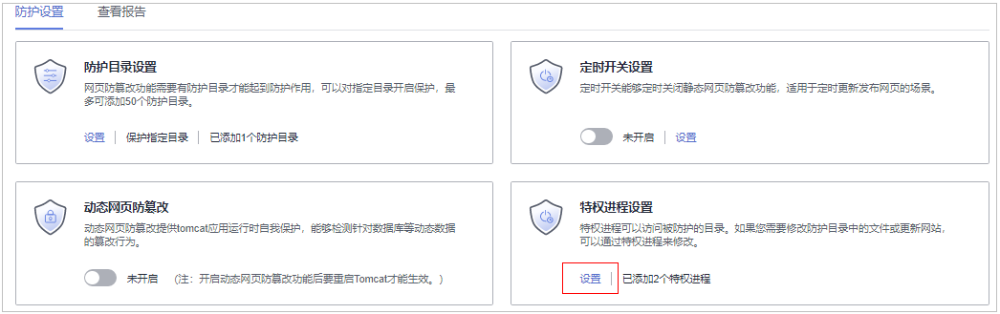

# 添加特权进程

开启网页防篡改防护后，防护目录中的内容是只读状态，如果您需要修改防护目录中的文件或更新网站，可以添加特权进程。

通过这个特权进程去修改防护目录里的文件或者更新网站，修改才会生效。若没有添加特权进程 ，网页防篡改仅防护原来的文件或者网站，即使修改了内容，文件或者网站也会恢复到原来的状态，修改不会生效。

特权进程可以访问被防护的目录，请确保特权进程安全可靠。

## 约束限制

-   仅开启网页防篡改版防护后才支持防篡改相关操作。
-   仅X86架构且系统内核为4.18版本的操作系统支持该功能。
-   Agent需要升级至3.2.4及以上版本特权进程才能生效。
-   每台服务器最多可添加10个特权进程。

## 前提条件

在“主动防御  \>  网页防篡改  \>  防护配置“页面中“防护状态“为“防护中“。

## 添加特权进程

1.  [登录管理控制台](https://console.huaweicloud.com/?locale=zh-cn)。
2.  在页面左上角选择“区域“，单击，选择“安全与合规 \> 主机安全服务”，进入主机安全平台界面。

    **图 1**  进入主机安全  
    

3.  在“主动防御  \>  网页防篡改  \>  防护配置“页面，单击目标服务器“操作“列的“防护设置“，进入“防护设置“页面。

    > **说明：** 
    >如果您的服务器已通过企业项目的模式进行管理，您可选择目标“企业项目“后查看或操作目标企业项目内的资产和检测信息。

    **图 2**  进入防护配置  
    

4.  单击“特权进程设置“下的“设置“，进入特权进程“设置“页面。

    **图 3**  选择特权进程设置  
    

5.  在“特权进程设置“页面，单击“添加特权进程“。

    **图 4**  添加特权进程  
    

6.  在弹出的“添加特权进程“对话框中，添加特权进程文件所在的路径。

    特权进程文件所在的路径需包含进程的名称和格式，如“C:/Path/Software.type“，若进程无格式，请确保进程名称的唯一性。

7.  特权进程添加完成后，单击“确定“，完成添加特权进程的操作。
8.  开启“子进程可信“开关，可开启对已添加特权文件路径下子进程的可信。

    > **说明：** 
    >开启后将对添加的所有特权进程文件下5个层级内的子进程可信。

## 相关操作

**修改或删除已添加的特权进程**

在特权进程列表右侧的“操作”列中，您可以根据需要修改已添加的特权进程，为方便管理，您也可以删除已无需使用的特权进程。

> **说明：** 
>-   执行编辑或删除操作后，特权进程将不能修改防护目录下的文件，为不影响业务应用的正常运行，请您谨慎处理。
>-   无用的进程可能会因为进程自身的漏洞被攻击者利用，请及时删除无需使用的特权进程。

