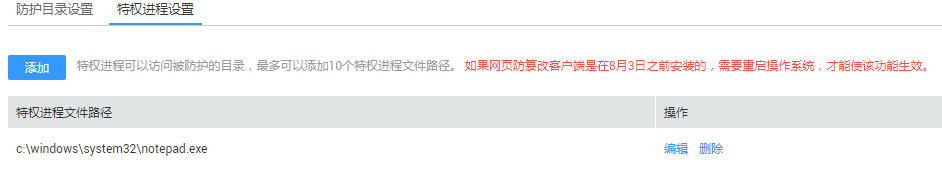

# 添加特权进程

该章节指导用户通过企业主机安全服务添加特权进程。

## 前提条件

-   已获取管理控制台的登录帐号与密码。
-   弹性云服务器的“Agent状态“为“在线“且“防护状态“为“关闭“。
-   操作系统类型为Windows系统。

## 操作步骤

1.  登录管理控制台。
2.  在页面上方，单击“服务列表“，选择“安全  \>  企业主机安全“。
3.  在左侧导航树中，选择“网页防篡改“，进入网页防篡改界面。
4.  在需要添加特权进程的弹性云服务器所在行的“操作“列，单击“防护设置“，进入防护设置界面。
5.  选中“特权进程设置“页签，单击“添加“，在弹出的对话框中，设置特权进程文件路径，如[图1](#fig9234184561612)所示。

    **图 1**  特权进程设置  
    

    > **注意：**   
    >如果网页防篡改客户端是在8月3日之前安装的，需要重启操作系统，才能使该功能生效。  

1.  单击“确定“，完成特权进程添加。

    > **说明：**   
    >-   若需要编辑添加的特权进程文件路径时，可单击待编辑的特权进程文件路径所在行的“编辑“，编辑特权进程文件路径。  
    >-   若需要删除添加的特权进程文件路径时，可单击待删除的特权进程文件路径所在行的“删除“，删除特权进程文件路径。  

