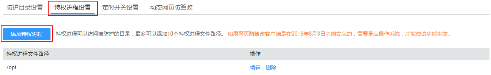

# 添加特权进程修改防护文件

开启网页防篡改防护后，防护目录中的内容是只读状态，如果您需要修改防护目录中的文件或更新网站，可以添加特权进程。

通过这个特权进程去修改防护目录里的文件或者更新网站，修改才会生效。若没有添加特权进程 ，网页防篡改仅防护原来的文件或者网站，即使修改了内容，文件或者网站也会恢复到原来的状态，修改不会生效。

特权进程可以访问被防护的目录，请确保特权进程安全可靠。

每个主机中最多可以添加10个特权进程的路径。

## 前提条件

-   在“网页防篡改  \>  防护列表“页面中“Agent状态“为“在线“、“防护状态“为“开启“。
-   针对Linux系统服务器特权进程，请在“防护目录设置“页签下将“防护模式“设置为“保护网络文件系统“，“特权进程设置“才会生效。

## 添加特权进程

1.  [登录管理控制台](https://console.huaweicloud.com)。
2.  在页面上方选择区域后，单击，选择“安全  \>  企业主机安全“。

    **图 1**  企业主机安全  
    

3.  在“网页防篡改  \>  防护列表“页面，单击“防护设置“，进入“防护设置“页面。

    **图 2**  在“网页防篡改“界面  
    

4.  在“特权进程设置“页面，单击“添加特权进程“。

    **图 3**  添加特权进程  
    

5.  在弹出的“添加特权进程“对话框中，添加特权进程文件所在的路径。

    特权进程文件所在的路径需包含进程的名称和格式，如“C:/Path/Software.type“，若进程无格式，请确保进程名称的唯一性。

6.  特权进程添加完成后，单击“确定“，完成添加特权进程的操作。

    > **说明：**   
    >若HSS的Agent是2018年8月3日前安装的，请在特权进程添加完成后重启操作系统。  

## 相关操作

**修改或删除已添加的特权进程**

在特权进程列表右侧的操作列表中，您可以根据需要修改已添加的特权进程，为方便管理，您也可以删除已无需使用的特权进程。

> **说明：**   
>-   执行编辑或删除操作后，特权进程将不能修改防护目录下的文件，为不影响业务应用的正常运行，请您谨慎处理。  
>-   无用的进程可能会因为进程自身的漏洞被攻击者利用，请及时删除无需使用的特权进程。  

