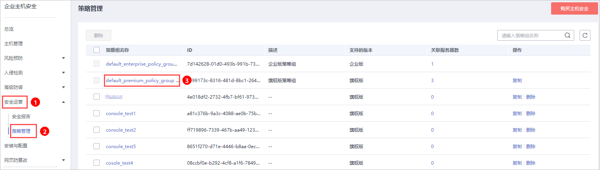
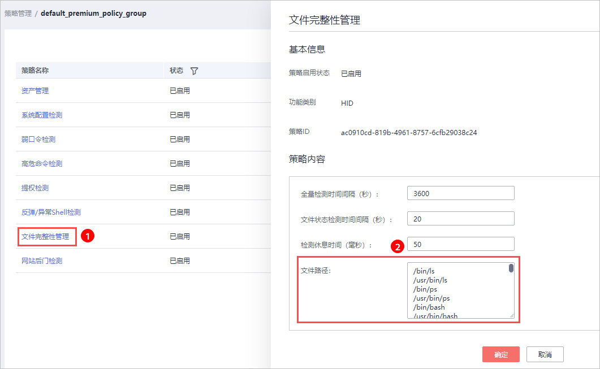

# 添加管理文件

文件完整性管理可以检查操作系统、应用程序软件和其他组件的文件，确定它们是否发生了可能遭受攻击的更改，同时，能够帮助用户通过PCI-DSS等安全认证。

文件完整性管理功能是使用对比的方法来确定当前文件状态是否不同于上次扫描该文件时的状态，利用这种对比来确定文件是否发生了有效或可疑的修改。

文件完整性管理会验证Linux文件的完整性，并管理针对文件执行的活动，包括：

-   文件的创建与删除。
-   文件的修改（文件大小、访问控制列表和内容哈希的更改）。

后续将支持注册表变更统计，敬请期待。

> **须知：** 
>选择需要管理的文件时，需要考虑对系统和应用程序至关重要的文件，选择不会在计划外发生更改的文件。
>如果选择应用程序或操作系统经常更改的文件（例如：日志文件和文本文件）会造成很多的干扰，使攻击识别变得非常困难。

## 开启文件完整性管理

1.  [登录管理控制台](https://console.huaweicloud.com)。

1.  在页面左上角选择“区域“，单击，选择“安全  \>  企业主机安全“，进入企业主机安全页面。

    **图 1**  企业主机安全  
    

2.  进入“文件完整性管理“页面，单击，开启文件完整性管理，默认，如[图2](#fig350162443614)所示。

    **图 2**  开启文件完整性管理  
    

3.  开启文件完整性管理后，可查看服务器总的台数、变更统计、变更类别、变更风险、云服务器列表和变更文件列表。

## 添加管理文件

若需要添加管理文件，请满足以下条件：

-   主机已部署策略。
-   已部署策略的“文件完整性管理“策略开关“已开启“。

添加管理文件的操作步骤，如下所示。

1.  [登录管理控制台](https://console.huaweicloud.com)。

1.  在页面左上角选择“区域“，单击，选择“安全  \>  企业主机安全“，进入企业主机安全页面。

    **图 3**  企业主机安全  
    

2.  在左侧导航栏，选择“安全运营“，单击“策略管理“，进入“策略管理“界面。
3.  在策略管理页面，单击主机应用的策略组的名称，进入策略列表页面，以默认“旗舰版策略组“为例，如[图4](#fig10124795120)所示。

    **图 4**  默认策略组  
    

4.  单击“文件完整性管理“，弹出文件完整性管理策略的页面，添加需要管理的文件，如[图5](#fig1018761513479)所示。

    关于配置“文件完整性管理“策略，详细操作请参见[文件完整性管理](修改策略内容.md#section181381720102814)。

    **图 5**  进入文件完整性管理策略  
    

1.  添加完成后，单击“确定“，完成管理文件的添加。

## 相关操作

**关闭文件完整性管理**

若您不需要使用文件完整性管理功能，可单击，关闭文件完整性管理。关闭后，企业主机安全将不再管理添加监控的文件，您也无法查看文件完整性管理页面的数据。

