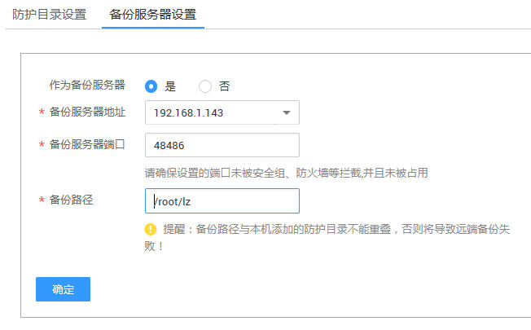
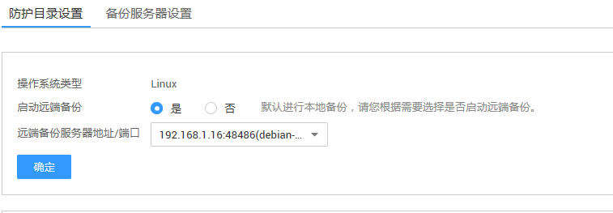

# 添加远端备份

将已有服务器设置为远端备份服务器。并且设置为备份服务器的备份模块状态是在运行中。本章节指导用户添加远端备份。

## 前提条件

-   已获取管理控制台的登录账号与密码。
-   弹性云服务器的“Agent状态“为“在线“且“防护状态“为“关闭“。

## 备份服务器设置

1.  登录管理控制台。
2.  在页面上方，单击“服务列表“，选择“安全  \>  企业主机安全“。
3.  在左侧导航树中，选择“网页防篡改“，进入网页防篡改界面。
4.  在“网页防篡改“界面，选择“主机列表“页签，进入云服务列表页面。
5.  在需要设置备份服务器的弹性云服务器所在行的“操作“列，单击“防护设置“，进入防护设置界面。
6.  选中“备份服务器设置“页签，在弹出的弹框进行相关的参数设置，如[图1](#fig9234184561612)所示，相关参数说明请参见[表1](#table1423774551618)。

    > **注意：**   
    >只有Linux系统类型的服务器才能作为备份服务器。请在Agent已注册的情况下设置备份服务器。  

    **图 1**  设置备份服务器  
    

    **表 1**  设置备份服务器参数说明

    
    <table><thead align="left"><tr id="row2234145121611"><th class="cellrowborder" valign="top" width="50%" id="mcps1.2.3.1.1">
参数名称

    </th>
    <th class="cellrowborder" valign="top" width="50%" id="mcps1.2.3.1.2">
说明

    </th>
    </tr>
    </thead>
    <tbody><tr id="row92368451164"><td class="cellrowborder" valign="top" width="50%" headers="mcps1.2.3.1.1 ">
作为备份服务器

    </td>
    <td class="cellrowborder" valign="top" width="50%" headers="mcps1.2.3.1.2 "><ul id="ul8236154512167"><li>选择“是”：将该服务器设置为备份服务器。</li><li>选择“否”：不将该服务器作为备份服务器。</li></ul>
    </td>
    </tr>
    <tr id="row18236745141617"><td class="cellrowborder" valign="top" width="50%" headers="mcps1.2.3.1.1 ">
备份服务器地址

    </td>
    <td class="cellrowborder" valign="top" width="50%" headers="mcps1.2.3.1.2 ">
单击下拉框选择备份服务器的地址。

    </td>
    </tr>
    <tr id="row623714581616"><td class="cellrowborder" valign="top" width="50%" headers="mcps1.2.3.1.1 ">
备份服务器端口

    </td>
    <td class="cellrowborder" valign="top" width="50%" headers="mcps1.2.3.1.2 ">
单击下拉框选择备份服务器的端口。

    
 注意： 

请确保设置的端口未被安全组、防火墙等拦截，并且未被占用。

    

    </td>
    </tr>
    <tr id="row023717458167"><td class="cellrowborder" valign="top" width="50%" headers="mcps1.2.3.1.1 ">
备份路径

    </td>
    <td class="cellrowborder" valign="top" width="50%" headers="mcps1.2.3.1.2 ">
服务器上的备份路径，将防护目录下的内容备份在该目录下。

    
 注意： 

备份路径不能与防护路径重叠。

    

    </td>
    </tr>
    </tbody>
    </table>

## 开启远端备份

> **说明：**   
>默认会进行本地备份，如果想要开启远端备份，请执行以下步骤。  

1.  登录管理控制台。
2.  在页面上方，单击“服务列表“，选择“安全  \>  企业主机安全“。
3.  在左侧导航树中，选择“网页防篡改“，进入网页防篡改界面。
4.  在需要设置备份服务器的弹性云服务器所在行的“操作“列，单击“防护设置“，进入防护设置界面，选中“防护目录设置“页签，如[图2](#fig1824482172911)所示，参数说明如[表2](#table0837761538)所示。

    **图 2**  远端备份防护目录设置  
    

    **表 2**  防护目录设置参数说明

    
    <table><thead align="left"><tr id="row98371961335"><th class="cellrowborder" valign="top" width="32%" id="mcps1.2.3.1.1">
参数名称

    </th>
    <th class="cellrowborder" valign="top" width="68%" id="mcps1.2.3.1.2">
说明

    </th>
    </tr>
    </thead>
    <tbody><tr id="row2837361435"><td class="cellrowborder" valign="top" width="32%" headers="mcps1.2.3.1.1 ">
操作系统类型

    </td>
    <td class="cellrowborder" valign="top" width="68%" headers="mcps1.2.3.1.2 ">
只有Linux系统类型的服务器才能作为备份服务器。请在Agent已注册的情况下设置备份服务器。

    </td>
    </tr>
    <tr id="row7837156436"><td class="cellrowborder" valign="top" width="32%" headers="mcps1.2.3.1.1 ">
启动远端备份

    </td>
    <td class="cellrowborder" valign="top" width="68%" headers="mcps1.2.3.1.2 ">
默认进行本地备份，您可以根据需要选择是否启动远端备份。

    </td>
    </tr>
    <tr id="row1283713613312"><td class="cellrowborder" valign="top" width="32%" headers="mcps1.2.3.1.1 ">
远端备份服务器地址/端口

    </td>
    <td class="cellrowborder" valign="top" width="68%" headers="mcps1.2.3.1.2 ">
在下拉框中选择远端备份的服务器地址/端口。

    </td>
    </tr>
    </tbody>
    </table>

5.  如果选择开启远端备份，单击“远端备份服务器地址/端口“下拉框，选择已设置为备份服务器的IP。
6.  单击“确定“完成设置。

