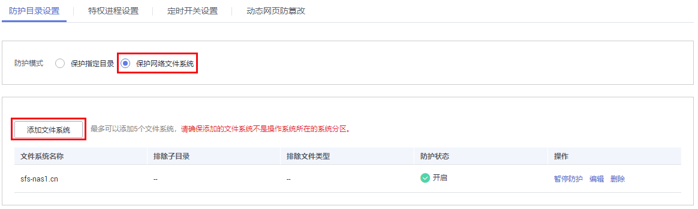
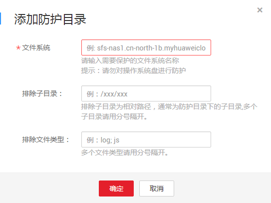
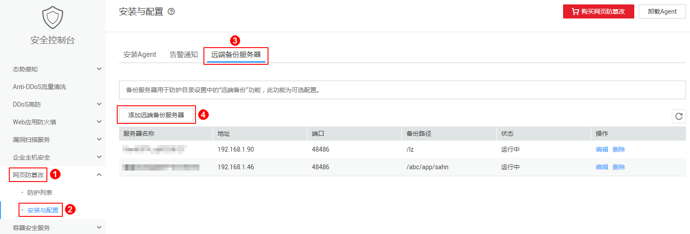
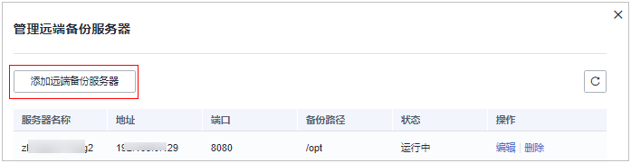

# 添加防护目录/文件系统

您可以保护指定目录，也可以保护网络文件系统。

## 保护指定目录

> **说明：**   
>-   您最多可在主机中添加50个防护目录。  
>-   为实时记录主机中的运行情况，请排除防护目录下Log类型的文件，您可以为日志文件添加等级较高的读写权限，防止攻击者恶意查看或篡改日志文件。  

1.  [登录管理控制台](https://console.huaweicloud.com)。
2.  在页面上方选择“区域“后，单击“服务列表“，选择“安全  \>  企业主机安全“。
3.  在“网页防篡改  \>  防护列表“页面，单击“防护设置“，进入“防护设置“页面。

    **图 1**  在“网页防篡改“界面  
    

4.  “防护模式“选择“保护指定目录“，如[图2](#fig8768142612508)所示。

    **图 2**  保护指定目录  
    

5.  添加防护目录。
    1.  单击“添加防护目录“，在弹出的“添加防护目录“对话框中添加防护目录，有关防护规则的详细内容请参见[表1](#table1250954064918)。

        **图 3**  添加防护目录  
        

        **表 1**  防护规则

        
        <table><thead align="left"><tr id="row55111140154917"><th class="cellrowborder" valign="top" width="15.65%" id="mcps1.2.4.1.1">
参数

        </th>
        <th class="cellrowborder" valign="top" width="43.36%" id="mcps1.2.4.1.2">
说明

        </th>
        <th class="cellrowborder" valign="top" width="40.99%" id="mcps1.2.4.1.3">
限制

        </th>
        </tr>
        </thead>
        <tbody><tr id="row11512114018498"><td class="cellrowborder" valign="top" width="15.65%" headers="mcps1.2.4.1.1 ">
防护目录

        </td>
        <td class="cellrowborder" valign="top" width="43.36%" headers="mcps1.2.4.1.2 ">
防护目录下的文件和文件夹为只读。

        </td>
        <td class="cellrowborder" valign="top" width="40.99%" headers="mcps1.2.4.1.3 ">
请勿对操作系统目录进行防护。

        </td>
        </tr>
        <tr id="row19512840174916"><td class="cellrowborder" valign="top" width="15.65%" headers="mcps1.2.4.1.1 ">
排除子目录

        </td>
        <td class="cellrowborder" valign="top" width="43.36%" headers="mcps1.2.4.1.2 ">
排除防护目录下不需要防护的子目录，例如临时文件目录。

        
多个子目录请用英文分号隔开。

        </td>
        <td class="cellrowborder" valign="top" width="40.99%" headers="mcps1.2.4.1.3 ">
排除子目录为防护目录中的相对目录。

        </td>
        </tr>
        <tr id="row551254014498"><td class="cellrowborder" valign="top" width="15.65%" headers="mcps1.2.4.1.1 ">
排除文件类型

        </td>
        <td class="cellrowborder" valign="top" width="43.36%" headers="mcps1.2.4.1.2 ">
排除防护目录下不需要防护的文件类型，例如Log类型的文件。

        
多个文件类型请用英文分号隔开。

        </td>
        <td class="cellrowborder" valign="top" width="40.99%" headers="mcps1.2.4.1.3 ">
-

        </td>
        </tr>
        <tr id="row3512104084919"><td class="cellrowborder" valign="top" width="15.65%" headers="mcps1.2.4.1.1 ">
本地备份路径

        </td>
        <td class="cellrowborder" valign="top" width="43.36%" headers="mcps1.2.4.1.2 ">
防护目录下的文件会备份至该路径。

        
被排除的子目录和文件类型不会备份。

        </td>
        <td class="cellrowborder" valign="top" width="40.99%" headers="mcps1.2.4.1.3 ">
本地备份路径与添加的防护目录不能重叠。

        </td>
        </tr>
        </tbody>
        </table>

    2.  添加完成后，单击“确定“，完成添加防护目录的操作。

        若您需要修改防护目录中的文件，请先暂停对防护目录的防护后再修改文件，以避免误报。文件修改完成后请及时恢复防护功能。

6.  启用远端备份。

    默认会对防护目录下的文件进行本地备份（被排除的子目录和文件类型不会备份），为防止备份在本地的文件被攻击者破坏，请您启用远端备份功能，并同时为远端备份服务器开启“网页防篡改”防护。

    有关设置远端备份服务器的详细操作请参见[设置远端备份服务器](#section159901154317)。

    1.  单击“启动远端备份“。

        **图 4**  开启远端备份  
        

    2.  通过下拉框选择备份服务器。

        **图 5**  启动远端备份  
        

    3.  单击“确定“，启动远端备份。

## 保护网络文件系统

1.  [登录管理控制台](https://console.huaweicloud.com)。
2.  在页面上方选择“区域“后，单击“服务列表“，选择“安全  \>  企业主机安全“。
3.  在“网页防篡改  \>  防护列表“页面，单击“防护设置“，进入“防护设置“页面。

    **图 6**  在“网页防篡改“界面  
    

4.  “防护模式“选择“保护网络文件系统“，如[图7](#fig186581020636)所示。

    **图 7**  保护网络文件系统  
    

5.  单击“添加文件系统“，在弹出的“添加防护目录“对话框中添加防护目录，有关防护规则的详细内容请参见[表2](#table9899135424718)。

    **图 8**  添加文件系统  
    

    **表 2**  防护规则

    
    <table><thead align="left"><tr id="row2899454154716"><th class="cellrowborder" valign="top" width="14.21%" id="mcps1.2.4.1.1">
参数

    </th>
    <th class="cellrowborder" valign="top" width="45.73%" id="mcps1.2.4.1.2">
说明

    </th>
    <th class="cellrowborder" valign="top" width="40.06%" id="mcps1.2.4.1.3">
限制

    </th>
    </tr>
    </thead>
    <tbody><tr id="row15900155411478"><td class="cellrowborder" valign="top" width="14.21%" headers="mcps1.2.4.1.1 ">
文件系统

    </td>
    <td class="cellrowborder" valign="top" width="45.73%" headers="mcps1.2.4.1.2 ">
防护文件系统下的文件和文件目录为只读。

    </td>
    <td class="cellrowborder" valign="top" width="40.06%" headers="mcps1.2.4.1.3 ">
请勿对操作系统盘进行防护。

    </td>
    </tr>
    <tr id="row19005543472"><td class="cellrowborder" valign="top" width="14.21%" headers="mcps1.2.4.1.1 ">
排除子目录

    </td>
    <td class="cellrowborder" valign="top" width="45.73%" headers="mcps1.2.4.1.2 ">
您可以排除文件系统中不需要防护的子目录，例如临时文件目录。

    
多个子目录请用英文分号隔开。

    </td>
    <td class="cellrowborder" valign="top" width="40.06%" headers="mcps1.2.4.1.3 ">
该目录为文件系统中的相对目录。

    </td>
    </tr>
    <tr id="row18900155414470"><td class="cellrowborder" valign="top" width="14.21%" headers="mcps1.2.4.1.1 ">
排除文件类型

    </td>
    <td class="cellrowborder" valign="top" width="45.73%" headers="mcps1.2.4.1.2 ">
您可以排除文件系统中不需要防护的文件类型，例如Log类型的文件。

    
多个文件类型请用英文分号隔开。

    </td>
    <td class="cellrowborder" valign="top" width="40.06%" headers="mcps1.2.4.1.3 ">
-

    </td>
    </tr>
    </tbody>
    </table>

    > **须知：**   
    >若您需要修改防护目录中的文件，您可以[设置特权进程](添加特权进程.md)。特权进程可以访问被防护的目录，请确保特权进程安全可靠。  

6.  添加完成后，单击“确定“，完成添加文件系统的操作。

## 设置远端备份服务器

-   仅“服务器状态“为“运行中“、“Agent状态“为“在线“的Linux主机可被设置为远端备份服务器。
-   可开启备份服务器的数量和“网页防篡改版”配额的数量一致，请确保在所选区域内您已购买了数量充足的“网页防篡改版”配额。

> **须知：**   
>-   Linux备份服务器与主机间网络可通时即可使用远程备份功能，但为保证备份功能的正常工作，建议您将同一内网中的主机设置为备份服务器。  
>-   由于主机的性能差异，非华为云的主机与企业主机安全服务的兼容性可能较差，为使您获得良好的服务体验，建议您使用华为云主机，并将华为云的主机设置为远端备份服务器。  

1.  [登录管理控制台](https://console.huaweicloud.com)。
2.  在页面上方选择“区域“后，单击“服务列表“，选择“安全  \>  企业主机安全“。
3.  在“远端备份服务器“页面，单击“添加远端备份服务器“。

    **图 9**  远端备份服务器  
    

4.  在弹出的对话框中，添加远端备份服务器，相关参数说明请参见[表3](#table1423774551618)。

    **图 10**  添加远端备份服务器  
    

    **表 3**  添加远端备份服务器参数说明

    
    <table><thead align="left"><tr id="row2234145121611"><th class="cellrowborder" valign="top" width="29.310000000000002%" id="mcps1.2.3.1.1">
参数名称

    </th>
    <th class="cellrowborder" valign="top" width="70.69%" id="mcps1.2.3.1.2">
说明

    </th>
    </tr>
    </thead>
    <tbody><tr id="row18236745141617"><td class="cellrowborder" valign="top" width="29.310000000000002%" headers="mcps1.2.3.1.1 ">
地址

    </td>
    <td class="cellrowborder" valign="top" width="70.69%" headers="mcps1.2.3.1.2 ">
该地址为华为云主机的私网地址。

    </td>
    </tr>
    <tr id="row623714581616"><td class="cellrowborder" valign="top" width="29.310000000000002%" headers="mcps1.2.3.1.1 ">
端口

    </td>
    <td class="cellrowborder" valign="top" width="70.69%" headers="mcps1.2.3.1.2 ">
请确保设置的端口未被安全组、防火墙等拦截，并且未被占用。

    </td>
    </tr>
    <tr id="row023717458167"><td class="cellrowborder" valign="top" width="29.310000000000002%" headers="mcps1.2.3.1.1 ">
备份路径

    </td>
    <td class="cellrowborder" valign="top" width="70.69%" headers="mcps1.2.3.1.2 ">
将防护目录下的内容备份在该目录下。

    
该路径与本机防护目录不能重叠。

    </td>
    </tr>
    </tbody>
    </table>

5.  单击“确定“，完成添加备份服务器的操作。

## 相关操作

-   暂停防护：暂停“网页防篡改”服务对某一目录的防护，在暂停防护后，请您及时恢复防护，避免该目录下的文档被篡改。
-   编辑防护目录：根据需要修改已添加的防护目录。
-   删除防护目录：为方便管理，您可以删除已无需防护的目录。

> **须知：**   
>-   执行暂停防护、编辑或删除防护目录后，防护目录下的文件将不再受“网页防篡改”功能的防护，建议您提前处理防护目录下的文档，再对文档执行暂停防护、编辑或删除的相关操作。  
>-   执行暂停防护、编辑或删除防护目录后，若您的文档不慎被删除，请在主机本地备份或远端主机的备份路径中查找。  

