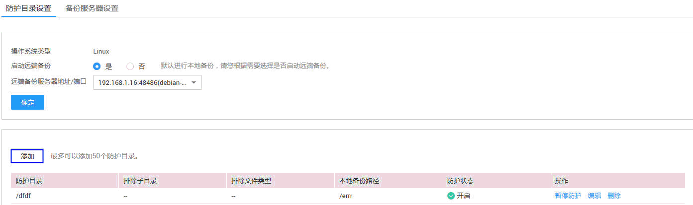

# 添加防护目录

该章节指导用户添加防护目录。在使用主机安全服务的网页防篡改功能前，需先开启网页防篡改功能，然后添加防护目录。

## 前提条件

-   已获取管理控制台的登录账号与密码。
-   弹性云服务器的“Agent状态“为“在线“且“防护状态“为“关闭“。

## 操作步骤

1.  登录管理控制台。
2.  在页面上方，单击“服务列表“，选择“安全  \>  企业主机安全“。
3.  在左侧导航树中，选择“网页防篡改“，进入网页防篡改界面。
4.  在“网页防篡改“界面，选择“主机列表“页签，进入云服务列表页面。
5.  在待添加防护目录的弹性云服务器所在行的操作列，单击“防护设置“，进入“防护设置“页面，如[图1](#fig976616191451)所示。

    **图 1**  防护目录设置  
    

6.  单击“添加“，在弹出的“添加防护目录“对话框中输入防护目录信息。

    -   防护目录：防护文件所在目录。
    -   排除子目录：防护目录中不参与防护的子目录。
    -   排除文件类型：防护目录中不参与防护的文件类型。
    -   本地备份路径：备份防护目录内容，防止篡改后无法恢复。

        > **注意：**   
        >本地备份路径不能与防护目录重叠。  

    -   远端备份服务器地址/端口：如果选择开启远端备份，单击“远端备份服务器地址/端口“下拉框进行选择。

    **图 2**  添加防护目录  
    

7.  单击“确定“，完成添加防护目录操作。

    > **说明：**   
    >-   新添加目录的“防护状态“默认为“开启“。  
    >-   若暂停对某个或某些防护目录的网页防篡改服务，请在相应防护目录所在行，单击“暂停防护“。  
    >-   若修改所添加的防护目录，请在相应防护目录所在行单击“编辑“。  

