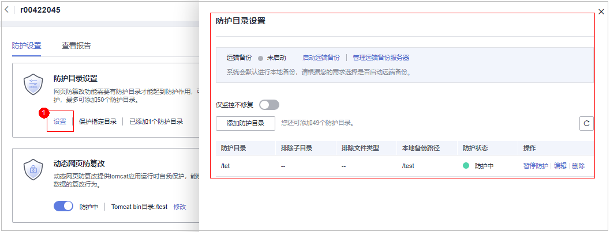
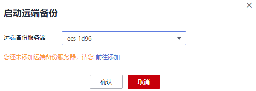

# 添加防护目录

网页防篡改可实时监控网站目录，并通过备份恢复被篡改的文件或目录，保障重要系统的网站信息不被恶意篡改，防止出现挂马、黑链、非法植入恐怖威胁、色情等内容。

## 前提条件

已开启主机安全服务版本为网页防篡改版。

## 约束与限制

-   仅开启网页防篡改版防护后才支持防篡改相关操作。

-   防护目录，存在以下约束：
    -   Linux系统：
        -   每台服务器最多可添加50个防护目录。
        -   每个被防护的目录的完整路径长度不得超过256个字符。
        -   每个被防护的目录文件夹层级不超过100。
        -   所有被防护的目录下的文件夹个数不超过900000。

    -   Windows系统：
        -   每台服务器最多可添加50个防护目录。
        -   每个被防护的目录的完整路径长度不得超过256个字符。

-   本地备份路径，存在以下约束：
    -   本地备份功能仅支持Linux系统。
    -   本地备份路径须为合法路径，如果该路径不存在，会导致防篡改不生效。
    -   本地备份路径与添加的防篡改目录不能重叠。
    -   本地备份路径所属磁盘剩余可用容量大于所有被防护目录的大小。

## 添加防护目录

1.  [登录管理控制台](https://console.huaweicloud.com/?locale=zh-cn)。
2.  在页面左上角选择“区域“，单击，选择“安全与合规 \> 主机安全服务”，进入主机安全平台界面。

    **图 1**  进入主机安全  
    

3.  在“主动防御  \>  网页防篡改  \>  防护配置“页面，单击目标服务器“操作“列的“防护设置“，进入“防护设置“页面。

    > **说明：** 
    >如果您的服务器已通过企业项目的模式进行管理，您可选择目标“企业项目“后查看或操作目标企业项目内的资产和检测信息。

    **图 2**  进入防护配置  
    

4.  单击“防护目录设置“下的“设置“，进入防护目录设置页面。

    **图 3**  防护目录设置页面  
    

5.  添加防护目录，您最多可在主机中添加50个防护目录。
    1.  单击“添加防护目录“，在弹出的“添加防护目录“对话框中添加防护目录，有关防护规则的详细内容请参见[表1](#table1250954064918)。

        **图 4**  添加防护目录  
        

        **表 1**  防护规则

        
        <table><thead align="left"><tr id="row55111140154917"><th class="cellrowborder" valign="top" width="16.38%" id="mcps1.2.4.1.1">
参数

        </th>
        <th class="cellrowborder" valign="top" width="42.63%" id="mcps1.2.4.1.2">
说明

        </th>
        <th class="cellrowborder" valign="top" width="40.99%" id="mcps1.2.4.1.3">
限制

        </th>
        </tr>
        </thead>
        <tbody><tr id="row11512114018498"><td class="cellrowborder" valign="top" width="16.38%" headers="mcps1.2.4.1.1 ">
防护目录

        </td>
        <td class="cellrowborder" valign="top" width="42.63%" headers="mcps1.2.4.1.2 ">
防护目录下的文件和文件夹为只读。

        </td>
        <td class="cellrowborder" valign="top" width="40.99%" headers="mcps1.2.4.1.3 ">
请勿对操作系统目录进行防护。

        </td>
        </tr>
        <tr id="row19512840174916"><td class="cellrowborder" valign="top" width="16.38%" headers="mcps1.2.4.1.1 ">
排除子目录

        </td>
        <td class="cellrowborder" valign="top" width="42.63%" headers="mcps1.2.4.1.2 "><ul id="ul1794416554332"><li>排除防护目录下不需要防护的子目录，例如临时文件目录。</li><li>多个子目录请用英文分号隔开，最多可添加10个子目录。</li></ul>
        </td>
        <td class="cellrowborder" valign="top" width="40.99%" headers="mcps1.2.4.1.3 ">
排除子目录为防护目录中的相对目录。

        </td>
        </tr>
        <tr id="row551254014498"><td class="cellrowborder" valign="top" width="16.38%" headers="mcps1.2.4.1.1 ">
排除文件类型

        </td>
        <td class="cellrowborder" valign="top" width="42.63%" headers="mcps1.2.4.1.2 "><ul id="ul761217453336"><li>排除防护目录下不需要防护的文件类型，例如Log类型的文件。</li><li>多个文件类型请用英文分号隔开。</li><li>为实时记录主机中的运行情况，请排除防护目录下Log类型的文件，您可以为日志文件添加等级较高的读写权限，防止攻击者恶意查看或篡改日志文件。</li></ul>
        </td>
        <td class="cellrowborder" valign="top" width="40.99%" headers="mcps1.2.4.1.3 ">
-

        </td>
        </tr>
        <tr id="row3512104084919"><td class="cellrowborder" valign="top" width="16.38%" headers="mcps1.2.4.1.1 ">
本地备份路径

        </td>
        <td class="cellrowborder" valign="top" width="42.63%" headers="mcps1.2.4.1.2 "><ul id="ul38357246332"><li>仅支持Linux系统。</li><li>开启网页防篡改防护后，防护目录下的文件会自动备份到设置的本地备份路径中。</li><li>防护目录下文件大小不同，备份时间也不同，一般约10分钟备份完成。备份完成后，立即生效。</li><li>被排除的子目录和文件类型不会备份。</li><li>若检测到防护目录下的文件被篡改时，将立即使用本地主机备份文件自动恢复被非法篡改的文件。</li></ul>
        </td>
        <td class="cellrowborder" valign="top" width="40.99%" headers="mcps1.2.4.1.3 ">
本地备份路径与添加的防护目录不能重叠。

        </td>
        </tr>
        <tr id="row133700465297"><td class="cellrowborder" valign="top" width="16.38%" headers="mcps1.2.4.1.1 ">
排除文件路径列表

        </td>
        <td class="cellrowborder" valign="top" width="42.63%" headers="mcps1.2.4.1.2 "><ul id="ul180311423301"><li>排除防护目录下不需要防护的路径。</li><li>多个路径请用英文分号隔开，最多可添加50个路径， 路径最长字符限制为256。</li><li>单个路径不能以空格开始，不能以/结束。</li></ul>
        </td>
        <td class="cellrowborder" valign="top" width="40.99%" headers="mcps1.2.4.1.3 ">
排除文件路径为防护目录的相对文件路径。

        </td>
        </tr>
        </tbody>
        </table>

    2.  添加完成后，单击“确认“，完成添加防护目录的操作。

        若您需要修改防护目录中的文件，请先暂停对防护目录的防护后再修改文件，以避免误报。文件修改完成后请及时恢复防护功能。

6.  启用远端备份。

    HSS默认会将防护目录下的文件备份在“添加防护目录“时添加的本地备份路径下（被排除的子目录和文件类型不会备份），为防止备份在本地的文件被攻击者破坏，请您启用远端备份功能。

    有关添加远端备份服务器的详细操作，请参见[管理远端备份服务器](管理远端备份服务器.md)。

    1.  在“防护目录设置“页单击“启动远端备份“。

        **图 5**  开启远端备份  
        

    2.  通过下拉框选择备份服务器。

        **图 6**  启动远端备份  
        

    3.  单击“确认“，启动远端备份。

## 相关操作

-   导出防护目录：如果您配置的防护目录较多不方便查看，您可以在防护目录配置页面单击，导出所有防护目录的配置信息保存到本地进行查看。
-   暂停防护：暂停“网页防篡改”服务对某一目录的防护，在暂停防护后，请您及时恢复防护，避免该目录下的文档被篡改。
-   编辑防护目录：根据需要修改已添加的防护目录。
-   删除防护目录：为方便管理，您可以删除已无需防护的目录。

> **须知：** 
>-   执行暂停防护、编辑或删除防护目录后，防护目录下的文件将不再受“网页防篡改”功能的防护，建议您提前处理防护目录下的文档，再对文档执行暂停防护、编辑或删除的相关操作。
>-   执行暂停防护、编辑或删除防护目录后，若您的文档不慎被删除，请在主机本地备份或远端主机的备份路径中查找。

