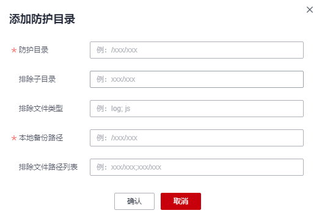

# 添加防护目录

网页防篡改可实时监控网站目录，并通过备份恢复被篡改的文件或目录，保障重要系统的网站信息不被恶意篡改，防止出现挂马、黑链、非法植入恐怖威胁、色情等内容。

## 约束与限制

网页防篡改仅防护“防护目录“下的文件，不防护文件中链接指向的文件。

## 保护指定目录

1.  [登录管理控制台](https://console.huaweicloud.com)。
2.  在页面左上角选择“区域“，单击，选择“安全  \>  企业主机安全“，进入企业主机安全页面。

    **图 1**  企业主机安全  
    

3.  在“网页防篡改  \>  防护列表“页面，单击“防护设置“，进入“防护设置“页面。

    **图 2**  在“网页防篡改“界面  
    

4.  “防护模式“选择“保护指定目录“，如[图3](#fig8768142612508)所示。

    **图 3**  保护指定目录  
    

5.  添加防护目录，您最多可在主机中添加50个防护目录。
    1.  单击“添加防护目录“，在弹出的“添加防护目录“对话框中添加防护目录，有关防护规则的详细内容请参见[表1](#table1250954064918)。

        **图 4**  添加防护目录  
        

        **表 1**  防护规则

        
        <table><thead align="left"><tr id="row55111140154917"><th class="cellrowborder" valign="top" width="15.65%" id="mcps1.2.4.1.1">
参数

        </th>
        <th class="cellrowborder" valign="top" width="43.36%" id="mcps1.2.4.1.2">
说明

        </th>
        <th class="cellrowborder" valign="top" width="40.99%" id="mcps1.2.4.1.3">
限制

        </th>
        </tr>
        </thead>
        <tbody><tr id="row11512114018498"><td class="cellrowborder" valign="top" width="15.65%" headers="mcps1.2.4.1.1 ">
防护目录

        </td>
        <td class="cellrowborder" valign="top" width="43.36%" headers="mcps1.2.4.1.2 ">
防护目录下的文件和文件夹为只读。

        </td>
        <td class="cellrowborder" valign="top" width="40.99%" headers="mcps1.2.4.1.3 ">
请勿对操作系统目录进行防护。

        </td>
        </tr>
        <tr id="row19512840174916"><td class="cellrowborder" valign="top" width="15.65%" headers="mcps1.2.4.1.1 ">
排除子目录

        </td>
        <td class="cellrowborder" valign="top" width="43.36%" headers="mcps1.2.4.1.2 ">
排除防护目录下不需要防护的子目录，例如临时文件目录。

        
多个子目录请用英文分号隔开。

        </td>
        <td class="cellrowborder" valign="top" width="40.99%" headers="mcps1.2.4.1.3 ">
排除子目录为防护目录中的相对目录。

        </td>
        </tr>
        <tr id="row551254014498"><td class="cellrowborder" valign="top" width="15.65%" headers="mcps1.2.4.1.1 ">
排除文件类型

        </td>
        <td class="cellrowborder" valign="top" width="43.36%" headers="mcps1.2.4.1.2 ">
排除防护目录下不需要防护的文件类型，例如Log类型的文件。

        
多个文件类型请用英文分号隔开。

        
为实时记录主机中的运行情况，请排除防护目录下Log类型的文件，您可以为日志文件添加等级较高的读写权限，防止攻击者恶意查看或篡改日志文件。

        </td>
        <td class="cellrowborder" valign="top" width="40.99%" headers="mcps1.2.4.1.3 ">
-

        </td>
        </tr>
        <tr id="row3512104084919"><td class="cellrowborder" valign="top" width="15.65%" headers="mcps1.2.4.1.1 ">
本地备份路径

        </td>
        <td class="cellrowborder" valign="top" width="43.36%" headers="mcps1.2.4.1.2 ">
开启网页防篡改防护后，防护目录下的文件会自动备份到设置的本地备份路径中。

        
防护目录下文件大小不同，备份时间也不同，一般约10分钟备份完成。备份完成后，立即生效。

        
被排除的子目录和文件类型不会备份。

        
若检测到防护目录下的文件被篡改时，将立即使用本地主机备份文件自动恢复被非法篡改的文件。

        </td>
        <td class="cellrowborder" valign="top" width="40.99%" headers="mcps1.2.4.1.3 ">
本地备份路径与添加的防护目录不能重叠。

        </td>
        </tr>
        </tbody>
        </table>

    2.  添加完成后，单击“确定“，完成添加防护目录的操作。

        若您需要修改防护目录中的文件，请先暂停对防护目录的防护后再修改文件，以避免误报。文件修改完成后请及时恢复防护功能。

6.  启用远端备份。

    HSS默认会将防护目录下的文件备份在“添加防护目录“时添加的本地备份路径下（被排除的子目录和文件类型不会备份），为防止备份在本地的文件被攻击者破坏，请您启用远端备份功能。

    有关添加远端备份服务器的详细操作，请参见[添加远端备份服务器](添加远端备份服务器.md)。

    1.  单击“启动远端备份“。

        **图 5**  开启远端备份  
        

    2.  通过下拉框选择备份服务器。

        **图 6**  启动远端备份  
        

    3.  单击“确定“，启动远端备份。

## 相关操作

-   暂停防护：暂停“网页防篡改”服务对某一目录的防护，在暂停防护后，请您及时恢复防护，避免该目录下的文档被篡改。
-   编辑防护目录：根据需要修改已添加的防护目录。
-   删除防护目录：为方便管理，您可以删除已无需防护的目录。

> **须知：** 
>-   执行暂停防护、编辑或删除防护目录后，防护目录下的文件将不再受“网页防篡改”功能的防护，建议您提前处理防护目录下的文档，再对文档执行暂停防护、编辑或删除的相关操作。
>-   执行暂停防护、编辑或删除防护目录后，若您的文档不慎被删除，请在主机本地备份或远端主机的备份路径中查找。

