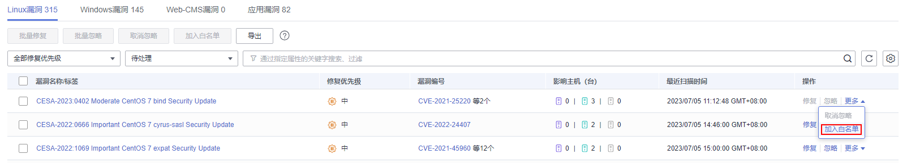
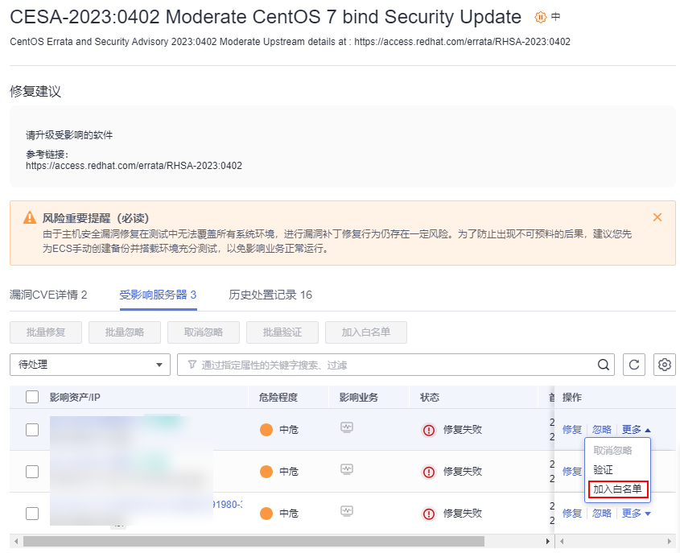
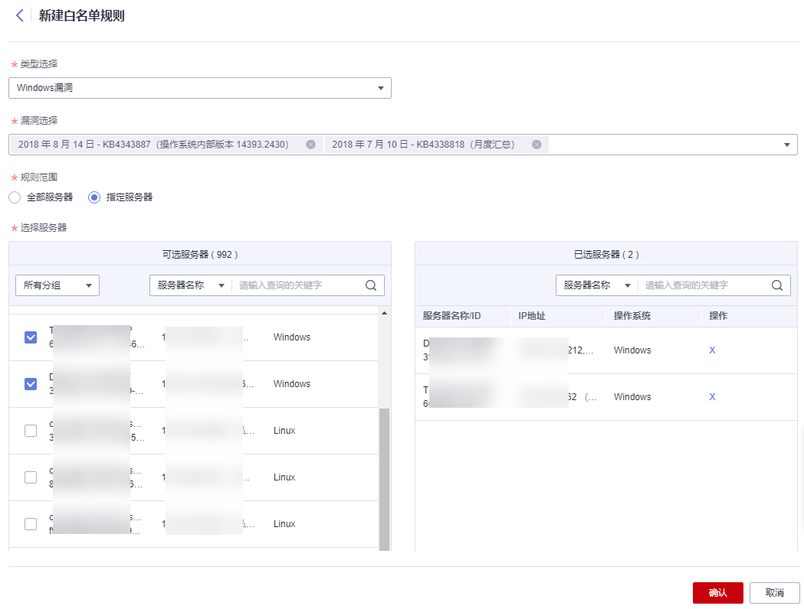

# 漏洞白名单管理

如果您评估某些漏洞对您的业务不会产生影响，并且不想在漏洞列表中看到该漏洞，您可以将该漏洞加入白名单，加入白名单后，针对漏洞列表已经展示的漏洞信息会处理为忽略，不再为您上报告警，在下一次漏洞扫描任务执行时不再扫描该漏洞和呈现该漏洞信息。

本章节为您介绍漏洞如何加入白名单，以及如何修改和删除漏洞白名单。

## 约束限制

HSS基础版不支持该功能，购买和升级HSS的操作请参见[购买主机安全防护配额](购买主机安全防护配额.md)和[配额版本升级](配额版本升级.md)。

## 漏洞添加白名单

1.  [登录管理控制台](https://console.huaweicloud.com/?locale=zh-cn)。
2.  在页面左上角选择“区域“，单击，选择“安全与合规 \> 主机安全服务”，进入主机安全平台界面。

    **图 1**  进入主机安全  
    

3.  在左侧导航树中，选择“风险预防  \>  漏洞管理“，进入漏洞管理界面。
    -   将漏洞影响的所有服务器加入白名单

        HSS扫描所有服务器存在的漏洞时，不再关注该漏洞。

        1.  在目标漏洞所在行的“操作”列，选择“更多  \>   加入白名单“。

            您也可以都选多个目标漏洞，单击漏洞列表上方的“加入白名单“。

            **图 2**  将漏洞影响的所有服务器加入白名单  
            

        2.  在弹出的对话框中，单击“确认“。

    -   将漏洞影响的单个或多个服务器加入白名单。

        HSS为这些服务器扫描漏洞时，不再关注漏洞。

        1.  单击目标漏洞的名称，进入漏洞详情页面。
        2.  选择“受影响服务器“页签。
        3.  在目标服务器所在行的“操作“列，选择“更多  \>   加入白名单“。

            您也可以勾选多个服务器，单击服务器列表上方的“加入白名单“。

            **图 3**  将漏洞影响的单个服务器加入白名单  
            

        4.  在弹出的对话框中，单击“确认“。

    -   通过白名单规则将漏洞加入白名单。
        1.  在漏洞管理界面右上角，单击“漏洞策略配置“，进入漏洞策略配置页面。
        2.  在漏洞白名单配置区域，单击“新增规则“。
        3.  根据界面提示配置白名单规则，相关参数说明请参见[表 漏洞白名单规则参数说明](#hss_01_0141_table15714142382020)。

            **图 4**  配置白名单规则  
            

            **表 1**  漏洞白名单规则参数说明

            
            <table><thead align="left"><tr id="hss_01_0141_row11715172362011"><th class="cellrowborder" valign="top" width="22.3%" id="mcps1.2.3.1.1">
参数

            </th>
            <th class="cellrowborder" valign="top" width="77.7%" id="mcps1.2.3.1.2">
说明

            </th>
            </tr>
            </thead>
            <tbody><tr id="hss_01_0141_row107152234209"><td class="cellrowborder" valign="top" width="22.3%" headers="mcps1.2.3.1.1 ">
类型选择

            </td>
            <td class="cellrowborder" valign="top" width="77.7%" headers="mcps1.2.3.1.2 ">
选择添加白名单的漏洞类型：

            <ul id="hss_01_0141_ul589517137343"><li>Linux系统漏洞</li><li>Windows系统漏洞</li><li>Web-CMS软件漏洞</li><li>应用漏洞</li></ul>
            </td>
            </tr>
            <tr id="hss_01_0141_row197151923102015"><td class="cellrowborder" valign="top" width="22.3%" headers="mcps1.2.3.1.1 ">
漏洞选择

            </td>
            <td class="cellrowborder" valign="top" width="77.7%" headers="mcps1.2.3.1.2 ">
选择为哪个漏洞添加白名单。支持选择单个或多个漏洞。

            </td>
            </tr>
            <tr id="hss_01_0141_row57158232208"><td class="cellrowborder" valign="top" width="22.3%" headers="mcps1.2.3.1.1 ">
规则范围

            </td>
            <td class="cellrowborder" valign="top" width="77.7%" headers="mcps1.2.3.1.2 ">
选择将漏洞影响的哪些服务器添加到白名单。

            <ul id="hss_01_0141_ul01021640142919"><li>全部服务器
HSS扫描所有服务器存在的漏洞时，不再关注该漏洞。

            </li><li>指定服务器
选择单个或多个目标服务器，HSS为这些服务器扫描漏洞时，不再关注漏洞。

            
您可以通过服务器名称、ID、公网IP、私网IP搜索目标服务器。

            </li></ul>
            </td>
            </tr>
            <tr id="hss_01_0141_row145219292369"><td class="cellrowborder" valign="top" width="22.3%" headers="mcps1.2.3.1.1 ">
备注（可选）

            </td>
            <td class="cellrowborder" valign="top" width="77.7%" headers="mcps1.2.3.1.2 ">
填写您需要备注的信息。

            </td>
            </tr>
            </tbody>
            </table>

        4.  单击“确认“。

## 编辑漏洞白名单

1.  [登录管理控制台](https://console.huaweicloud.com/?locale=zh-cn)。
2.  在页面左上角选择“区域“，单击，选择“安全与合规 \> 主机安全服务”，进入主机安全平台界面。

    **图 5**  进入主机安全  
    

1.  在左侧导航树中，选择“风险预防  \>  漏洞管理“，进入漏洞管理界面。
2.  在漏洞管理界面右上角，单击“漏洞策略配置“，进入漏洞策略配置页面。
3.  在目标漏洞白名单规则所在行的“操作“列，单击“编辑“。
4.  在编辑界面，完成信息修改后，单击“确认“。

## 删除漏洞白名单

1.  [登录管理控制台](https://console.huaweicloud.com/?locale=zh-cn)。
2.  在页面左上角选择“区域“，单击，选择“安全与合规 \> 主机安全服务”，进入主机安全平台界面。

    **图 6**  进入主机安全  
    

3.  在左侧导航树中，选择“风险预防  \>  漏洞管理“，进入漏洞管理界面。
4.  在漏洞管理界面右上角，单击“漏洞策略配置“，进入漏洞策略配置页面。
5.  在目标漏洞白名单规则所在行的“操作“列，单击“删除“。
6.  在弹窗中确认信息后，单击“确认“。

