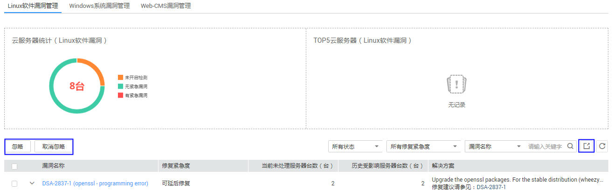
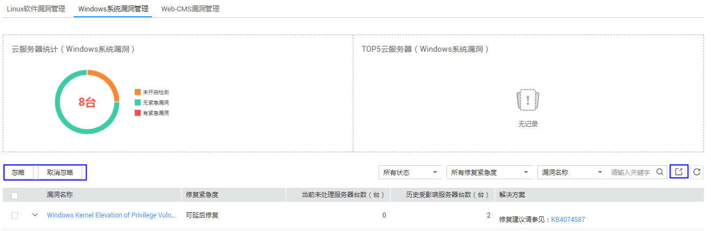
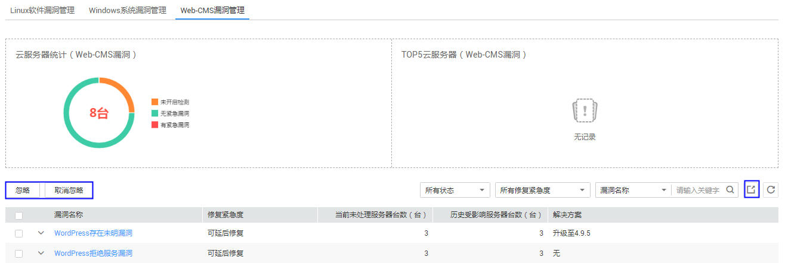

# 漏洞管理

该任务指导用户通过企业主机安全查看软件漏洞信息。

## 前提条件

已获取管理控制台的登录账号与密码。

## 操作步骤

1.  登录管理控制台。
2.  在页面上方，单击“服务列表“，选择“安全  \>  企业主机安全“。
3.  在左侧导航树中，选择“漏洞管理“，进入“漏洞管理“界面。
4.  单击“Linux软件漏洞管理“查看漏洞信息，如[图1](#fig197520546198)所示，各参数说明如[表1](#table61561323183110)所示。

    **图 1**  Linux软件漏洞管理  
    

    > **说明：**   
    >在列表的右上角，单击，下载漏洞报告。  

5.  单击“Windows系统漏洞管理“查看漏洞信息，如[图2](#fig191615432117)所示，各参数说明如[表1](#table61561323183110)所示。

    **图 2**  Windows系统漏洞管理  
    

    > **说明：**   
    >在列表的右上角，单击，下载漏洞报告。  

6.  单击“Web-CMS漏洞“查看漏洞信息，如[图3](#fig839910391452)所示，各参数说明如[表1](#table61561323183110)所示。

    **图 3**  Web-CMS漏洞管理  
    

    > **说明：**   
    >在列表的右上角，单击，下载漏洞报告。  

    **表 1**  参数说明

    
    <table><thead align="left"><tr id="row191561235312"><th class="cellrowborder" valign="top" width="19.64%" id="mcps1.2.4.1.1">
参数名称

    </th>
    <th class="cellrowborder" valign="top" width="45.37%" id="mcps1.2.4.1.2">
说明

    </th>
    <th class="cellrowborder" valign="top" width="34.99%" id="mcps1.2.4.1.3">
操作

    </th>
    </tr>
    </thead>
    <tbody><tr id="row1515602393110"><td class="cellrowborder" valign="top" width="19.64%" headers="mcps1.2.4.1.1 ">
漏洞名称

    </td>
    <td class="cellrowborder" valign="top" width="45.37%" headers="mcps1.2.4.1.2 ">
-

    </td>
    <td class="cellrowborder" valign="top" width="34.99%" headers="mcps1.2.4.1.3 "><ul id="ul737012944415"><li>单击展开漏洞查看受影响的服务器。</li><li>选中该漏洞，单击操作列的“忽略”单个忽略选中的漏洞。也可单击左上角“忽略”批量忽略选中的漏洞。</li><li>如果想撤销忽略操作，可单个选中该漏洞来取消，也可单击左上角“取消忽略”批量撤销忽略漏洞的操作。</li><li>单击“漏洞名称”查看漏洞详情。</li></ul>
    </td>
    </tr>
    <tr id="row121895194400"><td class="cellrowborder" valign="top" width="19.64%" headers="mcps1.2.4.1.1 ">
修复紧急度

    </td>
    <td class="cellrowborder" valign="top" width="45.37%" headers="mcps1.2.4.1.2 ">
提示您是否需要立刻处理漏洞。

    </td>
    <td class="cellrowborder" valign="top" width="34.99%" headers="mcps1.2.4.1.3 ">
-

    </td>
    </tr>
    <tr id="row1079418245401"><td class="cellrowborder" valign="top" width="19.64%" headers="mcps1.2.4.1.1 ">
当前未处理服务器台数

    </td>
    <td class="cellrowborder" valign="top" width="45.37%" headers="mcps1.2.4.1.2 ">
显示受该漏洞影响的服务器是否全部处理。

    </td>
    <td class="cellrowborder" valign="top" width="34.99%" headers="mcps1.2.4.1.3 ">
-

    </td>
    </tr>
    <tr id="row3796202714012"><td class="cellrowborder" valign="top" width="19.64%" headers="mcps1.2.4.1.1 ">
历史受影响服务器台数

    </td>
    <td class="cellrowborder" valign="top" width="45.37%" headers="mcps1.2.4.1.2 ">
显示受该漏洞影响的服务器台数。

    </td>
    <td class="cellrowborder" valign="top" width="34.99%" headers="mcps1.2.4.1.3 ">
-

    </td>
    </tr>
    <tr id="row164801031134019"><td class="cellrowborder" valign="top" width="19.64%" headers="mcps1.2.4.1.1 ">
解决方案

    </td>
    <td class="cellrowborder" valign="top" width="45.37%" headers="mcps1.2.4.1.2 ">
针对该漏洞给出的解决方案。

    </td>
    <td class="cellrowborder" valign="top" width="34.99%" headers="mcps1.2.4.1.3 ">
单击“修复建议请参见”后的链接来查看修复意见。

    </td>
    </tr>
    </tbody>
    </table>

