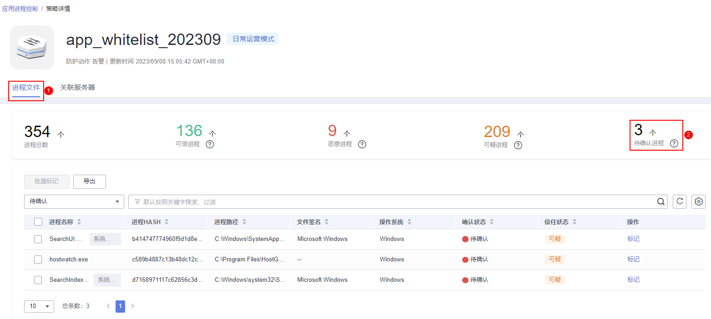

# 确认学习结果

HSS学习完白名单策略关联的服务器后，输出的学习结果中可能存在一些特征不明显的可疑进程需要再次进行确认，您可以手动或设置系统自动将这些可疑进程确认并分类标记为可疑、恶意或可信进程。

学习结果确认方式，在创建白名单策略时可设置：

-   “学习结果确认方式“选择的“自动确认可疑进程“：系统将根据应用进程情报自动对可疑进程进行分类标记。
-   “学习结果确认方式“选择的“手动确认可以进程“：您需要手动对可疑进程进程分类标记。具体操作您可以参考本章节。

## 前提条件

已完成策略创建，且策略状态为“学习完成，未生效“。具体操作请参见[创建白名单策略](创建白名单策略.md)。

## 操作步骤

1.  [登录管理控制台](https://console.huaweicloud.com/?locale=zh-cn)。
2.  在页面左上角选择“区域“，单击，选择“安全与合规 \> 主机安全服务”，进入主机安全平台界面。

    **图 1**  进入主机安全  
    

1.  在左侧导航栏，选择“主动防御  \>  应用进程控制“，进入“应用进程控制“界面。
2.  选择“白名单策略“页签。
3.  单击策略状态为“学习完成，未生效“的策略名称，进入“策略详情“界面。
4.  选择“进程文件“页签。
5.  单击待确认进程数量，查看待确认进程。

    **图 2**  查看待确认进程  
    

1.  根据进程名称和进程文件路径等信息，确认应用进程是否可信。
2.  在已确认进程所在行的操作列，单击“标记“。

    您也可以批量勾选所有应用进程，单击进程列表左上方的“批量标记“，进行批量标记。

3.  在标记弹窗中，选择进程“信任状态“。

    可选择可疑、可信和恶意三种信任状态。

4.  单击确认，完成标记。

