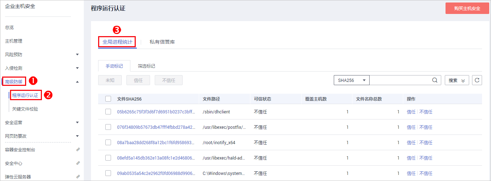
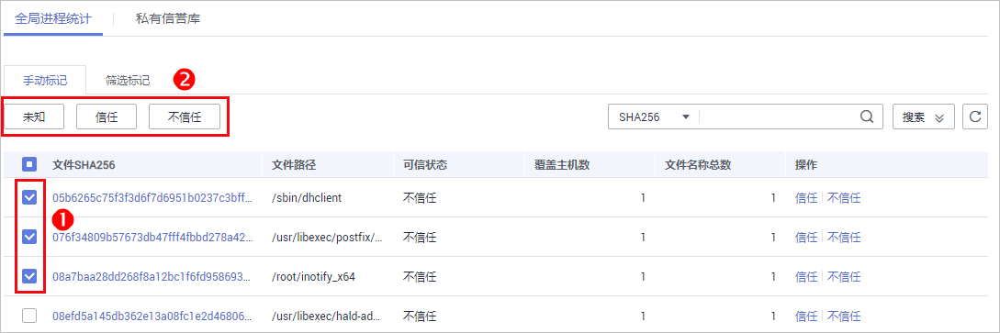
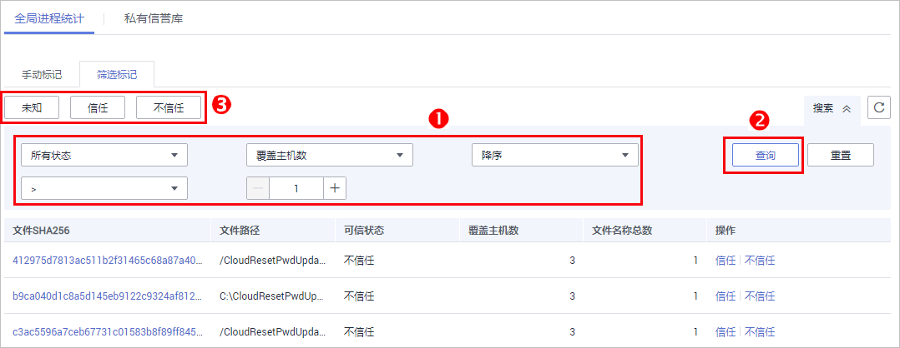

# 程序运行认证

程序运行认证为用户提供全局的进程统计，并为用户云主机提供程序运行认证检测功能，对于非配置的可信程序，进行实时检测，并统计和展现进程状态，保障云主机的安全性。用户还可以建立自己的私有信誉库，全局管控各个主机的运行信息。

用户可以调整进程状态，在“未知“、“可信“和“不信任“三种状态之间可以任意切换。

仅旗舰版支持程序运行认证。

## 应用场景

-   建立可信的应用基线：您可以将华为云ECS固有的应用或者长期稳定运行的应用设置为“信任“，进入私有信誉库。
-   关注增量的应用：创建私有信誉库后，您只需要关注增量的应用，并判断是否可信，来丰富自己的私有信誉库。

    例如：后门、木马、挖矿软件、蠕虫和病毒等恶意程序通常首次寄宿在一台主机上，您可以通过“覆盖主机数< 2“筛选只有一台主机上才有的应用，关注这些应用是否可信，清除首个感染主机的威胁。

## 查看全局进程统计

1.  [登录管理控制台](https://console.huaweicloud.com)。
2.  在页面上方选择区域后，单击，选择“安全  \>  企业主机安全“。

    **图 1**  企业主机安全  
    

3.  进入“程序运行认证“页面，选择“全局进程统计“，如[图2](#f4b44f24e0b3d4c228b8b22f956bcb7a9)所示，列表中的字段说明如[表1](#t151a768dac1e4bd692e70a2d688ee96e)所示。

    **图 2**  全局进程统计  
    

    > **说明：**   
    >-   通过列表上方的查询条件，用户可以筛选符合条件的进程。  
    >-   可以通过“手动标记“和“筛选标记“两种方式对进程进行标记。  

    **表 1**  全局进程列表字段说明

    
    <table><thead align="left"><tr id="rc3dae7a2107e4c3583f06d09611f154f"><th class="cellrowborder" valign="top" width="31.130000000000003%" id="mcps1.2.3.1.1">
字段

    </th>
    <th class="cellrowborder" valign="top" width="68.87%" id="mcps1.2.3.1.2">
说明

    </th>
    </tr>
    </thead>
    <tbody><tr id="rff38a6ab795a409bbd154ee6422f7426"><td class="cellrowborder" valign="top" width="31.130000000000003%" headers="mcps1.2.3.1.1 ">
文件SHA256

    </td>
    <td class="cellrowborder" valign="top" width="68.87%" headers="mcps1.2.3.1.2 ">
进程文件的SHA256值，格式为一组长度为64位的16进制数字。

    
单击进程文件的SHA256值，可以进入“进程详情”页面，查看进程文件的详细信息。

    </td>
    </tr>
    <tr id="row396584151306"><td class="cellrowborder" valign="top" width="31.130000000000003%" headers="mcps1.2.3.1.1 ">
文件路径

    </td>
    <td class="cellrowborder" valign="top" width="68.87%" headers="mcps1.2.3.1.2 ">
进程文件所在路径。

    </td>
    </tr>
    <tr id="r37f182fa1f8c4cf1ac626d5fac0deb33"><td class="cellrowborder" valign="top" width="31.130000000000003%" headers="mcps1.2.3.1.1 ">
可信状态

    </td>
    <td class="cellrowborder" valign="top" width="68.87%" headers="mcps1.2.3.1.2 ">
进程文件的可信状态，包括“信任”、“不信任”、“未知”。

    </td>
    </tr>
    <tr id="r8d7cac2b7ce345f6bb0f7b78e7e4b788"><td class="cellrowborder" valign="top" width="31.130000000000003%" headers="mcps1.2.3.1.1 ">
覆盖主机数

    </td>
    <td class="cellrowborder" valign="top" width="68.87%" headers="mcps1.2.3.1.2 ">
进程文件覆盖的主机数量。

    </td>
    </tr>
    <tr id="r81938b6bdc1f43e5a930d9d72d65083a"><td class="cellrowborder" valign="top" width="31.130000000000003%" headers="mcps1.2.3.1.1 ">
文件名称总数

    </td>
    <td class="cellrowborder" valign="top" width="68.87%" headers="mcps1.2.3.1.2 ">
同一文件，使用的文件名称的数量。

    </td>
    </tr>
    </tbody>
    </table>

## 创建私有信誉库

用户可以通过在“全局进程统计“中标记进程为“未知“、“可信“和“不信任“状态，标记后的进程会进入私有信誉库。若用户在“私有信誉库“中删除已标记的进程，那么该进程就会回到“全局进程统计“列表。

1.  [登录管理控制台](https://console.huaweicloud.com)。
2.  在页面上方选择区域后，单击，选择“安全  \>  企业主机安全“。

    **图 3**  企业主机安全  
    

3.  进入“程序运行认证“页面，单击“全局进程统计“，标记进程，如[图4](#fig145571440163414)所示。

    **图 4**  全局进程统计  
    

    -   手动标记
        1.  选择“手动标记“，选中一个或多个进程文件，单击“未知“、“信任“或“不信任“，如[图5](#fig022017321344)所示。

            **图 5**  手动标记  
            

            > **说明：**   
            >用户也可以在需要进行处理的进程文件所在行的“操作“列，单击“未知“、“信任“或“不信任“，对单个进程进行相应处理。  

        2.  在弹出的对话框中，确认操作信息无误后，单击“确定“。

    -   筛选标记
        1.  选择“筛选标记“，设置列表上方的筛选条件，单击“查询“，查询符合条件的进程，如[图6](#fig52224329342)所示。

            **图 6**  筛选标记  
            

        2.  单击“未知“、“信任“或“不信任“，对筛选结果进行批量标记。
        3.  在弹出的对话框中，确认操作信息无误后，单击“确定“。

4.  单击“私有信誉库“，查看已标记的进程，若已标记的进程均可在私有信誉库中查找到，则说明私有信誉库创建成功。

    **图 7**  私有信誉库列表  
    

    > **说明：**   
    >-   用户可在列表右上角单击，手动刷新当前列表。  
    >-   用户可以通过“所有状态“下拉框筛选符合条件的进程。  

    **表 2**  私有信誉库列表字段说明

    
    <table><thead align="left"><tr id="row0223153293415"><th class="cellrowborder" valign="top" width="27.01%" id="mcps1.2.3.1.1">
字段

    </th>
    <th class="cellrowborder" valign="top" width="72.99%" id="mcps1.2.3.1.2">
说明

    </th>
    </tr>
    </thead>
    <tbody><tr id="row12231432153418"><td class="cellrowborder" valign="top" width="27.01%" headers="mcps1.2.3.1.1 ">
进程路径

    </td>
    <td class="cellrowborder" valign="top" width="72.99%" headers="mcps1.2.3.1.2 ">
进程文件所在路径。

    </td>
    </tr>
    <tr id="row12231432163415"><td class="cellrowborder" valign="top" width="27.01%" headers="mcps1.2.3.1.1 ">
可信状态

    </td>
    <td class="cellrowborder" valign="top" width="72.99%" headers="mcps1.2.3.1.2 ">
进程文件的可信状态，包括“信任”、“不信任”、“未知”。

    </td>
    </tr>
    <tr id="row172241332143417"><td class="cellrowborder" valign="top" width="27.01%" headers="mcps1.2.3.1.1 ">
标记来源

    </td>
    <td class="cellrowborder" valign="top" width="72.99%" headers="mcps1.2.3.1.2 ">
有“手动标记”、“筛选标记”和“自动添加”三种来源。

    <ul id="ul436212917219"><li>手动标记：在“全局进程统计”中，选择指定进程进行标记，添加到私有信誉库。</li><li>筛选标记：在“全局进程统计”中，通过设置筛选条件，查询符合条件的进程进行标记，添加到私有信誉库。</li><li>自动添加：Agent在上报云主机已存在的进程时，会自动匹配系统中的白哈希库。<ul id="ul16585211201919"><li>若已存在的进程在白哈希库中，则被判定为“信任”，自动添加到私有信誉库。</li><li>若已存在的进程不在白哈希库中，则添加到“全局进程统计”里。</li></ul>
    </li></ul>
    </td>
    </tr>
    <tr id="row1422463233415"><td class="cellrowborder" valign="top" width="27.01%" headers="mcps1.2.3.1.1 ">
文件大小

    </td>
    <td class="cellrowborder" valign="top" width="72.99%" headers="mcps1.2.3.1.2 ">
进程文件的大小。

    </td>
    </tr>
    <tr id="row18224163214342"><td class="cellrowborder" valign="top" width="27.01%" headers="mcps1.2.3.1.1 ">
哈希值

    </td>
    <td class="cellrowborder" valign="top" width="72.99%" headers="mcps1.2.3.1.2 ">
进程文件的SHA256值，格式为一组长度为64位的16进制数字。

    </td>
    </tr>
    <tr id="row22241432203419"><td class="cellrowborder" valign="top" width="27.01%" headers="mcps1.2.3.1.1 ">
文件创建时间

    </td>
    <td class="cellrowborder" valign="top" width="72.99%" headers="mcps1.2.3.1.2 ">
进程文件创建的时间。

    </td>
    </tr>
    <tr id="row722417324344"><td class="cellrowborder" valign="top" width="27.01%" headers="mcps1.2.3.1.1 ">
文件最后修改时间

    </td>
    <td class="cellrowborder" valign="top" width="72.99%" headers="mcps1.2.3.1.2 ">
进程文件最后被修改的时间。

    </td>
    </tr>
    <tr id="row102241132133420"><td class="cellrowborder" valign="top" width="27.01%" headers="mcps1.2.3.1.1 ">
设置时间

    </td>
    <td class="cellrowborder" valign="top" width="72.99%" headers="mcps1.2.3.1.2 ">
进程文件状态的设置时间。

    </td>
    </tr>
    </tbody>
    </table>

## 相关操作

-   您可以在“全局进程统计“页签下，单击“搜索“，输入“文件SHA256“、“文件路径“，在“所有状态“下拉列表中选择进程的可信状态，查询进程。
-   您可以在需要进行处理的进程文件所在行的“操作“列，单击“信任“或者“不信任“，对单个进程进行相应处理。
-   您可以通过在“私有信誉库“页签，勾选指定进程，单击“删除“，将该进程文件从私有信誉库中删除，删除之后在“全局进程统计“列表中，该进程文件的“可信状态“将调整为公共信誉库中建议的可信状态。

