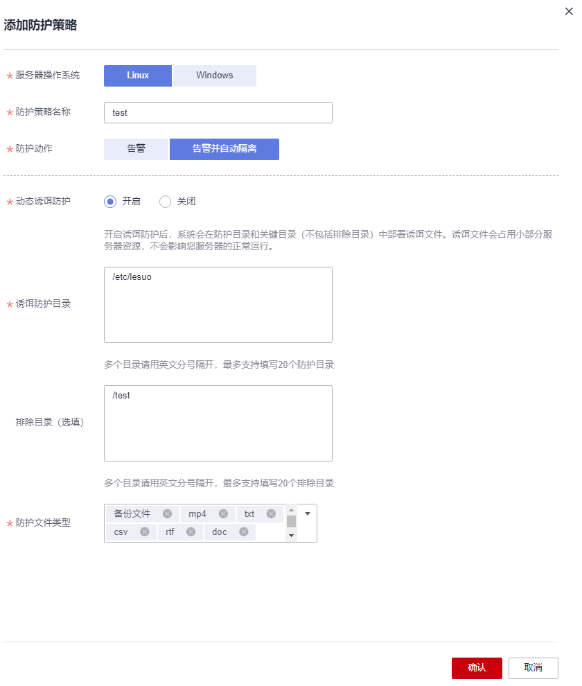

# 管理勒索病毒防护策略

如果系统预置的勒索病毒防护策略不满足您的防护需求，您可以为服务器切换防护策略，或者新建、修改勒索病毒防护策略。

## 约束限制

仅旗舰版、网页防篡改版、容器版支持勒索病毒防护功能。

## 新建防护策略

1.  [登录管理控制台](https://console.huaweicloud.com/?locale=zh-cn)。
2.  在页面左上角选择“区域“，单击，选择“安全与合规 \> 主机安全服务”，进入主机安全平台界面。

    **图 1**  进入主机安全  
    

3.  选择“主动防御  \>  勒索病毒防护 “，进入“勒索病毒防护“界面。

    > **说明：** 
    >如果您的服务器已通过企业项目的模式进行管理，您可选择目标“企业项目“后查看或操作目标企业项目内的资产和检测信息。

4.  选择“防护策略“页签，单击“添加防护策略“。
5.  设置防护策略参数，相关参数说明请参见[表 防护策略参数说明](#table1358122914521)。

    **图 2**  设置防护策略参数  
    

    **表 1**  防护策略参数说明

    
    <table><thead align="left"><tr id="row85811429155213"><th class="cellrowborder" valign="top" width="20.612061206120615%" id="mcps1.2.4.1.1">
参数名称

    </th>
    <th class="cellrowborder" valign="top" width="50.94509450945094%" id="mcps1.2.4.1.2">
参数说明

    </th>
    <th class="cellrowborder" valign="top" width="28.442844284428443%" id="mcps1.2.4.1.3">
取值样例

    </th>
    </tr>
    </thead>
    <tbody><tr id="row1431215405217"><td class="cellrowborder" valign="top" width="20.612061206120615%" headers="mcps1.2.4.1.1 ">
服务器操作系统

    </td>
    <td class="cellrowborder" valign="top" width="50.94509450945094%" headers="mcps1.2.4.1.2 ">
选择服务器操作系统类型。

    </td>
    <td class="cellrowborder" valign="top" width="28.442844284428443%" headers="mcps1.2.4.1.3 ">
Linux

    </td>
    </tr>
    <tr id="row169717121165"><td class="cellrowborder" valign="top" width="20.612061206120615%" headers="mcps1.2.4.1.1 ">
防护策略名称

    </td>
    <td class="cellrowborder" valign="top" width="50.94509450945094%" headers="mcps1.2.4.1.2 ">
设置防护策略的名称。

    </td>
    <td class="cellrowborder" valign="top" width="28.442844284428443%" headers="mcps1.2.4.1.3 ">
test

    </td>
    </tr>
    <tr id="row552355220615"><td class="cellrowborder" valign="top" width="20.612061206120615%" headers="mcps1.2.4.1.1 ">
防护动作

    </td>
    <td class="cellrowborder" valign="top" width="50.94509450945094%" headers="mcps1.2.4.1.2 ">
发现勒索病毒事件后的处理方式。

    <ul id="ul13498125347"><li>告警并自动隔离</li><li>告警</li></ul>
    </td>
    <td class="cellrowborder" valign="top" width="28.442844284428443%" headers="mcps1.2.4.1.3 ">
告警并自动隔离

    </td>
    </tr>
    <tr id="row4236290138"><td class="cellrowborder" valign="top" width="20.612061206120615%" headers="mcps1.2.4.1.1 ">
动态诱饵防护

    </td>
    <td class="cellrowborder" valign="top" width="50.94509450945094%" headers="mcps1.2.4.1.2 ">
开启诱饵防护后，系统会在防护目录和关键目录（不包括排除目录）中部署诱饵文件。诱饵文件会占用小部分服务器资源，不会影响您的服务器正常运行。

    
 说明： 

当前仅Linux系统支持动态生成和部署诱饵文件，Windows系统仅支持静态部署诱饵文件。

    

    </td>
    <td class="cellrowborder" valign="top" width="28.442844284428443%" headers="mcps1.2.4.1.3 ">
开启

    </td>
    </tr>
    <tr id="row596031111145"><td class="cellrowborder" valign="top" width="20.612061206120615%" headers="mcps1.2.4.1.1 ">
诱饵防护目录

    </td>
    <td class="cellrowborder" valign="top" width="50.94509450945094%" headers="mcps1.2.4.1.2 ">
被防护的目录（不包括子目录），建议配置为重要业务目录或数据目录。

    
多个目录请用英文分号隔开，最多支持填写20个防护目录。

    
Linux系统必填，Windows系统可选填。

    </td>
    <td class="cellrowborder" valign="top" width="28.442844284428443%" headers="mcps1.2.4.1.3 ">
Linux：/etc/lesuo

    
Windows：C:\Test

    </td>
    </tr>
    <tr id="row83172218147"><td class="cellrowborder" valign="top" width="20.612061206120615%" headers="mcps1.2.4.1.1 ">
排除目录（选填）

    </td>
    <td class="cellrowborder" valign="top" width="50.94509450945094%" headers="mcps1.2.4.1.2 ">
不进行部署诱饵文件的目录。

    
多个目录请用英文分号隔开，最多支持填写20个排除目录。

    </td>
    <td class="cellrowborder" valign="top" width="28.442844284428443%" headers="mcps1.2.4.1.3 ">
Linux：/test

    
Windows：C:\ProData

    </td>
    </tr>
    <tr id="row5275193521413"><td class="cellrowborder" valign="top" width="20.612061206120615%" headers="mcps1.2.4.1.1 ">
防护文件类型

    </td>
    <td class="cellrowborder" valign="top" width="50.94509450945094%" headers="mcps1.2.4.1.2 ">
被防护的服务器文件类型或格式，自定义勾选即可。

    
涵盖数据库、容器、代码、证书密匙、备份等9大文件类型，共70+种文件格式。

    
仅Linux系统时，需要设置此项。

    </td>
    <td class="cellrowborder" valign="top" width="28.442844284428443%" headers="mcps1.2.4.1.3 ">
全选

    </td>
    </tr>
    <tr id="row19464112901514"><td class="cellrowborder" valign="top" width="20.612061206120615%" headers="mcps1.2.4.1.1 ">
进程白名单（选填）

    </td>
    <td class="cellrowborder" valign="top" width="50.94509450945094%" headers="mcps1.2.4.1.2 ">
添加自动忽略检测的进程文件路径，可在告警中获取。

    
仅Windows系统，需要设置此项。

    </td>
    <td class="cellrowborder" valign="top" width="28.442844284428443%" headers="mcps1.2.4.1.3 ">
-

    </td>
    </tr>
    </tbody>
    </table>

6.  单击“确认“，添加完成。

## 切换防护策略

如果服务器当前的防护策略不满足您的防护需求，您可以为服务器切换防护策略。

1.  选择防护服务器页签。
2.  选中目标服务器，并在服务器列表上方单击“切换防护策略“。
3.  在“切换防护策略“弹窗中，选择防护策略。
4.  单击“确认“，完成切换。

## 修改防护策略

1.  登录管理控制台，进入主机安全服务界面。
2.  选择“主动防御  \>  勒索病毒防护  \>  防护策略 “。
3.  单击目标防护策略操作列的“编辑“，弹出防护策略编辑页面，对策略信息编辑，参数说明如[表2](#table1194918551568)所示。

    以下以Linux为例。您也可以在“防护服务器“页面，单击服务器关联的防护策略名称，编辑防护策略。

    **表 2**  防护策略参数说明

    
    <table><thead align="left"><tr id="hss_01_0349_row85811429155213"><th class="cellrowborder" valign="top" width="20.612061206120615%" id="mcps1.2.4.1.1">
参数名称

    </th>
    <th class="cellrowborder" valign="top" width="50.94509450945094%" id="mcps1.2.4.1.2">
参数说明

    </th>
    <th class="cellrowborder" valign="top" width="28.442844284428443%" id="mcps1.2.4.1.3">
取值样例

    </th>
    </tr>
    </thead>
    <tbody><tr id="hss_01_0349_row1431215405217"><td class="cellrowborder" valign="top" width="20.612061206120615%" headers="mcps1.2.4.1.1 ">
服务器操作系统

    </td>
    <td class="cellrowborder" valign="top" width="50.94509450945094%" headers="mcps1.2.4.1.2 ">
选择服务器操作系统类型。

    </td>
    <td class="cellrowborder" valign="top" width="28.442844284428443%" headers="mcps1.2.4.1.3 ">
Linux

    </td>
    </tr>
    <tr id="hss_01_0349_row169717121165"><td class="cellrowborder" valign="top" width="20.612061206120615%" headers="mcps1.2.4.1.1 ">
防护策略名称

    </td>
    <td class="cellrowborder" valign="top" width="50.94509450945094%" headers="mcps1.2.4.1.2 ">
设置防护策略的名称。

    </td>
    <td class="cellrowborder" valign="top" width="28.442844284428443%" headers="mcps1.2.4.1.3 ">
test

    </td>
    </tr>
    <tr id="hss_01_0349_row552355220615"><td class="cellrowborder" valign="top" width="20.612061206120615%" headers="mcps1.2.4.1.1 ">
防护动作

    </td>
    <td class="cellrowborder" valign="top" width="50.94509450945094%" headers="mcps1.2.4.1.2 ">
发现勒索病毒事件后的处理方式。

    <ul id="hss_01_0349_ul13498125347"><li>告警并自动隔离</li><li>告警</li></ul>
    </td>
    <td class="cellrowborder" valign="top" width="28.442844284428443%" headers="mcps1.2.4.1.3 ">
告警并自动隔离

    </td>
    </tr>
    <tr id="hss_01_0349_row4236290138"><td class="cellrowborder" valign="top" width="20.612061206120615%" headers="mcps1.2.4.1.1 ">
动态诱饵防护

    </td>
    <td class="cellrowborder" valign="top" width="50.94509450945094%" headers="mcps1.2.4.1.2 ">
开启诱饵防护后，系统会在防护目录和关键目录（不包括排除目录）中部署诱饵文件。诱饵文件会占用小部分服务器资源，不会影响您的服务器正常运行。

    
 说明： 

当前仅Linux系统支持动态生成和部署诱饵文件，Windows系统仅支持静态部署诱饵文件。

    

    </td>
    <td class="cellrowborder" valign="top" width="28.442844284428443%" headers="mcps1.2.4.1.3 ">
开启

    </td>
    </tr>
    <tr id="hss_01_0349_row596031111145"><td class="cellrowborder" valign="top" width="20.612061206120615%" headers="mcps1.2.4.1.1 ">
诱饵防护目录

    </td>
    <td class="cellrowborder" valign="top" width="50.94509450945094%" headers="mcps1.2.4.1.2 ">
被防护的目录（不包括子目录），建议配置为重要业务目录或数据目录。

    
多个目录请用英文分号隔开，最多支持填写20个防护目录。

    
Linux系统必填，Windows系统可选填。

    </td>
    <td class="cellrowborder" valign="top" width="28.442844284428443%" headers="mcps1.2.4.1.3 ">
Linux：/etc/lesuo

    
Windows：C:\Test

    </td>
    </tr>
    <tr id="hss_01_0349_row83172218147"><td class="cellrowborder" valign="top" width="20.612061206120615%" headers="mcps1.2.4.1.1 ">
排除目录（选填）

    </td>
    <td class="cellrowborder" valign="top" width="50.94509450945094%" headers="mcps1.2.4.1.2 ">
不进行部署诱饵文件的目录。

    
多个目录请用英文分号隔开，最多支持填写20个排除目录。

    </td>
    <td class="cellrowborder" valign="top" width="28.442844284428443%" headers="mcps1.2.4.1.3 ">
Linux：/test

    
Windows：C:\ProData

    </td>
    </tr>
    <tr id="hss_01_0349_row5275193521413"><td class="cellrowborder" valign="top" width="20.612061206120615%" headers="mcps1.2.4.1.1 ">
防护文件类型

    </td>
    <td class="cellrowborder" valign="top" width="50.94509450945094%" headers="mcps1.2.4.1.2 ">
被防护的服务器文件类型或格式，自定义勾选即可。

    
涵盖数据库、容器、代码、证书密匙、备份等9大文件类型，共70+种文件格式。

    
仅Linux系统时，需要设置此项。

    </td>
    <td class="cellrowborder" valign="top" width="28.442844284428443%" headers="mcps1.2.4.1.3 ">
全选

    </td>
    </tr>
    <tr id="hss_01_0349_row19464112901514"><td class="cellrowborder" valign="top" width="20.612061206120615%" headers="mcps1.2.4.1.1 ">
进程白名单（选填）

    </td>
    <td class="cellrowborder" valign="top" width="50.94509450945094%" headers="mcps1.2.4.1.2 ">
添加自动忽略检测的进程文件路径，可在告警中获取。

    
仅Windows系统，需要设置此项。

    </td>
    <td class="cellrowborder" valign="top" width="28.442844284428443%" headers="mcps1.2.4.1.3 ">
-

    </td>
    </tr>
    </tbody>
    </table>

4.  确认信息无误，单击“确认“，完成防护策略修改。

## 删除防护策略

1.  登录管理控制台，进入主机安全服务界面。
2.  选择“主动防御  \>  勒索病毒防护  \>  防护策略 “。
3.  单击目标策略“操作“列的“删除“。

    > **说明：** 
    >删除策略后，关联的服务器将不再被防护，风险系数将会升高，建议删除策略前将目标策略关联的服务器绑定其他策略开启防护。

4.  在弹窗确认正在删除的策略信息，确认无误，单击“确认“，完成删除。

