# 管理所有项目

如果您已开通企业项目，您可以在“所有项目“中，对您拥有的所有主机进行批量安全配置，可避免您到每个企业项目中对主机进行重复配置。

-   绑定主机配额

    在“所有项目“中，任意一个企业项目中的配额绑定给任意一个企业项目中的主机，实现配额共享使用，但计费仍归属于配额所在企业项目。

-   批量安全配置

    对所有主机进行安全配置，包含告警白名单、登录白名单、恶意程序自动隔离查杀和告警通知等。

-   部署策略组

    “所有项目“中的策略组，可以部署给您所在的任意企业项目中的任意一台开启旗舰版防护的主机。

    “所有项目“中的策略组独立于其他每一个企业项目的策略组，与其他企业项目的策略组互不干扰。

-   订阅所有项目安全报告

    “所有项目“的安全报告独立于其他每一个企业项目的安全报告，订阅设置与报告内容互不干扰。

在“所有项目“中进行批量配置后，若对其中某一个企业项目中的安全配置有差异化需求，您可以到具体的企业项目中进行单独配置。在某个企业项目中的差异化配置是独立的，对其他企业项目不产生影响。

## 前提条件

拥有Tenant Administrator权限，或者HSS Administrator+Tenant Guest权限。

## 绑定主机配额

如下以“在“所有项目“中为任意一个企业项目的主机绑定“主机安全旗舰版配额“”为例说明。

1.  [登录管理控制台](https://console.huaweicloud.com)。
2.  在页面左上角选择“区域“，单击，选择“安全  \>  企业主机安全“，进入企业主机安全页面。

    **图 1**  企业主机安全  
    

3.  选择“主机管理  \>  所有项目  \>  防护配额“，进入“防护配额“页面，在防护配额页面，您可以查看到所有项目的防护配额，如[图2](#fig36122416202)所示。

    **图 2**  防护配额页面  
    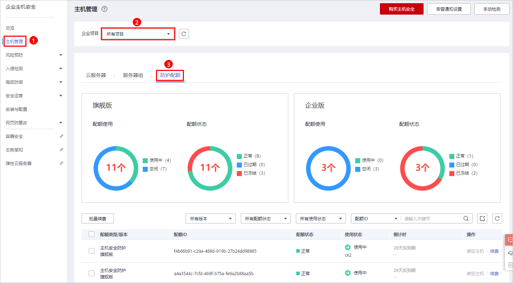

4.  在配额列表中，选择“使用状态“为“空闲“的配额，单击“绑定主机“，为主机绑定配额。

    **图 3**  为主机绑定配额  
    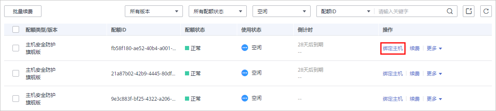

5.  在弹出的配额详情对话框中，选择待绑定配额的主机。

    **图 4**  绑定配额  
    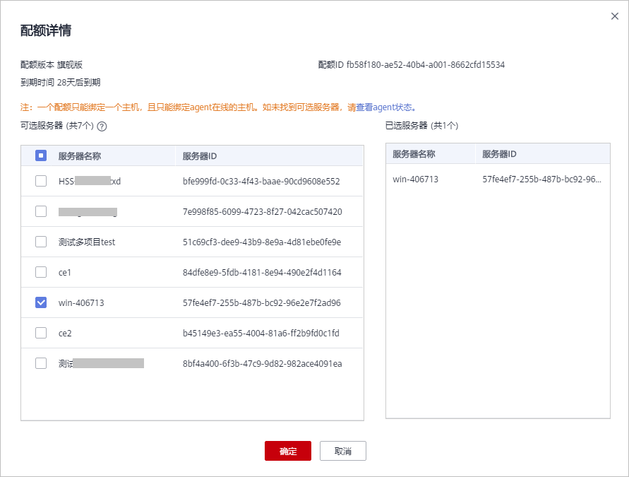

6.  单击“确定“，完成配额绑定。绑定配额后，您可以在云服务器列表中，查看到该主机已开启防护。

## 批量安全配置

“所有项目“仅作为用户对每一个企业项目进行批量配置使用，不作为实际生效的配置，实际生效的配置仍以各自所属企业项目中显示的配置为准。

> **须知：** 
>在“所有项目“中可以进行批量配置操作的包含：告警白名单、登录白名单、恶意程序自动隔离查杀和告警通知。

如下以“配置告警白名单“为例说明，“企业项目一“中无告警白名单，“企业项目二“中无告警白名单。

1.  选择“入侵检测  \>  事件管理“，进入事件管理页面。

    **图 5**  事件管理页面  
    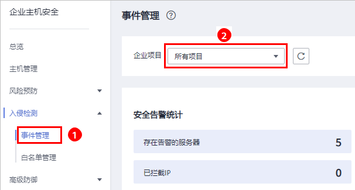

2.  在“企业项目“下拉列表中，选择“所有项目“。
3.  在告警事件列表中，以“恶意程序（云查杀）“为例，将“恶意程序（云查杀）“加入告警白名单，如[图6](#fig17753132013405)所示。

    **图 6**  加入告警白名单  
    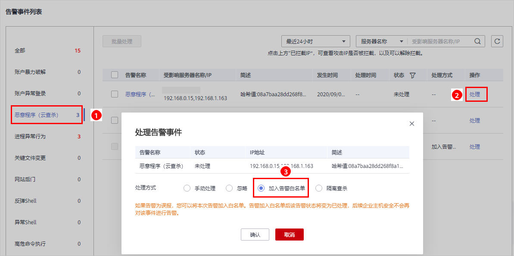

4.  选择“白名单管理  \>  所有项目  \>  告警白名单“，进入告警白名单页面。

    **图 7**  告警白名单页面  
    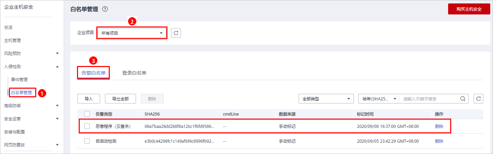

5.  在“企业项目“下拉列表中，分别选择“企业项目一“和“企业项目二“，查看“恶意程序（云查杀）“均已分别添加到“企业项目一“和“企业项目二“下的告警白名单中。

    **图 8**  企业项目一告警白名单  
    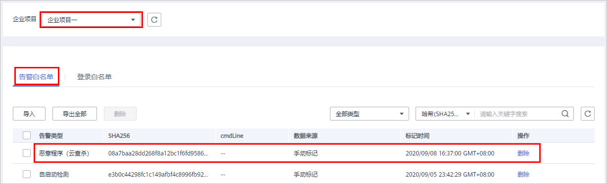

6.  若“企业项目二“中需要HSS对添加的“恶意程序（云查杀）“事件进行告警，您可以在“企业项目二“中将添加的告警白名单删除。

    “企业项目二“中的告警白名单删除后，对企业项目一中的已添加的告警白名单不产生影响。

## 部署策略组

“所有项目“中的策略组，可以部署给您所在的任意企业项目中的任意一台开启旗舰版防护的主机。

以“在“所有项目”中创建策略组“hss\_test”，将创建的策略组部署给任意一台开启旗舰版防护的主机“为例说明。

1.  选择“安全运营  \>  策略管理  \>  所有项目“，单击“复制“，在所有项目中，创建策略组。

    **图 9**  复制默认策略组  
    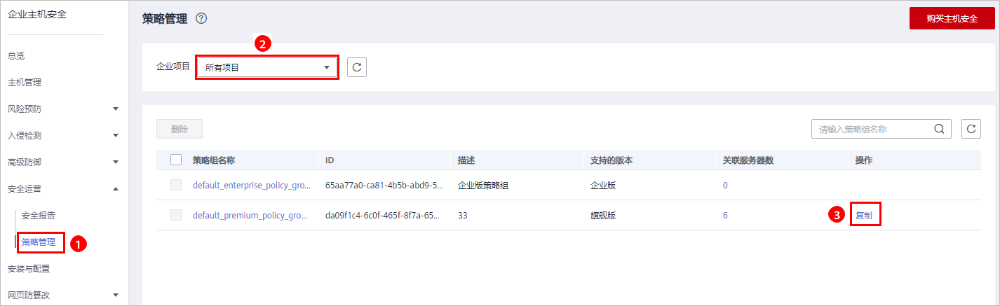

2.  在弹出的窗口中，输入策略组名称，例如“hss\_test“，如[图10](#fig1171512429585)所示。

    **图 10**  配置策略组  
    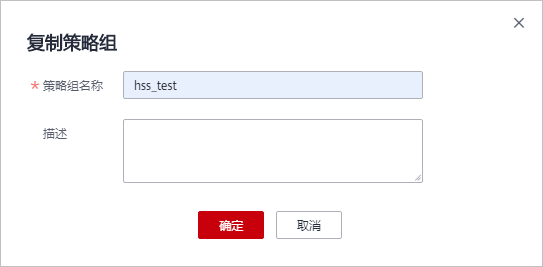

3.  单击“确定“，完成策略组的创建。

    您可以根据您的需要单击策略组的名称，配置策略组。

4.  选择“主机管理  \>  所有项目“，选择任意一台开启旗舰版防护的主机，单击“部署策略“，为主机部署创建的“hss\_test“策略组。

    **图 11**  部署自定义策略  
    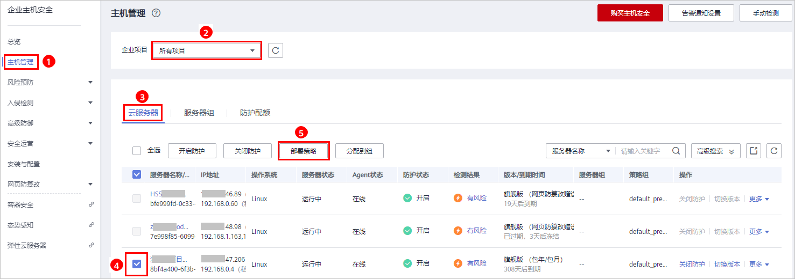

5.  在弹出的窗口中，选择策略组，如[图12](#fig925122517381)所示。

    **图 12**  选择待部署的策略组  
    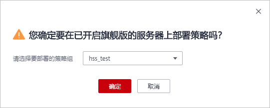

6.  单击“确定“，完成策略组的部署。

## 订阅所有项目的安全报告

选择“安全报告  \>  所有项目“，勾选“周报“、“月报“，订阅周报和月报。

**图 13**  订阅所有项目安全报告  
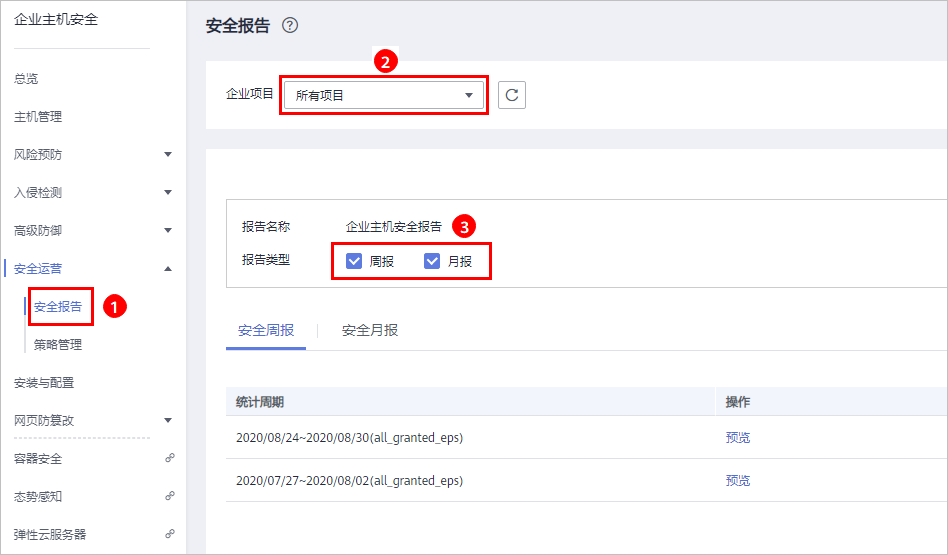

