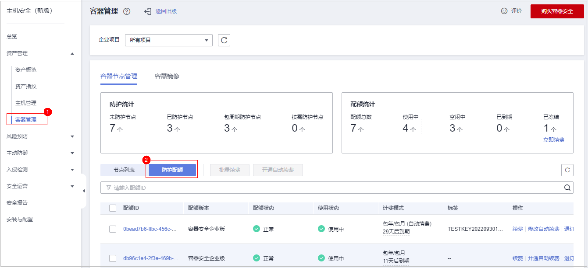

# 管理所有项目

如果您已开通企业项目，您可以在“所有项目“中，对您拥有的所有主机进行批量安全配置，可避免您到每个企业项目中对主机进行重复配置。

-   绑定主机配额

    在“所有项目“中，任意一个企业项目中的配额绑定给任意一个企业项目中的主机，实现配额共享使用，但计费仍归属于配额所在企业项目。

-   批量安全配置

    对所有主机进行安全配置，包含告警白名单、登录白名单、恶意程序自动隔离查杀和告警通知等。

-   部署策略组

    “所有项目“中的策略组，可以部署给您所在的任意企业项目中的任意一台开启旗舰版防护的主机。

    “所有项目“中的策略组独立于其他每一个企业项目的策略组，与其他企业项目的策略组互不干扰。

-   订阅所有项目安全报告

    “所有项目“的安全报告独立于其他每一个企业项目的安全报告，订阅设置与报告内容互不干扰。

在“所有项目“中进行批量配置后，若对其中某一个企业项目中的安全配置有差异化需求，您可以到具体的企业项目中进行单独配置。在某个企业项目中的差异化配置是独立的，对其他企业项目不产生影响。

## 前提条件

拥有Tenant Administrator权限，或者HSS Administrator+Tenant Guest权限。

## 绑定主机配额

如下，以在“所有项目“中为任意一个企业项目的主机绑定“主机安全服务网页防篡改版配额”为例说明。

1.  [登录管理控制台](https://console.huaweicloud.com)。
2.  在页面左上角选择“区域“，单击，选择“安全与合规 \> 主机安全服务”，进入主机安全服务页面。

    **图 1**  主机安全服务  
    

3.  选择“资产管理  \>  主机管理  \>  防护配额“，进入“防护配额“页面，在防护配额页面，您可以查看主机防护的防护配额，如[图2](#zh-cn_topic_0274634590_fig36122416202)所示。

    **图 2**  主机防护配额页面  
    

4.  在配额列表中，选择“使用状态“为“空闲“的配额，单击“绑定主机“，为主机绑定配额。

    **图 3**  将配额绑定至主机  
    

5.  在弹出的配额详情对话框中，选择待绑定配额的主机。

    **图 4**  选择主机  
    

6.  单击“确定“，完成配额绑定。绑定配额后，您可以在云服务器列表中，查看到该主机已开启防护。

## 绑定容器配额

如下，以在“所有项目“中为任意一个企业项目的节点绑定“容器版配额“为例说明。

1.  [登录管理控制台](https://console.huaweicloud.com)。
2.  在页面左上角选择“区域“，单击，选择“安全与合规 \> 主机安全服务”，进入主机安全服务页面。

    **图 5**  主机安全服务  
    

3.  选择“资产管理  \>  容器管理  \>  防护配额“，进入“防护配额“页面，在防护配额页面，您可以查看容器防护的防护配额，如[图6](#fig323474710512)所示。

    **图 6**  容器防护配额页面  
    

4.  在配额列表中，查看“使用状态“为“空闲“的配额，即可以绑定主机的配额单。
5.  选择“节点列表“页签，在目标“未防护“的服务器“操作“列单击“开启防护“。

    > **说明：** 
    >开启防护的主机“服务器状态“须为“正常“，“Agent状态“须为“在线“。

    **图 7**  为服务器绑定容器配额  
    

6.  在弹出的配额详情对话框中，选择待绑定配额的主机。

    在“您确定要对以下集群开启防护吗？“对话框中，“计费模式“选择“包年/包月“，阅读并确认“《容器安全服务免责声明》“。

    **图 8**  开启包周期节点防护  
    

    “防护配额“分配方式：

    -   随机分配：下拉框选择“随机选择配额“，系统优先为主机分发服务剩余时间较长的配额。
    -   指定分配：下拉框选择具体配额ID，您可以为主机分配指定的配额。

7.  单击“确定“，完成配额绑定。绑定配额后，您可以在云服务器列表中，查看到该主机已开启防护。

