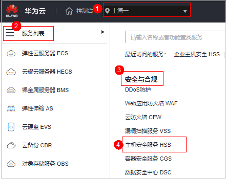
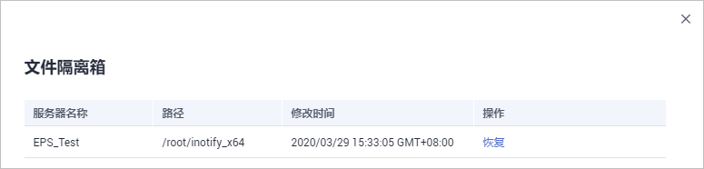

# 管理文件隔离箱

主机安全服务可对检测到的威胁文件进行隔离处理，被成功隔离的文件会添加到“主机安全告警“的“文件隔离箱“中，无法对主机造成威胁。被成功隔离的文件一直保留在文件隔离箱中，您也可以根据自己的需要进行一键恢复。

对应告警事件支持隔离查杀的情况详情请参见[主机安全告警事件概述](主机安全告警事件概述.md)。

## 约束限制

未开启防护不支持告警事件相关操作。

## 隔离查杀操作

1.  [登录管理控制台](https://console.huaweicloud.com/?locale=zh-cn)。
2.  在页面左上角选择“区域“，单击，选择“安全与合规 \> 主机安全服务”，进入主机安全平台界面。

    **图 1**  进入主机安全  
    

3.  在左侧导航栏中，单击“入侵检测  \>  安全告警事件  \>  主机安全告警“，进入“主机安全告警“页面。

    > **说明：** 
    >如果您的服务器已通过企业项目的模式进行管理，您可选择目标“企业项目“后查看或操作目标企业项目内的资产和检测信息。

    **表 1**  安全告警统计说明

    
    <table><thead align="left"><tr id="hss_01_0026_row75072811434"><th class="cellrowborder" valign="top" width="17.150000000000002%" id="mcps1.2.3.1.1">
参数名称

    </th>
    <th class="cellrowborder" valign="top" width="82.85%" id="mcps1.2.3.1.2">
告警事件状态说明

    </th>
    </tr>
    </thead>
    <tbody><tr id="hss_01_0026_row2050528194316"><td class="cellrowborder" valign="top" width="17.150000000000002%" headers="mcps1.2.3.1.1 ">
企业项目

    </td>
    <td class="cellrowborder" valign="top" width="82.85%" headers="mcps1.2.3.1.2 ">
自定义选择企业项目，按照企业项目的维度查看告警详情。

    </td>
    </tr>
    <tr id="hss_01_0026_row1650152810431"><td class="cellrowborder" valign="top" width="17.150000000000002%" headers="mcps1.2.3.1.1 ">
时间范围

    </td>
    <td class="cellrowborder" valign="top" width="82.85%" headers="mcps1.2.3.1.2 ">
支持选择固定周期，支持自定义查询告警的时间范围，自定义只能选择30天范围内的查询。

    
固定周期可选择如下：

    <ul id="hss_01_0026_ul950328154311"><li>最近24小时</li><li>最近3天</li><li>最近7天</li><li>最近30天</li></ul>
    </td>
    </tr>
    <tr id="hss_01_0026_row1394317172210"><td class="cellrowborder" valign="top" width="17.150000000000002%" headers="mcps1.2.3.1.1 ">
需紧急处理告警

    </td>
    <td class="cellrowborder" valign="top" width="82.85%" headers="mcps1.2.3.1.2 ">
展示需紧急处理告警的数量。

    </td>
    </tr>
    <tr id="hss_01_0026_row820367202319"><td class="cellrowborder" valign="top" width="17.150000000000002%" headers="mcps1.2.3.1.1 ">
告警总数

    </td>
    <td class="cellrowborder" valign="top" width="82.85%" headers="mcps1.2.3.1.2 ">
展示资产中存在的所有告警数量。

    </td>
    </tr>
    <tr id="hss_01_0026_row1051112810434"><td class="cellrowborder" valign="top" width="17.150000000000002%" headers="mcps1.2.3.1.1 ">
存在告警的服务器

    </td>
    <td class="cellrowborder" valign="top" width="82.85%" headers="mcps1.2.3.1.2 ">
展示存在告警的服务器数量。

    
当查看“最近24小时”存在告警情况时，您可以单击存在告警的服务器数值，跳转到“主机管理”界面查看相应的服务器列表。

    </td>
    </tr>
    <tr id="hss_01_0026_row0518283434"><td class="cellrowborder" valign="top" width="17.150000000000002%" headers="mcps1.2.3.1.1 ">
已处理告警事件

    </td>
    <td class="cellrowborder" valign="top" width="82.85%" headers="mcps1.2.3.1.2 ">
展示您资产中所有已处理的告警事件数量。

    </td>
    </tr>
    <tr id="hss_01_0026_row251628114310"><td class="cellrowborder" valign="top" width="17.150000000000002%" headers="mcps1.2.3.1.1 ">
已拦截IP

    </td>
    <td class="cellrowborder" valign="top" width="82.85%" headers="mcps1.2.3.1.2 ">
展示已拦截的IP。单击“已拦截IP”，可查看已拦截的IP地址列表。

    
已拦截IP列表展示“服务器名称”、“攻击源IP”、“登录类型”、“拦截状态”、“拦截次数”、“开始拦截时间”、“最近拦截时间”。

    
如果您发现有合法IP被误封禁（比如运维人员因为记错密码，多次输错密码导致被封禁），可以手工解除拦截。如果发现某个主机被频繁攻击，需要引起重视，建议及时修补漏洞，处理风险项。

    
 须知： 
<ul id="hss_01_0026_ul1052152816435"><li>解除被拦截的IP后，主机将不会再拦截该IP地址对主机执行的操作。</li><li>每种软件最多拦截10000个ip。
如果您的linux主机不支持ipset，mysql和vsftp最多拦截50个ip。

    
如果您的linux主机既不支持ipset不支持hosts.deny，ssh最多拦截50个ip。

    </li></ul>
    

    </td>
    </tr>
    <tr id="hss_01_0026_row75272894316"><td class="cellrowborder" valign="top" width="17.150000000000002%" headers="mcps1.2.3.1.1 ">
已隔离文件

    </td>
    <td class="cellrowborder" valign="top" width="82.85%" headers="mcps1.2.3.1.2 ">
主机安全可对检测到的威胁文件进行隔离处理，被成功隔离的文件会添加到“主机安全告警”的“文件隔离箱”中。

    
被成功隔离的文件一直保留在文件隔离箱中，您可以根据自己的需要进行一键恢复处理，关于文件隔离箱的详细信息，请参见<a href="管理文件隔离箱.md">管理文件隔离箱</a>。

    </td>
    </tr>
    </tbody>
    </table>

4.  单击支持隔离查杀的告警事件“操作“列的“处理“，选择“隔离查杀“。

    > **说明：** 
    >对应告警事件支持隔离查杀的情况详情请参见[主机安全告警事件概述](主机安全告警事件概述.md)。

5.  单击“确认“，对目标告警事件进行隔离查杀。

    被成功隔离的文件会添加到“主机安全告警“的“文件隔离箱“中，无法对主机造成威胁。

## 查看文件隔离箱

1.  在“主机安全告警“页面的“安全告警统计“中，单击“已隔离文件“上方的数值，进入“文件隔离箱“页面。

    **图 2**  安全告警统计  
    

2.  在文件隔离箱列表中，您可以查看被隔离的文件服务器名称、路径和修改时间。

    **图 3**  文件隔离箱  
    

## 一键恢复

1.  单击文件隔离箱列表中“操作“列的“恢复“，可以指定被隔离的文件从隔离箱中移除。
2.  单击“确认“，恢复的文件将重新回到告警事件列表中。

    > **说明：** 
    >执行恢复操作会将隔离文件查杀恢复，请谨慎操作。

