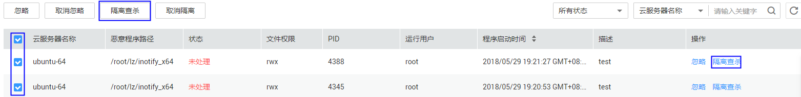

# 管理文件隔离箱

企业主机安全可对检测到的威胁文件进行隔离处理，被成功隔离的文件会添加到“事件管理“的“文件隔离箱“中，无法对主机造成威胁。被成功隔离的文件一直保留在文件隔离箱中，您也可以根据自己的需要进行一键恢复。

对以下两类告警事件支持线上隔离查杀：

-   恶意程序（云查杀）
-   进程异常检测

## 选择隔离查杀

1.  [登录管理控制台](https://console.huaweicloud.com)。
2.  在页面上方选择区域后，单击，选择“安全  \>  企业主机安全“。

    **图 1**  企业主机安全  
    

3.  在左侧导航栏，单击“入侵检测  \>  事件管理“，进入事件管理页面。

    **图 2**  事件管理  
    

1.  单击存在威胁的“恶意程序（云查杀）“或者“进程异常行为“，选择“隔离查杀“，以“进程异常行为“告警事件为例，如[图3](#fig18746131217577)所示。

    **图 3**  隔离查杀  
    

2.  单击“确认“，对进程异常行为告警事件进行隔离查杀。被成功隔离的文件会添加到“事件管理“的“文件隔离箱“中，无法对主机造成威胁。

## 查看文件隔离箱

1.  在“事件管理“页面，单击“文件隔离箱“，弹出文件隔离箱页面。
2.  在文件隔离箱列表中，您可以查看被隔离的文件服务器名称、路径和修改时间，如[图4](#fig13625184415178)所示。

    **图 4**  文件隔离箱  
    

## 一键恢复

1.  单击文件隔离箱列表中操作列的“恢复“，可以指定被隔离的文件从隔离箱中移除。
2.  单击“确认“，恢复的文件将重新回到告警事件列表中。

    > **说明：**   
    >执行恢复操作会将隔离文件查杀恢复，请谨慎操作。  

