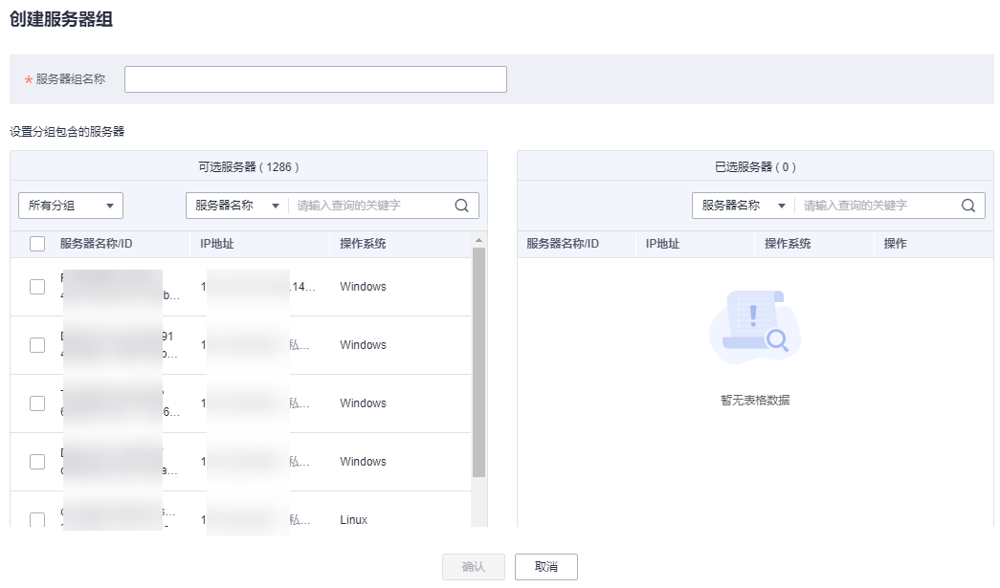

# 管理服务器组

用户可以创建服务器组，并将主机分配到服务器组，将主机进行分类管理。

用户可以根据创建的服务器组，查看该服务器组内的服务器数量、有风险服务器的数量、以及未防护的服务器数量。

## 创建服务器组

创建服务器组后，可将服务器按照一定类别分配到组进行统一管理。

1.  [登录管理控制台](https://console.huaweicloud.com/?locale=zh-cn)。
2.  在页面左上角选择“区域“，单击，选择“安全与合规 \> 主机安全服务”，进入主机安全平台界面。

    **图 1**  进入主机安全  
    

1.  在左侧导航树中，选择“资产管理  \>  主机管理“，在“云服务器“界面，选择“服务器组“，单击“创建服务器组“。

    > **说明：** 
    >如果您的服务器已通过企业项目的模式进行管理，您可选择目标“企业项目“后查看或操作目标企业项目内的资产和检测信息。

    **图 2**  进入服务器组页面  
    

2.  在弹出的“创建服务器组“对话框中，输入“服务器组名称“，并设置服务器组中包含的云服务器。

    > **说明：** 
    >-   服务器组名称不能重复，如果尝试填写的服务器组名称重复，操作将会失败。
    >-   “服务器组名称“不能包含空格，只能包含字母、数字、下划线、中划线、点、星号（\*）、加号（+）；且内容长度不能超过64个字符。

    **图 3**  创建服务器组  
    

3.  设置完成后，单击“确认“，完成服务器组的创建。

## 分配服务器到组

若服务器没有被分配到服务器组，您可以将服务器分配到已创建的服务器组。

1.  单击“云服务器“，进入云服务器列表界面。
2.  选中需要分配到服务器组的一台或多台云服务器，单击“分配到组“，将云服务器分配到服务器组。

    **图 4**  分配到服务器组  
    

    > **说明：** 
    >您也可以在云服务器所在行的“操作”列，单击“更多“，然后单击“分配到组“，分配云服务器到服务器组。

3.  在弹出的对话框中，选择服务器组后，单击“确定“，完成分配云服务器到服务器组的操作。

    > **说明：** 
    >一个云服务器只能分配到一个服务器组。

## 相关操作

**编辑服务器组**

1.  选择“主机管理  \>  云服务器“下的“服务器组“页签。
2.  在待修改的服务器组所在行的“操作”列，单击“编辑“，修改服务器组。
3.  在弹出的对话框中，可重新修改“服务器组名称“和设置分组包含的云服务器。
4.  完成修改后，单击“确认“，完成服务器组的修改。

**删除服务器组**

1.  选择“主机管理  \>  云服务器“下的“服务器组“页签。
2.  在需要删除的服务器组所在行的“操作”列，单击“删除“，删除单个服务器组。

    > **说明：** 
    >服务器组被删除后，隶属于该服务器组的所有云服务器将被划分到“未分组“中。

