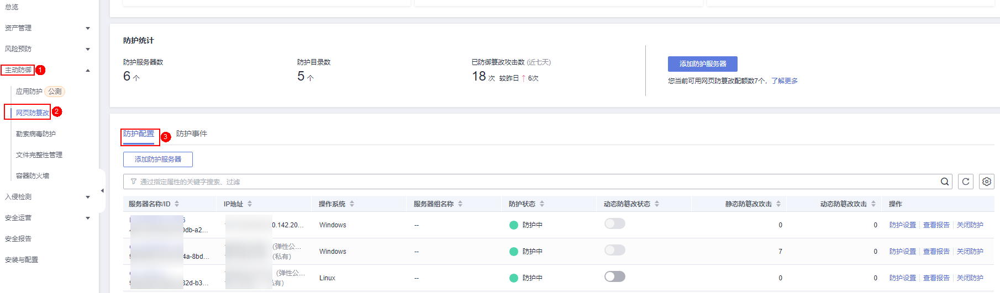
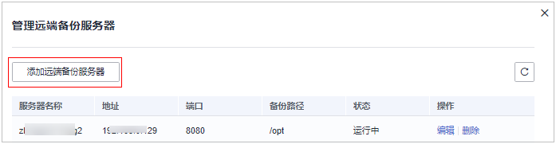
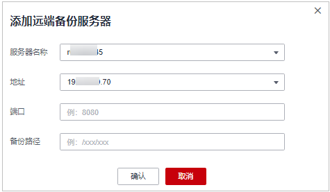

# 管理远端备份服务器

HSS默认会将防护目录下的文件备份在“添加防护目录“时添加的本地备份路径下（被排除的子目录和文件类型不会备份），为防止备份在本地的文件被攻击者破坏，请您启用远端备份功能。

若本地主机上的文件目录和备份目录失效，用户可通过远端备份服务恢复被篡改的网页。

## 约束限制

仅开启网页防篡改版防护后才支持防篡改相关操作。

## 前提条件

设置为远端备份服务器的主机，需要满足以下条件：

“Linux操作系统“的华为云主机、“服务器状态“为“运行中“，已安装HSS的Agent且“Agent状态“为“在线“。

> **须知：** 
>-   Linux备份服务器与主机间网络可通时即可使用远程备份功能，但为保证备份功能的正常工作，建议您将同一内网中的主机设置为备份服务器。
>-   建议尽量选择不容易被攻击的内网服务器作为远端备份服务器。

## 添加远端备份服务器

1.  [登录管理控制台](https://console.huaweicloud.com/?locale=zh-cn)。
2.  在页面左上角选择“区域“，单击，选择“安全与合规 \> 主机安全服务”，进入主机安全平台界面。

    **图 1**  进入主机安全  
    

3.  在“主动防御  \>  网页防篡改  \>  防护配置“页面，单击目标服务器“操作“列的“防护设置“，进入“防护设置“页面。

    > **说明：** 
    >如果您的服务器已通过企业项目的模式进行管理，您可选择目标“企业项目“后查看或操作目标企业项目内的资产和检测信息。

    **图 2**  进入防护配置  
    

4.  单击“防护目录设置“下的“设置“，进入防护目录设置页面。

    **图 3**  防护目录设置页面  
    

5.  单击“管理远端备份服务器“，在弹出的对话框中，“添加远端备份服务器“，填写备份服务器信息，相关参数说明请参见[表1](#table1423774551618)。

    **图 4**  添加远端备份服务器  
    

    **图 5**  填写备份服务器信息  
    

    **表 1**  添加远端备份服务器参数说明

    
    <table><thead align="left"><tr id="row2234145121611"><th class="cellrowborder" valign="top" width="12.35%" id="mcps1.2.3.1.1">
参数名称

    </th>
    <th class="cellrowborder" valign="top" width="87.64999999999999%" id="mcps1.2.3.1.2">
说明

    </th>
    </tr>
    </thead>
    <tbody><tr id="row18236745141617"><td class="cellrowborder" valign="top" width="12.35%" headers="mcps1.2.3.1.1 ">
地址

    </td>
    <td class="cellrowborder" valign="top" width="87.64999999999999%" headers="mcps1.2.3.1.2 ">
该地址为华为云主机的私网地址。

    </td>
    </tr>
    <tr id="row623714581616"><td class="cellrowborder" valign="top" width="12.35%" headers="mcps1.2.3.1.1 ">
端口

    </td>
    <td class="cellrowborder" valign="top" width="87.64999999999999%" headers="mcps1.2.3.1.2 ">
请确保设置的端口未被安全组、防火墙等拦截，并且未被占用。

    </td>
    </tr>
    <tr id="row023717458167"><td class="cellrowborder" valign="top" width="12.35%" headers="mcps1.2.3.1.1 ">
备份路径

    </td>
    <td class="cellrowborder" valign="top" width="87.64999999999999%" headers="mcps1.2.3.1.2 ">
将需要备份的防护目录下的内容备份在该远端备份服务器的目录下。

    <ul id="ul9528101874316"><li>若多个主机的防护目录同时备份在同一远端备份服务器时，备份路径下生成以“Agentid”为目录的文件夹，存放各主机的防护文件，以便用户手动恢复被篡改的网页。
例如：两台主机的防护目录分别为“/hss01”和“hss02”，主机Agentid分别为“f1fdbabc-6cdc-43af-acab-e4e6f086625f”和“f2ddbabc-6cdc-43af-abcd-e4e6f086626f”，设置远端备份路径为“/hss01”。

    
备份后路径为“/hss01/f1fdbabc-6cdc-43af-acab-e4e6f086625f”和“/hss01/f2ddbabc-6cdc-43af-abcd-e4e6f086626f”。

    </li><li>若设置为远端备份服务器的主机开启了“网页放篡改”防护，那么该备份路径与自身的“防护目录”不能重叠，否则会导致远端备份失败。</li></ul>
    </td>
    </tr>
    </tbody>
    </table>

6.  单击“确认“，完成添加备份服务器的操作。

## 启动远端备份

1.  [登录管理控制台](https://console.huaweicloud.com/?locale=zh-cn)。
2.  在页面左上角选择“区域“，单击，选择“安全与合规 \> 主机安全服务”，进入主机安全平台界面。

    **图 6**  进入主机安全  
    

3.  在“主动防御  \>  网页防篡改  \>  防护配置“页面，单击目标服务器“操作“列的“防护设置“，进入“防护设置“页面。

    > **说明：** 
    >如果您的服务器已通过企业项目的模式进行管理，您可选择目标“企业项目“后查看或操作目标企业项目内的资产和检测信息。

    **图 7**  进入防护配置  
    

4.  单击“防护目录设置“下的“设置“，进入防护目录设置页面。

    **图 8**  防护目录设置页面  
    

5.  单击“启动远端备份“，在弹出的对话框中，选择远端备份服务器。

    **图 9**  启动远端备份  
    

6.  单击“确认“，启动远端备份。

## 修改远端备份

1.  [登录管理控制台](https://console.huaweicloud.com/?locale=zh-cn)。
2.  在页面左上角选择“区域“，单击，选择“安全与合规 \> 主机安全服务”，进入主机安全平台界面。

    **图 10**  进入主机安全  
    

3.  在“主动防御  \>  网页防篡改  \>  防护配置“页面，单击目标服务器“操作“列的“防护设置“，进入“防护设置“页面。

    > **说明：** 
    >如果您的服务器已通过企业项目的模式进行管理，您可选择目标“企业项目“后查看或操作目标企业项目内的资产和检测信息。

    **图 11**  进入防护配置  
    

4.  单击“防护目录设置“下的“设置“，进入防护目录设置页面。

    **图 12**  防护目录设置页面  
    

5.  单击“修改远端备份服务器“，在“远端备份服务器“下拉框中，选择远端备份服务器。

    **图 13**  修改远端备份服务器  
    

    > **说明：** 
    >“修改远端备份服务器“的“远端备份“状态须为“已启动“。

6.  单击“确认“，完成修改远端备份服务器。

## 相关操作

**关闭远端备份**

关闭远端备份后，HSS将不再备份您防护目录下的文件；若您本地主机上的文件目录和备份目录被攻击者破坏或者失效，您将无法从远端备份服务器恢复被篡改的网页，请谨慎操作。

