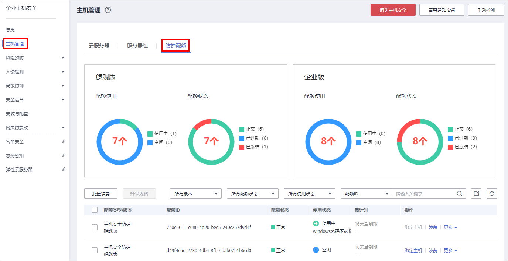
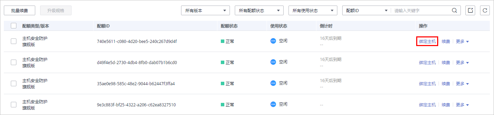
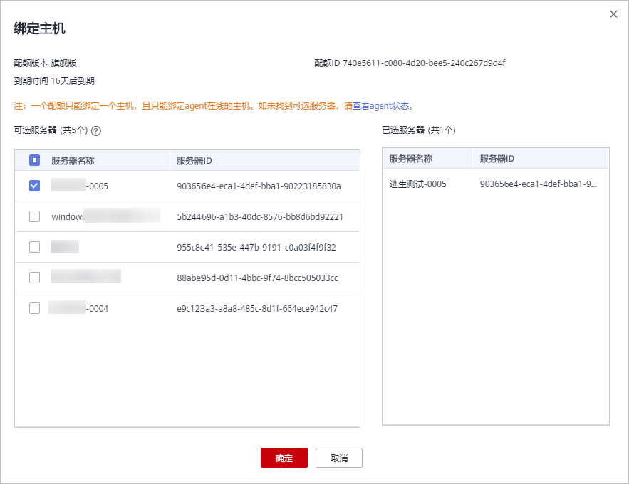

# 绑定主机

一个配额只绑定一个主机，且只能绑定agent在线的主机。

## 前提条件

-   已获取管理控制台的登录账号与密码。
-   主机已安装agent。
-   购买的防护配额的“配额状态“为“正常“，“使用状态“为“空闲“。

## 绑定主机配额

1.  [登录管理控制台](https://console.huaweicloud.com)。
2.  在页面左上角选择“区域“，单击，选择“安全  \>  企业主机安全“，进入企业主机安全页面。

    **图 1**  企业主机安全  
    

3.  在“主机管理“页面，选择“防护配额“页签，进入防护配额列表页面。

    **图 2**  查看主机安全防护配额  
    

4.  在防护配额列表页面，单击“绑定主机“，为空闲配额绑定主机。

    > **说明：** 
    >您也可以在“网页防篡改  \>  防护列表  \>  配额详情“页面的“操作“列中，单击“绑定主机“，为主机绑定网页防篡改防护配额，HSS自动为主机开启网页防篡改防护。

    **图 3**  绑定主机  
    

5.  在弹出的绑定主机窗口中，选择一个待绑定的主机。

    **图 4**  选择绑定的主机  
    

6.  单击“确定“，完成主机的绑定，HSS自动为主机开启防护。

