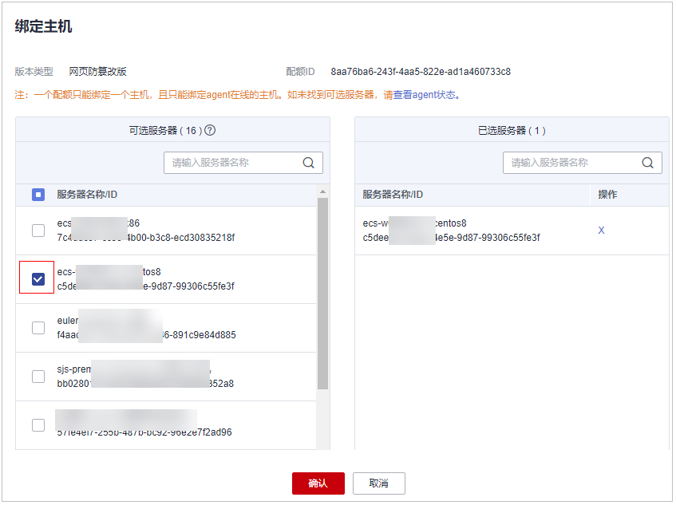

# 绑定防护配额

将购买的防护配额与服务器绑定，绑定后目标服务器将开启配额版本所支持能力的安全防护。

## 前提条件

-   主机已安装agent。
-   购买的防护配额的“配额状态“为“正常“，“使用状态“为“空闲“。
-   一个配额只绑定一个主机，且只能绑定agent在线的主机。

## 绑定主机配额

1.  [登录管理控制台](https://console.huaweicloud.com/?locale=zh-cn)。
2.  在页面左上角选择“区域“，单击，选择“安全与合规 \> 主机安全服务”，进入主机安全平台界面。

    **图 1**  进入主机安全  
    

3.  在左侧选择“资产管理  \>  主机管理“页面，选择“防护配额“页签，进入防护配额列表页面，点击目标选项可进行筛选查看。

    > **说明：** 
    >如果您的服务器已通过企业项目的模式进行管理，您可选择目标“企业项目“后查看或操作目标企业项目内的资产和检测信息。

4.  在防护配额列表页面，单击目标配额“操作“列“绑定主机“。

    > **说明：** 
    >为主机绑定网页防篡改防护配额，需要在“主动防御  \>  网页防篡改  \>  防护配置“页面的“操作”列中，单击“开启防护“，HSS自动为主机开启网页防篡改防护。

5.  在弹出的绑定主机窗口中，选择一个待绑定的主机。

    **图 2**  勾选需绑定的主机  
    

6.  单击“确定“，完成主机的绑定，HSS自动为主机开启防护。

## 绑定容器配额

1.  [登录管理控制台](https://console.huaweicloud.com/?locale=zh-cn)。
2.  在页面左上角选择“区域“，单击，选择“安全与合规 \> 主机安全服务”，进入主机安全平台界面。

    **图 3**  进入主机安全  
    

3.  在左侧选择“资产管理  \>  主机管理“页面，选择“防护配额“页签，进入防护配额列表页面，点击目标选项可进行筛选查看。

    > **说明：** 
    >如果您的服务器已通过企业项目的模式进行管理，您可选择目标“企业项目“后查看或操作目标企业项目内的资产和检测信息。

4.  在防护配额列表页面，单击目标配额“操作“列“绑定主机“。
5.  在弹出的绑定主机窗口中，选择一个待绑定的主机。
6.  单击“确定“，完成主机的绑定，HSS自动开启防护。

