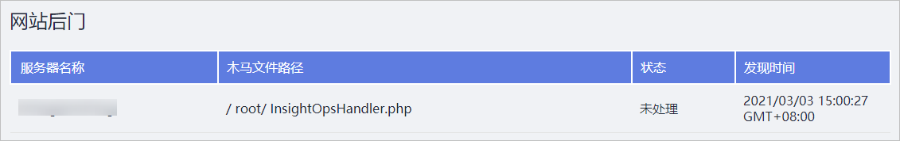

# 网站后门检测

## 告警策略

HSS将**实时检测**您服务器上的Web目录中的文件，判断是否为Webshell网站后门文件。如果发现您的主机可能存在网站后门文件，HSS将会触发告警信息。

## 检测范围

您需要通过[网站后门检测设置](安全配置.md#section1932114315)配置了Web目录后，HSS才能检测到您主机上存在的网站后门。

网站后门检测设置支持自动识别您服务器中的Web目录作为网站后门的检测范围，您也可以手动添加需要检测的Web目录。

## 查看网站后门检测结果

1.  [登录管理控制台](https://console.huaweicloud.com)。
2.  在页面上方选择“区域“后，单击“服务列表“，选择“安全  \>  企业主机安全“。
3.  在左侧导航栏中选择“入侵检测“，进入“入侵检测“页面。
4.  选择“网站后门检测“页签，如[图1](#fig1125872011315)所示。

    **图 1**  网站后门  
    

## 网站后门处理

-   删除网站后门

    确认是网站后门，您可以手动删除。

    删除网站后门后，建议您立即手动执行网站后门检测，查看修复结果。

-   忽略网站后门

    您可以忽略被企业主机安全服务检测出的可信任的网站后门。

    已被忽略的网站后门，将不会被统计在安全风险中，但在网站后门列表中仍然可见。

