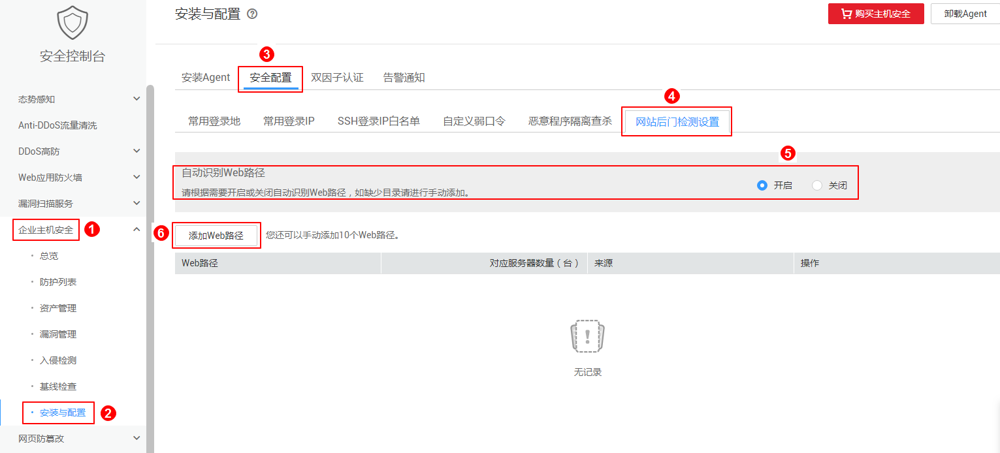
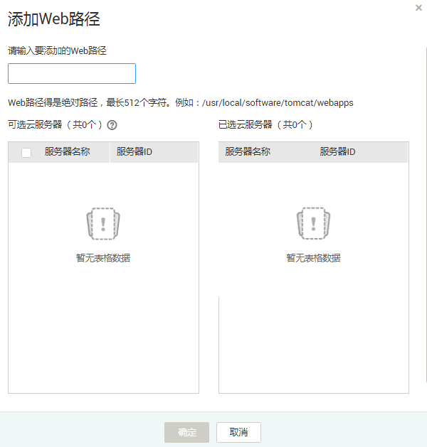

# 网站后门检测设置

该任务指导用户进行网站后门检测设置。

## 前提条件

已获取管理控制台的登录账号与密码。

## 操作步骤

1.  登录管理控制台。
2.  在页面上方，单击“服务列表“，选择“安全  \>  企业主机安全“。
3.  在左侧导航树中，选择“安装与配置“，进入“安装与配置“界面。
4.  选择“安全配置“页签，在“网站后门检测设置“右侧进行设置。

    **图 1**  网站后门检测设置  
    

    > **说明：**   
    >自动识别的Web路径只能查看，手动添加的Web路径才可以编辑或删除。  

    -   自动识别

        自动识别默认关闭，选择“是“，即可打开自动识别功能。

    -   手动添加
        1.  单击“添加Web路径“，在弹出的对话框中，填写要添加的Web路径。

            **图 2**  手动添加Web路径  
            

        2.  在左侧“可选云服务器“列表框中选中需要添加该Web路径的弹性云服务器，将该弹性云服务器移动到“已选云服务器“列表框。
        3.  单击“确定“，完成一个Web路径的添加。

            > **说明：**   
            >-   如果需要编辑添加的Web路径，在目标Web路径所在行的“操作“列，单击“编辑“。  
            >-   如果需要删除添加的Web路径，在目标Web路径所在行的“操作“列，单击“删除“。  

