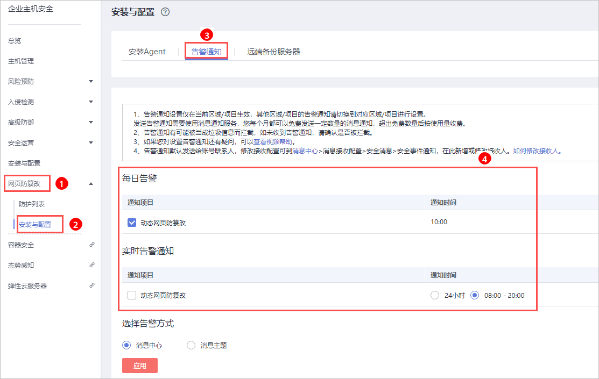

# 网页防篡改版

开启告警通知功能后，您能接收到企业主机安全服务发送的告警通知，及时了解主机/网页内的安全风险。否则，无论是否有风险，您都只能登录管理控制台自行查看，无法收到报警信息。

-   告警通知设置仅在当前区域生效，若需要接收其他区域的告警通知，请切换到对应区域后进行设置。
-   告警通知信息可能会被误拦截，若您未收到相关告警信息，请在信息拦截中查看。
-   消息通知服务为付费服务，价格详情请参见[SMN价格详情](https://www.huaweicloud.com/pricing.html?tab=detail#/smn)。

## 前提条件

在设置告警通知前。

-   如果选择“消息中心“，建议您在“消息中心  \>  消息接收配置  \>  安全消息  \>  安全事件通知“，新增或修改消息接收人，具体操作请参见[修改指定消息接收人](https://support.huaweicloud.com/usermanual-mc/zh-cn_topic_0065943707.html)。
-   如果选择“消息主题“，建议您先以管理员身份在“消息通知服务“中创建“消息主题“，详细操作请参见[如何发布主题消息](https://support.huaweicloud.com/qs-smn/smn_ug_0004.html)。

## 开启网页防篡改告警通知

1.  [登录管理控制台](https://console.huaweicloud.com)。
2.  在页面左上角选择“区域“，单击，选择“安全  \>  企业主机安全“，进入企业主机安全页面。

    **图 1**  企业主机安全  
    

3.  进入“告警通知“页面，选择告警通知时间，如[图2](#fig15544929122911)所示。

    **图 2**  告警通知设置  
    

4.  选择“消息中心“或者“消息主题“告警通知方式，接收告警通知。
    -   选择“消息中心“。

        告警通知默认发送给账号联系人，修改接收配置可到“消息中心  \>  消息接收配置  \>  安全消息  \>  安全事件通知“，新增或修改接收人，具体操作请参见[修改指定消息接收人](https://support.huaweicloud.com/usermanual-mc/zh-cn_topic_0065943707.html)。

        **图 3**  新增或修改接收人  
        

    -   选择“消息主题“。

        单击下拉列表选择已创建的主题，或者单击“查看消息通知服务主题“创建新的主题。

        创建新的主题，即配置接收告警通知的手机号码或邮箱地址，具体操作如下：

        1.  参见[创建主题](https://support.huaweicloud.com/usermanual-smn/zh-cn_topic_0043961401.html)创建一个主题。
        2.  配置接收告警通知的手机号码或邮箱地址，即为创建的主题添加一个或多个订阅，具体操作请参见[添加订阅](https://support.huaweicloud.com/usermanual-smn/smn_ug_0008.html)。
        3.  确认订阅。添加订阅后，按接收到的短信或邮件提示，完成订阅确认。

            主题订阅确认的信息可能被当成垃圾短信拦截，如未收到，请查看是否设置了垃圾短信拦截。

        您可以根据运维计划和告警通知类型，创建多个“消息通知主题“，以接收不同类型的告警通知。更多关于主题和订阅的信息，请参见《消息通知服务用户指南》。

5.  单击“应用“，完成配置主机安全告警通知的操作。

## 相关操作

-   [配置告警通知时选不到消息主题？](https://support.huaweicloud.com/hss_faq/hss_01_0254.html)
-   若您收到告警通知，请参见[告警事件处理](https://support.huaweicloud.com/bestpractice-hss/hss_06_0007.html)对告警事件进行处理。

