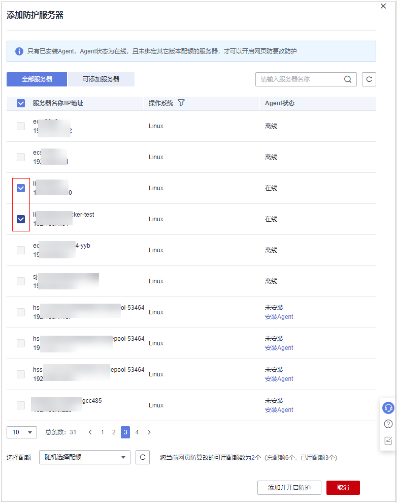

# 网页防篡改版

您可以为已购买的服务器开启网页防篡改版安全防护，开启后按照网页防篡改版所提供的能力对服务器进行安全防护。

## 网页防篡改原理

**表 1**  网页防篡改原理

<table><thead align="left"><tr id="row101311123165010"><th class="cellrowborder" valign="top" width="17.669999999999998%" id="mcps1.2.3.1.1">
防护类型

</th>
<th class="cellrowborder" valign="top" width="82.33%" id="mcps1.2.3.1.2">
原理说明

</th>
</tr>
</thead>
<tbody><tr id="row1213192345010"><td class="cellrowborder" valign="top" width="17.669999999999998%" headers="mcps1.2.3.1.1 ">
静态网页防护

</td>
<td class="cellrowborder" valign="top" width="82.33%" headers="mcps1.2.3.1.2 "><ol id="ol2079014295015"><li>锁定本地文件目录
驱动级锁定Web文件目录下的文件，禁止攻击者修改，网站管理员可通过特权进程进行更新网站内容。

</li><li>主动备份恢复
若检测到防护目录下的文件被篡改时，将立即使用本地主机备份文件自动恢复被非法篡改的文件。

</li><li>远端备份恢复
若本地主机上的文件目录和备份目录失效，还可通过远端备份服务恢复被篡改的网页。

</li></ol>
</td>
</tr>
<tr id="row11131142385011"><td class="cellrowborder" valign="top" width="17.669999999999998%" headers="mcps1.2.3.1.1 ">
动态网页防护

</td>
<td class="cellrowborder" valign="top" width="82.33%" headers="mcps1.2.3.1.2 ">
为Tomcat提供动态网页防护。

<ol id="ol58315471807"><li>基于RASP过滤恶意行为
采用华为自研RASP检测应用程序行为，有效阻断攻击者通过应用程序篡改网页内容的行为。

</li><li>网盘文件访问控制
精细化定义网盘文件中的文件访问权限，包括新增，修改，查询等，确保防篡改同时不影响网站内容发布。

</li></ol>
</td>
</tr>
</tbody>
</table>

## 前提条件

-   在“资产管理  \>  主机管理“页面“云服务器“列表中目标服务器“Agent状态“为“在线“、“防护状态“为“未防护“。

## 设置防护目录

网页防篡改功能需要有防护目录才能起到防护作用，网页防篡改提供以下目录防护模式：

-   保护指定目录

    您最多可在主机中添加50个防护目录，详细操作请参见[保护指定目录](添加防护目录.md#section4367121594314)。

    为实时记录主机中的运行情况，请排除防护目录下Log类型的文件，您可以为日志文件添加等级较高的读写权限，防止攻击者恶意查看或篡改日志文件。

## 操作步骤

1.  [登录管理控制台](https://console.huaweicloud.com/?locale=zh-cn)。
2.  在页面左上角选择“区域“，单击，选择“安全与合规 \> 主机安全服务”，进入主机安全平台界面。

    **图 1**  进入主机安全  
    

1.  在左侧导航树中，选择“主动防御  \>  网页防篡改“，进入“网页防篡改“界面，选择“防护配置“页签，进入“防护配置“页面。

    > **说明：** 
    >如果您的服务器已通过企业项目的模式进行管理，您可选择目标“企业项目“后查看或操作目标企业项目内的资产和检测信息。

    **图 2**  进入防护配置  
    

2.  单击“添加防护服务器“，在弹窗勾选需要开启防护的服务器，配额选择“随机选择配额“即可。

    > **说明：** 
    >选择的服务器数量应等于或少于可用配额数量，若配额不足，您需[购买网页防篡改版配额](购买主机安全防护配额.md)后才可开启防护。

    **图 3**  添加防护服务器  
    

3.  单击“添加并开启防护“，在“主动防御  \>  网页防篡改  \>  防护配置“查看目标服务器的“防护状态“为“防护中“表示已开启防护。

    > **须知：** 
    >-   开启功能后需要有防护目录才能起到防护作用，请根据需要设置相应的防护目录，操作详情请参见[添加防护目录](添加防护目录.md)。
    >-   仅Linux服务器支持动态网页防篡改，且开启后，还需重启Tomcat才能使其生效。
    >-   开启“网页防篡改”防护服务后，请在控制台上查看主机安全服务的开启状态。
    >    “网页防篡改版“开启后，旗舰版防护会同步开启。
    >    -   选择“主动防御  \>  网页防篡改“，目标服务器所在行的“防护状态“为“防护中“，则表示网页防篡改版已开启。
    >    -   选择“资产管理  \>  主机管理  \>  云服务器“，目标主机所在行的“防护状态“为“防护中“，且“版本/到期时间“为“网页防篡改版“，则表示网页防篡改赠送的旗舰版已开启。
    >-   开启网页防篡改防护会自动为您开启勒索病毒防护，勒索病毒防护开启后，您需要根据自身业务情况配置诱饵防护目录、开启动态诱饵防护，进一步提升勒索病毒防护能力；另外，建议您同时开启勒索备份，提升勒索防护的事后恢复能力，最小化降低业务受损程度。详细操作请参见[修改防护策略](管理勒索病毒防护策略.md#section1453183620529)、[开启勒索备份](开启勒索备份.md)。

## 后续操作

网页防篡改版支持勒索病毒防护，开启网页防篡改版防护后，如果您需要为服务器开启勒索病毒防护，请参考[开启勒索病毒防护](开启勒索病毒防护.md)。

