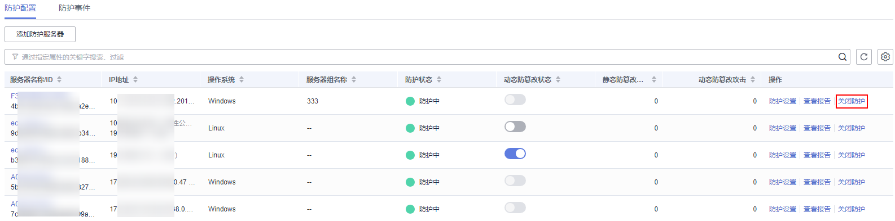

# 网页防篡改版

您可以为已开启防护的服务器关闭网页防篡改版安全防护，关闭后可释放配额，可供其他服务器防护使用。

## 操作须知

关闭防护对业务不会产生影响，但关闭后服务器被入侵的风险会急剧上升，建议保持开启防护的状态。

## 操作步骤

1.  [登录管理控制台](https://console.huaweicloud.com/?locale=zh-cn)。
2.  在页面左上角选择“区域“，单击，选择“安全与合规 \> 主机安全服务”，进入主机安全平台界面。

    **图 1**  进入主机安全  
    

1.  在左侧导航树中，选择“主动防御  \>  网页防篡改“，进入“网页防篡改“界面，选择“防护配置“页签，进入“防护配置“页面。

    > **说明：** 
    >如果您的服务器已通过企业项目的模式进行管理，您可选择目标“企业项目“后查看或操作目标企业项目内的资产和检测信息。

    **图 2**  进入防护配置  
    

2.  单击目标服务器“操作“列的“关闭防护“。

    > **说明：** 
    >网页防篡改版防护不支持批量关闭。

    **图 3**  关闭网页防篡改防护  
    

3.  在弹窗中确认关闭服务器的信息，确认无误，单击“确认“，防护关闭。

    **图 4**  确认关闭防篡改防护信息  
    

4.  关闭后在“资产管理  \>  主机管理  \>  云服务器“页面查看目标服务器的“防护状态“为“未防护“，关闭成功。

    > **注意：** 
    >关闭防护对业务不会产生影响，但关闭后服务器被入侵的风险会急剧上升，建议保持开启防护的状态。

