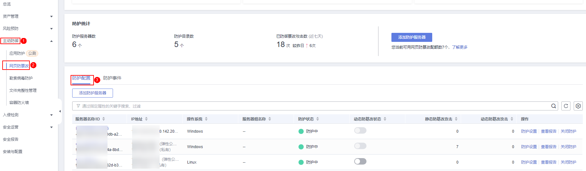
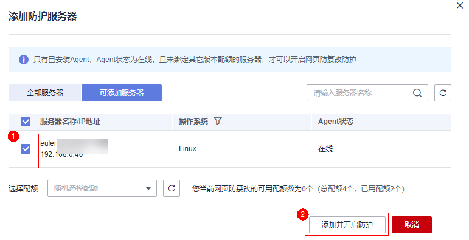

# 网页防篡改版

开启网页防篡改时，您需为指定的主机分配一个配额，关闭主机安全服务或删除主机后，该配额可分配给其他的主机使用。

开启网页防篡改防护时会同步开启主机安全的旗舰版防护。

## 网页防篡改原理

**表 1**  网页防篡改原理

<table><thead align="left"><tr id="row101311123165010"><th class="cellrowborder" valign="top" width="17.669999999999998%" id="mcps1.2.3.1.1">
防护类型

</th>
<th class="cellrowborder" valign="top" width="82.33%" id="mcps1.2.3.1.2">
原理说明

</th>
</tr>
</thead>
<tbody><tr id="row1213192345010"><td class="cellrowborder" valign="top" width="17.669999999999998%" headers="mcps1.2.3.1.1 ">
静态网页防护

</td>
<td class="cellrowborder" valign="top" width="82.33%" headers="mcps1.2.3.1.2 "><ol id="ol2079014295015"><li>锁定本地文件目录
驱动级锁定Web文件目录下的文件，禁止攻击者修改，网站管理员可通过特权进程进行更新网站内容。

</li><li>主动备份恢复
若检测到防护目录下的文件被篡改时，将立即使用本地主机备份文件自动恢复被非法篡改的文件。

</li><li>远端备份恢复
若本地主机上的文件目录和备份目录失效，还可通过远端备份服务恢复被篡改的网页。

</li></ol>
</td>
</tr>
<tr id="row11131142385011"><td class="cellrowborder" valign="top" width="17.669999999999998%" headers="mcps1.2.3.1.1 ">
动态网页防护

</td>
<td class="cellrowborder" valign="top" width="82.33%" headers="mcps1.2.3.1.2 ">
提供Tomcat应用运行时自我保护，防护原理如下：

<ol id="ol411252115210"><li>基于RASP过滤恶意行为
采用华为自研RASP检测应用程序行为，有效阻断攻击者通过应用程序篡改网页内容的行为。

</li><li>网盘文件访问控制
精细化定义网盘文件中的文件访问权限，包括新增，修改，查询等，确保防篡改同时不影响网站内容发布。

</li></ol>
</td>
</tr>
</tbody>
</table>

## 前提条件

-   在“主动防御  \>  网页防篡改  \>   防护配置“页面中“防护状态“为“未防护“。
-   在“资产管理  \>  主机管理“页面“云服务器“列表中“Agent状态“为“在线“、“防护状态“为“未防护“。
-   已在所选区域内购买了充足可用的“网页防篡改版”配额，[查看配额详情](查看配额.md)。

## 设置防护目录

网页防篡改功能需要有防护目录才能起到防护作用，网页防篡改提供以下目录防护模式：

-   保护指定目录

    您最多可在主机中添加50个防护目录，详细操作请参见[保护指定目录](添加防护目录.md#section4367121594314)。

    为实时记录主机中的运行情况，请排除防护目录下Log类型的文件，您可以为日志文件添加等级较高的读写权限，防止攻击者恶意查看或篡改日志文件。

## 开启网页防篡改

1.  [登录管理控制台](https://console.huaweicloud.com/?locale=zh-cn)。
2.  在页面左上角选择“区域“，单击，选择“安全合规 \> 主机安全服务”，进入主机安全服务界面。

    **图 1**  进入主机安全服务  
    

3.  在左侧导航树中，选择“主动防御  \>  网页防篡改“，进入“网页防篡改“界面，单击“添加防护服务器“。

    **图 2**  添加防护服务器  
    

4.  在“添加防护服务器“页面，选择需要开启防护的服务器，选择目标配额，可默认随机选择，单击“添加并开启防护“。

    **图 3**  勾选目标服务器开启防护  
    

5.  开启“网页防篡改”防护服务后，请在控制台上查看主机安全服务的开启状态。

    “网页防篡改版“开启后，旗舰版防护会同步开启。

    -   选择“主动防御  \>  网页防篡改“，目标服务器所在行的“防护状态“为“防护中“，则表示网页防篡改版已开启。
    -   选择“资产管理  \>  主机管理  \>  云服务器“，目标主机所在行的“防护状态“为“防护中“，且“版本/到期时间“为“网页防篡改版“，则表示网页防篡改赠送的旗舰版已开启。

> **须知：** 
>-   您也可以通过在“资产管理  \>  主机管理  \>  防护配额“页面，单击“绑定主机“，为主机绑定防护配额，HSS自动为主机开启网页防篡改防护。
>-   一个配额只能绑定一个主机，且只能绑定Agent在线的主机。
>-   开启网页防篡改防护会自动为您开启勒索病毒防护，勒索病毒防护开启后，您需要根据自身业务情况配置诱饵防护目录、开启动态诱饵防护，进一步提升勒索病毒防护能力；另外，建议您同时开启勒索备份，提升勒索防护的事后恢复能力，最小化降低业务受损程度。详细操作请参见[修改防护策略](管理勒索病毒防护策略.md#section1453183620529)、[开启勒索备份](开启勒索备份.md)。
>-   开启网页防篡改后如果需要更新网站请先临时关闭网页防篡改，完成更新后再开启。否则会造成网站更新失败。
>-   关闭网页防篡改期间，您的网站不受保护，更新网页后，请及时开启网页防篡改。

## 相关操作

**关闭网页防篡改**

您可以在“主动防御  \>  网页防篡改  \>  防护配置“列表的“操作”列中，单击“关闭防护“，关闭对指定主机的网页防篡改防护。

关闭网页防篡改后，HSS会自动释放防护配额。您可将空闲的配额分配给其他主机继续使用或退订无需使用的配额，避免造成配额资源的浪费。

> **须知：** 
>-   关闭网页防篡改防护服务前，请对主机执行全面的检测，处理已知风险并记录操作信息，避免运维失误，使您的主机遭受攻击。
>-   关闭网页防篡改防护服务后，网页应用被篡改的可能性将大大提高，请及时清理主机中的重要数据、关停主机中的重要业务并断开主机与外部网络的连接，避免因主机遭受攻击而承担不必要的损失。
>-   执行关闭网页防篡改操作后，防护目录下的文件将不再受“网页防篡改”功能的防护，建议您提前处理防护目录下的文档，再对文档执行暂停防护、编辑或删除的相关操作。
>-   执行关闭网页防篡改操作后，若您的文档不慎被删除，请在主机本地备份或远端主机的备份路径中查找。
>-   当用户关闭网页防篡改时会同步关闭旗舰版防护。

**解绑配额**

您可以在“资产管理  \>  主机管理  \>  防护配额“页面的“操作”列中，单击“解除绑定”，解除绑定后，该配额的使用状态将从“使用中“变更为“空闲“。HSS将自动关闭关联主机的网页防篡改防护。

您可将“空闲“的配额分配给其他主机继续使用或退订无需使用的配额，避免造成配额资源的浪费。

