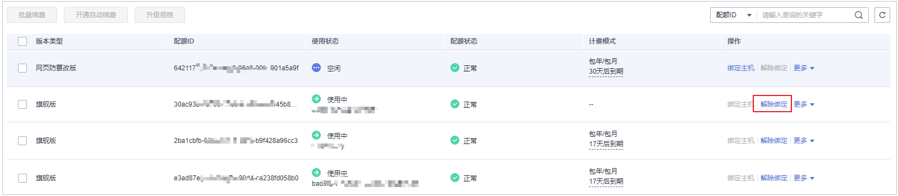
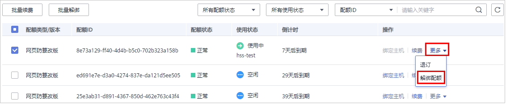

# 解绑配额

解绑配额后，HSS会关闭主机防护，无法检测主机存在的潜在风险，请谨慎操作。

您可将解绑后的空闲配额分配给其他主机继续使用或退订无需使用的配额，避免造成配额资源的浪费。

## 解绑机制

-   在防护配额页面，通过手动解绑配额的方式，解除绑定的配额。
-   Agent离线30天后，自动解绑配额。

## 前提条件

-   已获取管理控制台的登录账号与密码。
-   主机已绑定配额。

## 解绑基础版/企业版/旗舰版配额

1.  [登录管理控制台](https://console.huaweicloud.com)。
2.  在页面左上角选择“区域“，单击，选择“安全与合规  \>  企业主机安全“，进入企业主机安全页面。

    **图 1**  企业主机安全  
    

3.  在“主机管理“页面，选择“防护配额“页签，进入防护配额列表页面。

    **图 2**  查看主机安全防护配额  
    

4.  在防护配额列表页面，选择“更多“，单击“解绑配额“，解除绑定的配额，如[图3](#fig86901377479)所示。

    **图 3**  解绑配额  
    

    > **说明：** 
    >您也可以勾选待解绑配额，单击“批量解绑“，批量解绑配额。解绑配额后，HSS将无法检测您主机存在的潜在风险，请谨慎操作。

5.  在弹出的解绑配额对话框中，单击“确定“，解除绑定。

## 解绑网页防篡改配额

1.  [登录管理控制台](https://console.huaweicloud.com)。
2.  在页面左上角选择“区域“，单击，选择“安全与合规  \>  企业主机安全“，进入企业主机安全页面。

    **图 4**  企业主机安全  
    

3.  在左侧导航树中，选择“网页防篡改”，进入网页防篡改的防护列表界面。

    **图 5**  查看企业主机安全“网页防篡改版“防护配额  
    

4.  单击“配额详情“，进入网页防篡改防护配额详细信息页面。

    **图 6**  配额详情  
    

5.  在防护配额列表页面，选择“更多“，单击“解绑配额“，解除绑定的配额，如[图7](#fig115370497519)所示。

    **图 7**  解绑网页防篡改配额  
    

    > **说明：** 
    >您也可以勾选待解绑配额，单击“批量解绑“，批量解绑配额。解绑配额后，HSS将无法检测您主机存在的潜在风险，请谨慎操作。

6.  在弹出的解绑配额对话框中，单击“确定“，解除绑定。

