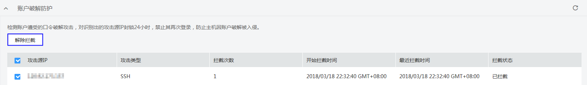

# 解除拦截受信任的IP

账户破解防护会对非法破解密码的IP进行拦截，如果此IP可信任，可解除拦截。该任务指导用户对可信任的IP解除拦截。

## 前提条件

-   已获取管理控制台的登录帐号与密码。
-   弹性云服务器的“防护状态“为“开启“。
-   弹性云服务器的账户遭受了口令破解攻击。

## 操作步骤

1.  登录管理控制台。
2.  在页面上方，单击“服务列表“，选择“安全  \>  企业主机安全“。
3.  在左侧导航树中，选择“云服务器列表“，进入“云服务器列表“界面。
4.  在需要解封IP的弹性云服务器所在行的“检测结果“列，单击检测结果。
5.  选择“入侵检测“页签，展开“账户破解防护“栏，勾选需要解除拦截的IP，单击“解除拦截“，如[图1](#fig963957016565)所示。

    **图 1**  解除拦截  
    

6.  在弹出“解除拦截“对话框中，单击“确定“，完成解除拦截操作。

