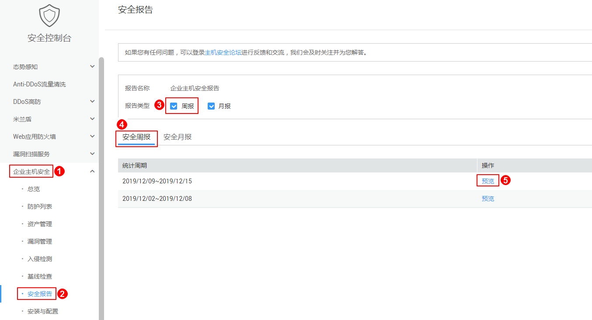
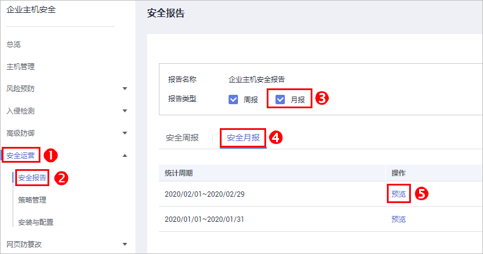

# 订阅主机安全报告

企业主机安全支持订阅周报和月报，订阅报告为您保存6个月。

> **说明：**   
>勾选订阅报告后，第二天即可查看、下载。  

## 操作步骤

1.  [登录管理控制台](https://console.huaweicloud.com)。
2.  在页面上方选择区域后，单击，选择“安全  \>  企业主机安全“。

    **图 1**  企业主机安全  
    

3.  在“企业主机安全  \>  安全报告“页面，单击操作列的“预览“，预览安全周报或月报。

    **图 2**  安全周报  
    

    **图 3**  安全月报  
    

4.  单击预览页面右侧的“下载“，可下载安全报告到本地。

