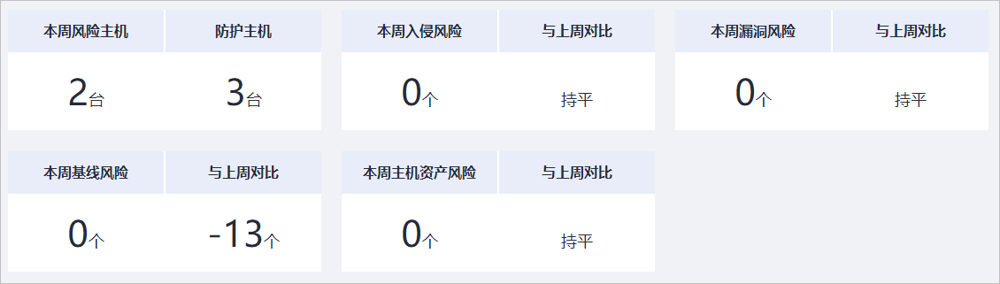
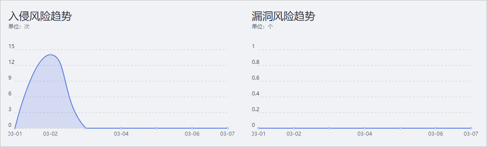
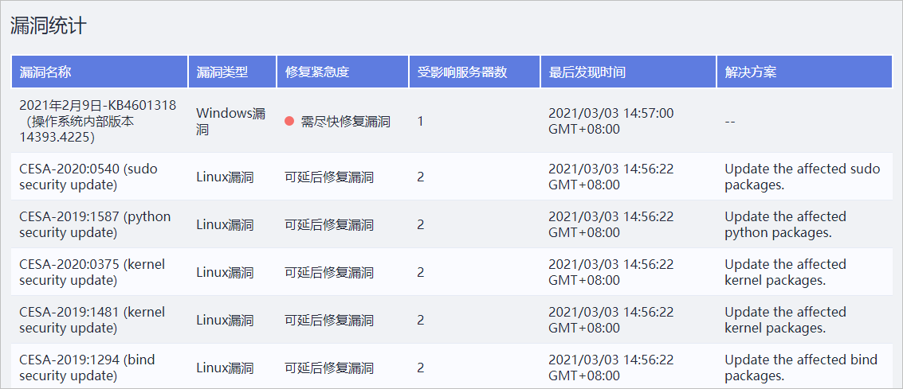
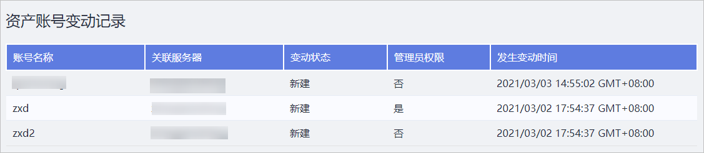
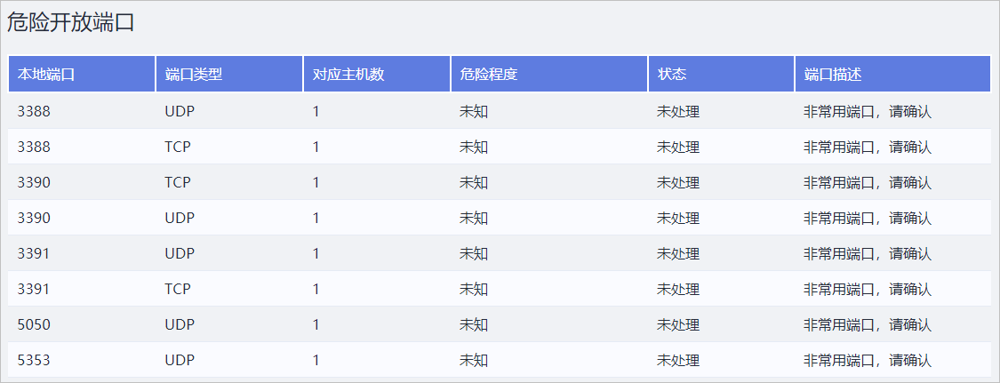
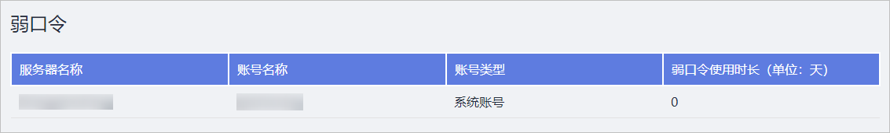
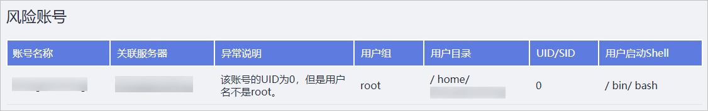
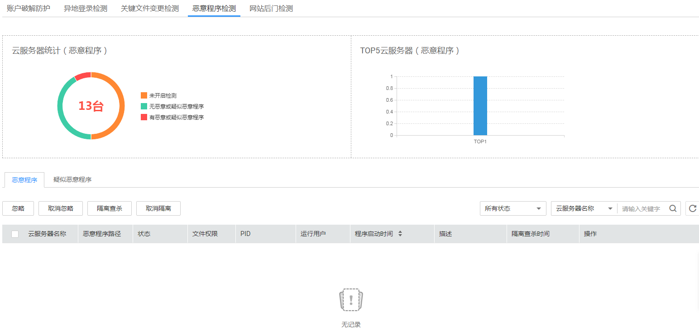
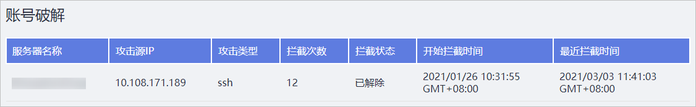
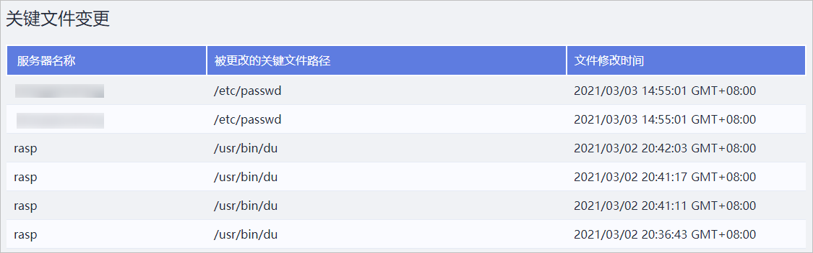

# 订阅主机安全报告

企业主机安全支持订阅周报和月报，展现每周或每月的主机安全趋势以及关键安全事件与风险。企业主机安全仅保留6个月的安全报告，建议您定期下载，以满足等保测评以及审计的需要。

> **说明：** 
>-   如果您已开通企业项目，您可以在“企业项目“下拉列表中，选择您所在的企业项目，订阅您所在企业项目的主机安全报告；或者选择“所有项目“，订阅当前区域下所有项目的主机安全报告。
>-   勾选订阅报告后，第二天即可查看、下载。

## 下载主机安全报告

1.  [登录管理控制台](https://console.huaweicloud.com)。
2.  在页面左上角选择“区域“，单击，选择“安全  \>  企业主机安全“，进入企业主机安全页面。

    **图 1**  企业主机安全  
    

3.  选择“安全报告“页面，单击操作列的“预览“，预览安全周报或月报。

    **图 2**  安全周报  
    

    **图 3**  安全月报  
    

4.  单击预览页面右侧的“下载“，可下载安全报告到本地。

    **图 4**  下载安全报告  
    

## 主机安全报告模板说明

企业主机安全支持订阅周报和月报，您可以根据需要下载主机安全的周报或者月报；下载安全报告后，您可以根据HSS的检测结果，了解主机风险状态，并及时对主机风险进行处理。

报告模板主要内容包含：风险总览、风险趋势、风险分布、TOP5主机、TOP5暴力破解攻击来源、漏洞统计、资产账号变动记录、危险开放端口、弱口令、风险账号、异地登录、恶意程序、网站后门、账号破解以及关键文件变更。

如下以周报的报告模板为例进行说明。

-   风险总览

    查看本周的风险信息与上周对比的风险情况。

    **图 5**  风险总览信息  
    

-   风险趋势

    查看本周的入侵风险趋势和漏洞风险趋势。

    **图 6**  风险趋势  
    

-   TOP5风险主机和TOP5暴力破解攻击来源

    查看本周的TOP5风险主机和TOP5暴力破解攻击来源。

    **图 7**  TOP5风险主机和TOP5暴力破解攻击来源  
    

-   漏洞统计

    查看本周检测出的漏洞统计信息。

    最多仅列举20条风险项，详情请登录企业主机安全控制台查看。

    **图 8**  漏洞统计信息  
    

-   资产账号变动记录

    查看本周检测出的资产变动记录。

    最多仅列举20条风险项，详情请登录企业主机安全控制台查看。

    **图 9**  资产账号变动记录  
    

-   危险开放端口

    查看本周检测出的开放的危险端口。

    最多仅列举20条风险项，详情请登录企业主机安全控制台查看。

    **图 10**  开放的危险端口  
    

-   弱口令

    查看本周检测出的弱口令。

    最多仅列举20条风险项，详情请登录企业主机安全控制台查看。

    **图 11**  弱口令  
    

-   风险账号

    查看本周检测出的风险账号。

    最多仅列举20条风险项，详情请登录企业主机安全控制台查看。

    **图 12**  风险账号  
    

-   异地登录

    查看本周检测出的异地登录。

    最多仅列举20条风险项，详情请登录企业主机安全控制台查看。

    **图 13**  异地登录  
    

-   恶意程序

    查看本周检测出的恶意程序。

    最多仅列举20条风险项，详情请登录企业主机安全控制台查看。

    **图 14**  恶意程序  
    

-   网站后门

    查看本周检测出的网站后门。

    最多仅列举20条风险项，详情请登录企业主机安全控制台查看。

    **图 15**  网站后门  
    

-   账号破解

    查看本周检测出的账号破解。

    最多仅列举20条风险项，详情请登录企业主机安全控制台查看。

    **图 16**  账号破解  
    

-   关键文件变更

    查看本周检测出的关键文件变更。

    最多仅列举20条风险项，详情请登录企业主机安全控制台查看。

    **图 17**  关键文件变更  
    

