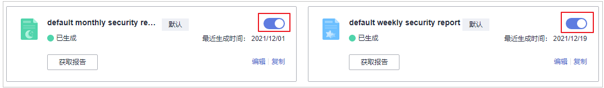

# 订阅安全报告

指导您通过控制台的预设模板快速实现以周为单位或以月为单位的安全报告订阅。如需自定义，操作详情请参见[创建安全报告](创建安全报告.md#hss_01_0371)。

## 约束限制

企业版及以上版本支持安全报告相关操作。

## 订阅说明

-   安全报告是为所有已开启防护的主机生成报告，不支持选择特定主机生成报告。
-   订阅安全报告均为免费，但报告内容会受防护配额版本支持的功能限制。

## 操作步骤

1.  [登录管理控制台](https://console.huaweicloud.com/?locale=zh-cn)。
2.  在页面左上角选择“区域“，单击，选择“安全与合规 \> 主机安全服务”，进入主机安全平台界面。

    **图 1**  进入主机安全  
    

3.  左侧选择“安全报告“进入安全报告概览页面。

    服务预设了按月（default monthly security report）和按周（default weekly security report）统计的两个安全报告模板，可直接使用。

    > **说明：** 
    >如果您的服务器已通过企业项目的模式进行管理，您可选择目标“企业项目“后查看或操作目标企业项目内的资产和检测信息。

    **图 2**  查看安全报告  
    

4.  单击按月或按周的报告开关状态为开启状态，开启安全报告的订阅，如需对报告进行编辑详情请参见[编辑安全报告](安全报告管理.md#hss_01_0557_section341765792112)。

    **图 3**  开启安全报告  
    

