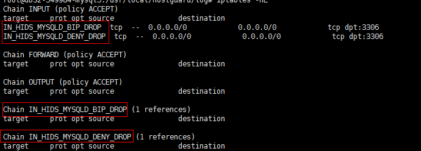
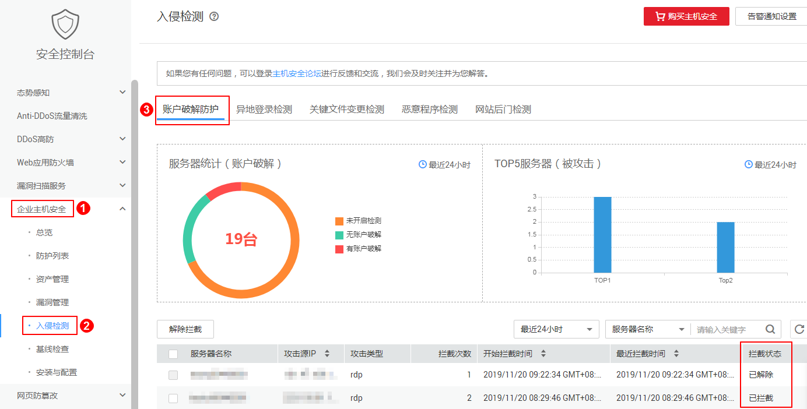

# 账户破解防护

## 防护范围

HSS可拦截的攻击类型包括：mysql、mssql、vsftp、filezilla、serv-u、ssh、rdp。

> **说明：**   
>若您的服务器上安装了mysql或者vsftp，开启主机安全防护之后，Agent会在iptables里面新增一些规则，用于mysql/vsftp爆破防护。当检测到爆破行为后会将爆破IP加入到阻断列表里面，新增的规则如图所示：  
>**图 1**  新增规则    
>  

## 账户破解拦截原理

暴力破解是一种常见的入侵攻击行为，通过暴力破解或猜解主机密码，从而获得主机的控制权限，会严重危害主机的安全。

通过暴力破解检测算法和全网IP黑名单，若发现暴力破解主机的行为，HSS会对发起攻击的源IP拦截24小时。**若被拦截的IP在24小时内没有再继续攻击，系统自动解除拦截**。同时HSS支持[双因子认证](安全配置.md#section172571068317)功能，双重认证用户身份，有效阻止攻击者对主机账号的破解行为。

您可以[设置常用登录IP](安全配置.md#section10435391307)、[设置SSH登录IP白名单](安全配置.md#section525414343012)，常用登录IP、SSH登录IP白名单中的IP登录行为不会被拦截。

> **说明：**   
>使用鲲鹏计算EulerOS（EulerOS with ARM）的主机，在遭受SSH账户破解攻击时，HSS不会对攻击IP进行拦截，仅支持对攻击行为进行告警；SSH登录IP白名单功能也对其不生效。  

## 告警策略

-   如果黑客暴力破解密码成功，且成功登录您的服务器，会立即发送实时告警通知用户。
-   如果检测到暴力破解攻击并且评估认为账户存在被破解的风险，会立即发送实时告警通知用户。
-   如果该次暴力破解没有成功，主机上也没有已知风险项（不存在弱口令），评估认为账户没有被破解的风险时，不会发送实时告警。企业主机安全服务会在每天发送一次的每日告警信息中通告当日攻击事件数量。您也可以登录企业主机安全控制台入侵检测页面实时查看拦截信息。

## 查看账户破解检测结果

1.  [登录管理控制台](https://console.huaweicloud.com)。
2.  在页面上方选择区域后，单击，选择“安全  \>  企业主机安全“。

    **图 2**  企业主机安全  
    

3.  进入“账户破解防护“页面，查看已防护的服务器上的暴力破解拦截记录，如[图3](#fig135381859471)所示。

    -   已拦截：表示该暴力破解行为已被HSS成功拦截。
    -   已解除：表示您已解除对该暴力破解行为的拦截。

        > **说明：**   
        >若被拦截的IP在24小时内没有再继续攻击，系统自动解除拦截。  

    **图 3**  账户破解防护  
    

## 处理拦截IP

-   如果发现某个主机被频繁攻击，需要引起重视，建议及时修补漏洞，处理风险项。

    建议开启[双因子认证](安全配置.md#section172571068317)功能，并[设置常用登录IP](安全配置.md#section10435391307)、[设置SSH登录IP白名单](安全配置.md#section525414343012)。

-   如果发现有合法IP被误封禁（比如运维人员因为记错密码，多次输错密码导致被封禁），可以手工解除拦截。

    > **须知：**   
    >解除被拦截的IP后，主机将不会再拦截该IP地址对主机执行的操作。  

