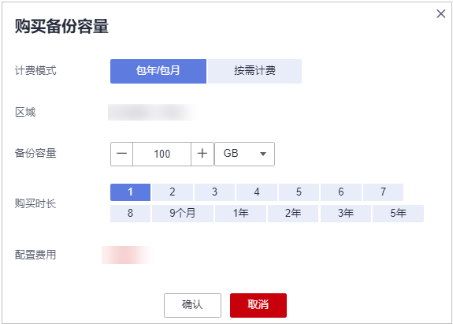

# 购买备份存储库

为了进一步提升您主机的勒索病毒防御能力，降低主机被勒索后的业务损失风险，建议您开启勒索防护备份，定期为服务器备份数据。在开启勒索备份之前，您需要购买备份存储库。

您可以参考本章节在HSS控制台购买备份存储库，也可以前往云备份服务控制台购买备份存储库，在云备份购买备份存储库的操作请参见[创建云服务器备份](https://support.huaweicloud.com/qs-cbr/cbr_02_0003.html)。

## 购买备份存储库

1.  [登录管理控制台](https://console.huaweicloud.com/?locale=zh-cn)。
2.  在页面左上角选择“区域“，单击，选择“安全与合规 \> 主机安全服务”，进入主机安全平台界面。

    **图 1**  进入主机安全  
    

3.  选择“主动防御 \> 勒索病毒防护 “，进入勒索病毒防护界面。
4.  选择“防护服务器“页签。
5.  鼠标滑动至置灰的“开启勒索备份“按钮上，在弹窗提示中单击“立即购买“。
6.  在弹出的对话框中设置需要购买的备份存储库容量等参数，如[图 购买备份容量](#fig176751132703)所示，详细参数说明请参见[表 购买备份容量参数说明](#table41411515348)。

    **图 2**  购买备份容量  
    

    **表 1**  购买备份容量参数说明

    
    <table><thead align="left"><tr id="row31411815547"><th class="cellrowborder" valign="top" width="24.92%" id="mcps1.2.3.1.1">
参数名称

    </th>
    <th class="cellrowborder" valign="top" width="75.08%" id="mcps1.2.3.1.2">
参数说明

    </th>
    </tr>
    </thead>
    <tbody><tr id="row5141131517411"><td class="cellrowborder" valign="top" width="24.92%" headers="mcps1.2.3.1.1 ">
计费模式

    </td>
    <td class="cellrowborder" valign="top" width="75.08%" headers="mcps1.2.3.1.2 ">
选择计费模式，支持“包年/包月”和“按需计费”。

    <ul id="ul1169573716338"><li>包年/包月：按照订单的购买周期进行结算。</li><li>按需计费：按实际的使用时长收费，以小时为单位，每小时整点结算，不设最低消费标准。</li></ul>
    </td>
    </tr>
    <tr id="row131418158411"><td class="cellrowborder" valign="top" width="24.92%" headers="mcps1.2.3.1.1 ">
区域

    </td>
    <td class="cellrowborder" valign="top" width="75.08%" headers="mcps1.2.3.1.2 ">
当前购买备份存储库的区域。

    </td>
    </tr>
    <tr id="row1314191519416"><td class="cellrowborder" valign="top" width="24.92%" headers="mcps1.2.3.1.1 ">
备份容量

    </td>
    <td class="cellrowborder" valign="top" width="75.08%" headers="mcps1.2.3.1.2 ">
根据需求选择购买备份存储库的大小。

    </td>
    </tr>
    <tr id="row11413151344"><td class="cellrowborder" valign="top" width="24.92%" headers="mcps1.2.3.1.1 ">
购买时长

    </td>
    <td class="cellrowborder" valign="top" width="75.08%" headers="mcps1.2.3.1.2 ">
根据需求选择购买时长，当计费模式选择“按需计费”时无需选择。

    </td>
    </tr>
    <tr id="row101427159410"><td class="cellrowborder" valign="top" width="24.92%" headers="mcps1.2.3.1.1 ">
配置费用

    </td>
    <td class="cellrowborder" valign="top" width="75.08%" headers="mcps1.2.3.1.2 "><ul id="ul4119205504120"><li>包年/包月：选择的备份存储库容量、购买时长所需的费用。</li><li>按需计费：选择的备份存储库容量每小时所需的费用。</li></ul>
    </td>
    </tr>
    </tbody>
    </table>

7.  单击“确认“，根据不同的计费模式执行后续操作。
    -   “包年/包月“计费模式：
        1.  进入订单确认页面。
        2.  确认订单无误后，单击“确认付款“，完成支付，购买成功。

    -   “按需计费“计费模式：

        购买成功。

        > **说明：** 
        >请注意后续备份存储库使用过程中，会持续计费，请保证您帐户中余额充足，避免因为备份存储库按需计费导致您的帐户欠费。

