# 资产管理

本章节指导用户通过企业主机安全查看资产管理的账号信息、端口检测、进程信息管理。

## 前提条件

已获取管理控制台的登录账号与密码。

## 查看账号信息管理

1.  登录管理控制台。
2.  在页面上方，单击“服务列表“，选择“安全  \>  企业主机安全“。
3.  在左侧导航树中，选择“资产管理“，进入“资产管理“界面。
4.  选择“账号信息管理  \>  实时账号数据“。
    1.  选择“实时账号数据“页签，查看实时账号数据，如[图1](#fig13220793224052)所示。

        **图 1**  账号信息  
        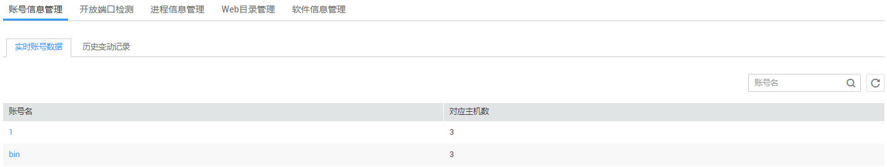

    2.  选择“历史变动记录“页签，可查看历史变动的账号数据信息，如[图2](#fig1864361913714)所示。

        **图 2**  历史变动数据  
        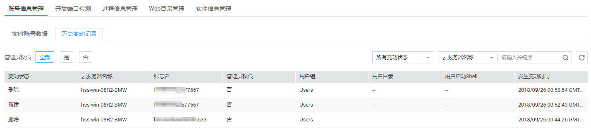

        > **说明：**   
        >-   变动状态：新建（上次未发现，本次数据收集发现新建了）、删除（上次数据收集有，本次没有了）、修改（账号名、管理员权限、用户组等信息变动了）。  
        >-   发生变动时间：由于为周期收集，变动记录的时间为获取到改动的时间，非真实发生的时间，一般情况下每6个小时收集一次。  

5.  单击账号名称，查看该账号下的云服务器列表，如[图3](#fig146691930185511)所示。

    **图 3**  查看账号信息服务器列表  
    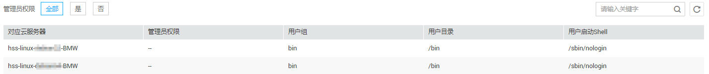

## 查看开放端口检测结果

1.  登录管理控制台。
2.  在页面上方，单击“服务列表“，选择“安全  \>  企业主机安全“。
3.  在左侧导航树中，选择“资产管理“，进入“资产管理“界面。
4.  选择“开放端口检测“页签，如[图4](#fig1441317504584)所示，各参数说明如[表1](#table4668152381212)所示。

    **图 4**  开放端口  
    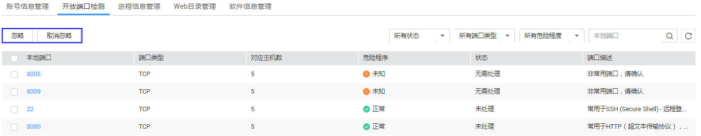

    > **说明：**   
    >-   选择要忽略的危险端口，单击左上角“忽略“批量忽略危险端口。  
    >-   单击左上角“取消忽略“，批量撤销忽略危险端口的操作。  

    **表 1**  查看开放端口检测结果参数说明

    
    <table><thead align="left"><tr id="row9652182310127"><th class="cellrowborder" valign="top" width="20%" id="mcps1.2.4.1.1">
参数名称

    </th>
    <th class="cellrowborder" valign="top" width="36%" id="mcps1.2.4.1.2">
说明

    </th>
    <th class="cellrowborder" valign="top" width="44%" id="mcps1.2.4.1.3">
界面说明

    </th>
    </tr>
    </thead>
    <tbody><tr id="row18668122331217"><td class="cellrowborder" valign="top" width="20%" headers="mcps1.2.4.1.1 ">
本地端口

    </td>
    <td class="cellrowborder" valign="top" width="36%" headers="mcps1.2.4.1.2 ">
本地端口号。

    </td>
    <td class="cellrowborder" valign="top" width="44%" headers="mcps1.2.4.1.3 ">
用户可在搜索框中输入“本地端口”号，单击，查看指定开放性端口检测结果。

    </td>
    </tr>
    <tr id="row6668202311129"><td class="cellrowborder" valign="top" width="20%" headers="mcps1.2.4.1.1 ">
端口类型

    </td>
    <td class="cellrowborder" valign="top" width="36%" headers="mcps1.2.4.1.2 ">
两种类型：TCP和UDP。

    </td>
    <td class="cellrowborder" valign="top" width="44%" headers="mcps1.2.4.1.3 ">
用户可通过筛选列表右上角的“所有端口类型”下拉列表，查看指定类型的开放性端口检测结果。

    </td>
    </tr>
    <tr id="row10668102318127"><td class="cellrowborder" valign="top" width="20%" headers="mcps1.2.4.1.1 ">
对应主机数

    </td>
    <td class="cellrowborder" valign="top" width="36%" headers="mcps1.2.4.1.2 ">
该端口号下的云服务主机数。

    </td>
    <td class="cellrowborder" valign="top" width="44%" headers="mcps1.2.4.1.3 ">
--

    </td>
    </tr>
    <tr id="row5842174732413"><td class="cellrowborder" valign="top" width="20%" headers="mcps1.2.4.1.1 ">
危险程度

    </td>
    <td class="cellrowborder" valign="top" width="36%" headers="mcps1.2.4.1.2 ">
“正常”、“危险”、“未知”

    </td>
    <td class="cellrowborder" valign="top" width="44%" headers="mcps1.2.4.1.3 ">
用户可通过筛选列表右上角的“所有危险程度”下拉列表，查看指定危险程度的端口检测结果。

    </td>
    </tr>
    <tr id="row62516521244"><td class="cellrowborder" valign="top" width="20%" headers="mcps1.2.4.1.1 ">
状态

    </td>
    <td class="cellrowborder" valign="top" width="36%" headers="mcps1.2.4.1.2 ">
“未处理”、“已忽略”、“无需处理”

    </td>
    <td class="cellrowborder" valign="top" width="44%" headers="mcps1.2.4.1.3 ">
用户可通过筛选列表右上角的“所有状态”，查看指定状态的端口检测结果。

    </td>
    </tr>
    <tr id="row16242118112719"><td class="cellrowborder" valign="top" width="20%" headers="mcps1.2.4.1.1 ">
端口描述

    </td>
    <td class="cellrowborder" valign="top" width="36%" headers="mcps1.2.4.1.2 ">
端口的详细描述。

    </td>
    <td class="cellrowborder" valign="top" width="44%" headers="mcps1.2.4.1.3 ">
--

    </td>
    </tr>
    </tbody>
    </table>

5.  单击端口号，查看该端口对应的服务器列表，如[图5](#fig5251915193317)所示。

    **图 5**  查看端口服务器列表  
    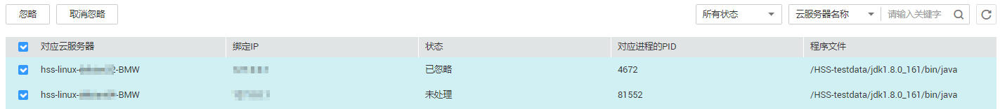

## 查看进程信息管理

1.  登录管理控制台。
2.  在页面上方，单击“服务列表“，选择“安全  \>  企业主机安全“。
3.  在左侧导航树中，选择“资产管理“，进入“资产管理“界面。
4.  选择“进程信息管理“页签，如[图6](#fig840112116592)所示。

    **图 6**  进程信息  
    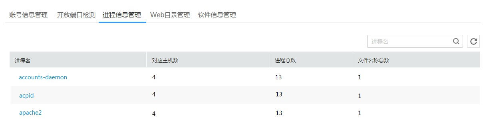

5.  单击进程名，查看该进程下的云服务器列表，如[图7](#fig853718469405)所示。

    **图 7**  查看进程服务器列表  
    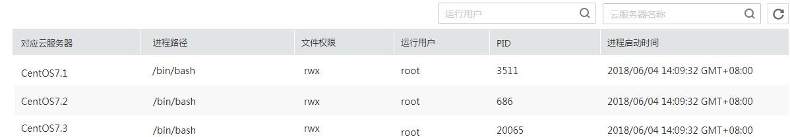

## 查看Web目录管理

1.  登录管理控制台。
2.  在页面上方，单击“服务列表“，选择“安全  \>  企业主机安全“。
3.  在左侧导航树中，选择“资产管理“，进入“资产管理“界面。
4.  选择“Web目录管理“页签，如[图8](#fig11431114665913)所示。

    **图 8**  Web目录  
    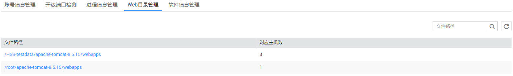

5.  单击文件路径名称，查看该路径下的云服务器列表，如[图9](#fig1739920345218)所示。

    **图 9**  查看Web目录管理云服务器列表  
    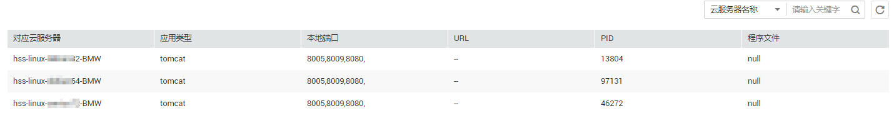

## 查看软件信息管理

1.  登录管理控制台。
2.  在页面上方，单击“服务列表“，选择“安全  \>  企业主机安全“。
3.  在左侧导航树中，选择“资产管理“，进入“资产管理“界面。
4.  选择“软件信息管理  \>  实时软件数据“。
    1.  选择“实时软件数据“页签，查看软件信息数据，如[图10](#fig357416311907)所示。

        **图 10**  实时软件数据  
        

    2.  选择“历史变动记录“页签，可查看历史变动的软件数据信息，如[图11](#fig1455619287102)所示。

        **图 11**  历史变动记录  
        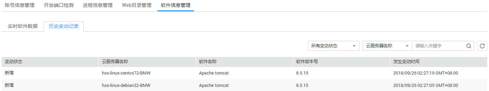

        > **说明：**   
        >-   变动状态：新增（上次未发现，本次数据收集发现新增了）、删除（上次数据收集有，本次没有了）。  
        >-   发生变动时间：由于为周期收集，变动记录的时间为获取到改动的时间，非真实发生的时间，一般情况下每6个小时收集一次。  

5.  单击软件名称，查看该软件下对应的云服务器列表，如[图12](#fig598511712020)所示。

    **图 12**  软件信息云服务器列表  
    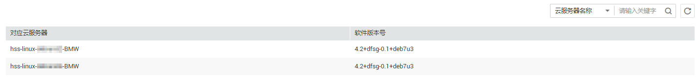

