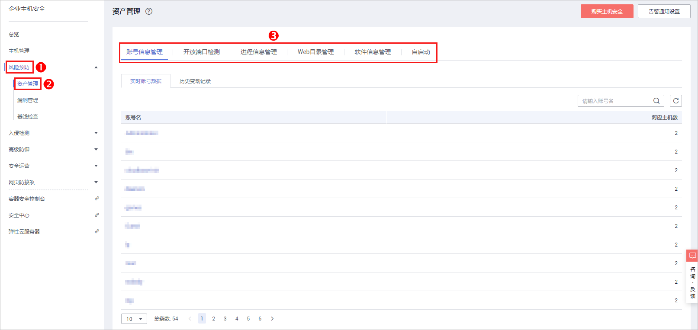

# 资产管理

资产管理功能将主动检测主机中的开放端口、系统运行中的进程和主机中的Web目录，并对账号信息和软件信息的变动情况进行记录。关于资产管理的详细说明请参见[资产管理功能介绍](https://support.huaweicloud.com/productdesc-hss/hss_01_0010.html#section0)。

通过资产管理，您能集中清点主机中的各项资产信息，及时发现主机中含有风险的各项资产。

资产管理仅提供风险检测功能，若发现有可疑资产信息，请手动处理。

## 检测周期

账号信息管理、开放端口检测：实时检测。

进程信息管理、Web目录管理、软件信息管理：**每日凌晨**自动进行一次检测。

## 查看主机中的资产信息

1.  [登录管理控制台](https://console.huaweicloud.com)。
2.  在页面上方选择区域后，单击，选择“安全  \>  企业主机安全“。

    **图 1**  企业主机安全  
    

3.  进入“资产管理“页面，选择不同页签，查看HSS检测到的您服务器上的所有资产。

    **图 2**  资产管理  
    

## 账号信息管理

历史变动状态说明：

-   变动状态：新建（新建了账号）、删除（删除了账号）、修改（修改了账号名、管理员权限或用户组等信息）。
-   发生变动时间：由于为周期收集，变动记录的时间是获取到改动的时间，非真实发生的时间。

根据实时账号数据和历史变动记录，您可以统一管理所有主机中的账号信息。若发现系统中有不必要的多余账号，或者发现有超级权限的账号（拥有root权限），需要排查这些账号是否是正常业务使用，如果不是则建议删除多余账号或者修改账号的权限，避免账号被黑客利用。

## 开放端口检测

根据开放端口检测结果中的详细信息，您可以统一管理所有主机中的开放端口。

-   手动关闭风险端口

    如果检测到开放了危险端口或者开放了不必要的端口，需要排查这些端口是否是正常业务使用，如果不是正常业务端口，建议关闭端口。对于危险端口建议进一步检查程序文件，如果存在风险建议删除或者隔离源文件。

    建议您及时优先处理危险程度为“危险”的端口，根据业务实际情况处理危险程度为“未知”的端口。

-   忽略风险：如果检测出的危险端口是业务正在使用的正常端口，您可以忽略该条告警。忽略之后将不再作为危险项进行记录，也不再发送告警。

## 进程信息管理

根据进程检测结果中的详细信息，您可以快速查看主机中可疑的应用进程，并及时终止可疑的应用进程。

## Web目录管理

HSS能够检测出主机中存在的Web目录，您可以根据检测结果及时发现主机中可能含有风险的Web目录，及时删除可疑的Web目录并终止可疑的进程。

## 软件信息管理

历史变动状态说明：

-   变动状态：新增（新增的软件）、删除（删除的软件）。
-   发生变动时间：由于为周期收集，变动记录的时间是获取到改动的时间，非真实发生的时间。

根据实时软件数据和历史变动记录，您可以统一管理所有主机中的软件信息。若发现主机中的软件版本过低或存在可疑的软件，您可以及时升级低版本的软件或删除可疑和无需使用的软件。

