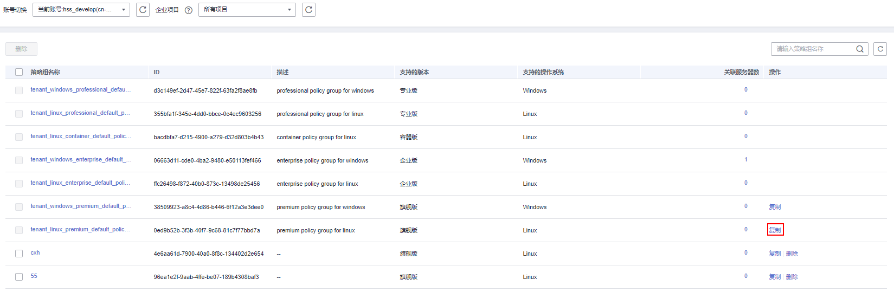
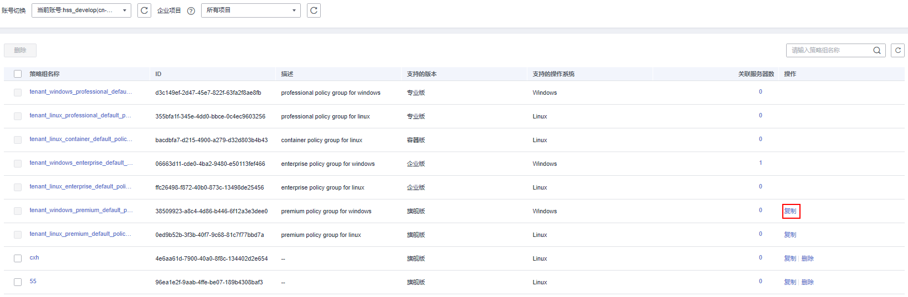

# 部署策略

您可以通过新建策略组并将策略组快速分发给目标云服务器，云服务器上的Agent将会根据策略组中配置的策略开启相应的检测功能，实现安全检测。

## 操作须知

-   开启企业版防护时，默认绑定“企业版策略组“（包含“弱口令检测“和“网站后门检测“策略），应用于全部的云服务器，不需要单独部署策略。
-   开启“旗舰版“或者“网页防篡改赠送旗舰版“后，开启旗舰版/网页防篡改版防护时，默认绑定了“旗舰版策略组“。

    用户也可以通过复制“旗舰版策略组“的方式，创建自定义策略组，将“旗舰版策略组“替换为用户的自定义策略组，更加灵活的应用于不同的云服务器或者云服务器组。

## 创建策略组

1.  [登录管理控制台](https://console.huaweicloud.com/?locale=zh-cn)。
2.  在页面左上角选择“区域“，单击，选择“安全与合规 \> 主机安全服务”，进入主机安全平台界面。

    **图 1**  进入主机安全  
    

1.  在左侧导航栏，选择“安全运营  \>  策略管理“，进入“策略管理“界面。

    > **说明：** 
    >如果您的服务器已通过企业项目的模式进行管理，您可选择目标“企业项目“后查看或操作目标企业项目内的资产和检测信息。

2.  复制策略组。
    -   复制linux策略组：选择“tenant\_linux\_premium\_default\_policy\_group”策略组，在该策略组所在行的“操作”列中，单击“复制“。

        **图 2**  复制linux策略组  
        

    -   复制windows策略组：选择“tenant\_windows\_premium\_default\_policy\_group”策略组，在该策略组所在行的“操作”列中，单击“复制“。

        **图 3**  复制windows策略组  
        

3.  在弹出的对话框中，输入“策略组名称“和“描述“。

    > **说明：** 
    >-   策略组的名称不能重复，如果尝试通过复制来创建一个同名的策略组，将会失败。
    >-   “策略组名称“和“描述“只能包含中文、字母、数字、下划线、中划线、空格，并且首尾不能为空格。

    **图 4**  创建策略组  
    

4.  单击“确认“，将会创建一个新的策略组。
5.  单击已创建的策略组名称，进入策略组的策略页面。

    **图 5**  策略组策略  
    

6.  单击“策略名称“，修改具体的策略内容，详细信息请参见[编辑策略内容](编辑策略内容.md)。
7.  策略内容修改完成后，单击策略所在行的“开启“或者“关闭“并单击右上角刷新，开启或者关闭对应的策略才会生效。

## 部署策略

1.  登录管理控制台，进入主机安全服务页面。

1.  在左侧导航栏，选择“资产管理  \>  主机管理“，单击“云服务器“，进入云服务器列表界面。
2.  选中需要进行策略部署的一台或多台云服务器，单击“部署策略“。

    **图 6**  部署策略  
    

3.  在弹出的对话框中，选择策略组后，单击“确定“，完成部署策略操作。

    **图 7**  选择策略组  
    

    > **说明：** 
    >-   若当前云服务器已部署策略，再次部署策略时，会替换原有的策略组。
    >-   在1分钟内，策略组将被部署到所选主机上，对应的安全功能将会被启用。
    >-   对当前处于离线状态的主机，策略部署不会立即生效，需要等主机再次上线后，部署才会生效。
    >-   策略部署完成后，您可以通过开启或者关闭策略组中的策略的方式，或者修改策略组中策略内容的方式修改策略组。
    >-   已经部署的策略组不能删除。

