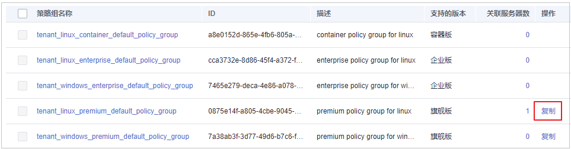

# 部署策略

用户可以通过新建策略组并将策略组快速分发给目标云服务器，云服务器上的Agent将会根据策略组中配置的策略开启相应的检测功能，实现安全检测。

## 操作须知

-   开启企业版防护时，默认绑定“默认企业版策略组“（包含“弱口令检测“和“网站后门检测“策略），应用于全部的云服务器，不需要单独部署策略。
-   购买“旗舰版“或者“网页防篡改赠送旗舰版“后，开启旗舰版/网页防篡改版防护时，默认绑定了“默认旗舰版策略组“。

    用户也可以通过复制“默认旗舰版策略组“的方式，创建自定义策略组，将“默认旗舰版策略组“替换为用户的自定义策略组，更加灵活的应用于不同的云服务器或者云服务器组。

## 进入策略管理

1.  [登录管理控制台](https://console.huaweicloud.com)。

1.  在页面左上角选择“区域“，单击，选择“安全  \>  企业主机安全“，进入企业主机安全页面。

    **图 1**  企业主机安全  
    

2.  在左侧导航栏，选择“安全运营“，单击“策略管理“，进入“策略管理“界面。

## 创建策略组

1.  选择“default\_premium\_policy\_group （默认旗舰版策略组）”策略组，在该策略组所在行的操作列中，单击“复制“，如[图2](#fig15964857392)所示。

    **图 2**  复制策略组  
    

2.  在弹出的对话框中，输入“策略组名称“和“描述“，如[图3](#fig2889958811472)所示。

    > **说明：** 
    >-   策略组的名称不能重复，如果尝试通过复制来创建一个同名的策略组，将会失败。
    >-   “策略组名称“和“描述“只能包含中文、字母、数字、下划线、中划线、空格，并且首尾不能为空格。

    **图 3**  创建策略组  
    

3.  单击“确定“，将会创建一个新的策略组。
4.  单击已创建的策略组名称，进入策略组的策略页面，如[图4](#fig1861202845918)所示。

    **图 4**  策略组策略  
    

5.  单击策略名称，修改具体的策略内容，详细信息请参见[修改策略内容](修改策略内容.md)。
6.  策略内容修改完成后，单击策略所在行的“开启“或者“关闭“，开启或者关闭对应的策略。

## 部署策略

1.  在左侧导航栏，选择“主机管理“，单击“云服务器“，进入云服务器列表界面。

1.  选中需要进行策略部署的一台或多台云服务器，单击“部署策略“，如[图5](#f16e53b83bcb749599a5e7637a4117e3e)所示。

    **图 5**  部署策略  
    

2.  在弹出的对话框中，选择策略组后，单击“确定“，完成部署策略操作。

    **图 6**  选择策略组  
    

    > **说明：** 
    >-   若当前云服务器已部署策略，再次部署策略时，会替换原有的策略组。
    >-   在1分钟内，策略组将被部署到所选主机上，对应的安全功能将会被启用。
    >-   对当前处于离线状态的主机，策略部署不会立即生效，需要等主机再次上线后，部署才会生效。
    >-   策略部署完成后，您可以通过开启或者关闭策略组中的策略的方式，或者修改策略组中策略内容的方式修改策略组。
    >-   已经部署的策略组不能删除。

