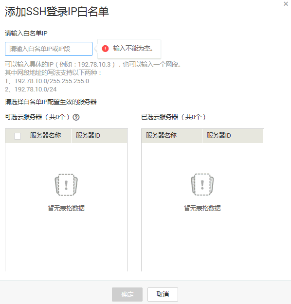

# 配置SSH登录IP白名单

该任务指导用户配置SSH登录IP白名单。配置到白名单的IP地址，是可以信任的，将不会被封禁。

> **说明：**   
>配置了白名单的弹性云服务器，只允许白名单内的IP登录到弹性云服务器。  

## 前提条件

已获取管理控制台的登录账号与密码。

## 操作步骤

1.  登录管理控制台。
2.  在页面上方，单击“服务列表“，选择“安全  \>  企业主机安全“。
3.  在左侧导航树中，选择“安装与配置“，进入“安装与配置“界面。
4.  选择“安全配置“页签，在“SSH登录IP白名单“页面，单击“添加白名单IP“。
5.  在弹出的对话框中，填写要添加的白名单IP，如[图1](#fig30200071125018)所示。

    > **说明：**   
    >用户可以输入单个IP地址，也可以输入一个网段，支持的格式如下：  
    >-   10.78.10.0/255.255.255.0  
    >-   10.78.10.0/24  
    >-   10.78.10.0  

    **图 1**  添加白名单  
    

6.  在左侧“可选云服务器“列表框中选中需要添加该白名单IP的弹性云服务器，将该弹性云服务器移动到“已选云服务器“列表框。
7.  单击“确定“，完成一个SSH登录IP白名单的配置。

    > **说明：**   
    >-   如果需要编辑已添加的SSH登录IP白名单，在目标SSH登录IP白名单所在行的“操作“列，单击“编辑“。  
    >-   如果需要删除已添加的SSH登录IP白名单，在目标SSH登录IP白名单所在行的“操作“列，单击“删除“。  

