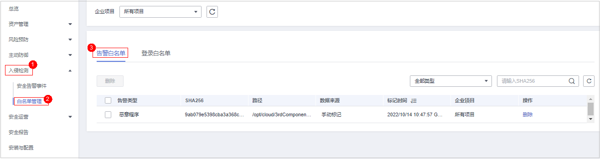
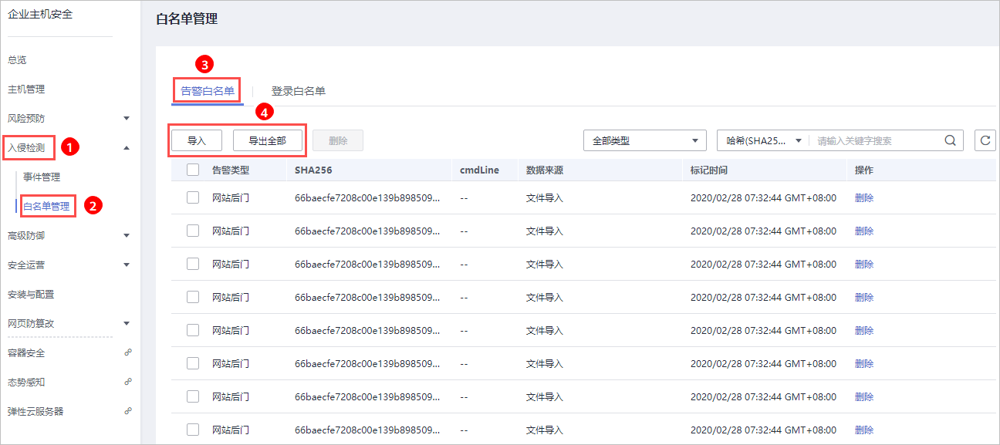

# 配置告警白名单<a name="hss_01_0028"></a>

白名单管理提供告警白名单的展示与批量导入/导出功能，用户可以通过导入/导出告警白名单避免大量告警误报的发生，提升安全事件告警质量。

告警白名单用于忽略告警，把当前告警事件加入告警白名单后，当再次发生相同的告警时不再进行告警。

在“事件管理“页面处理告警事件时，如果告警为误报，您可以将告警加入告警白名单。告警加入白名单后，后续企业主机安全不会再对该事件进行告警，“总览“页面也不会对该告警事件统计数据。

仅企业版、旗舰版支持白名单管理，网页防篡改版赠送旗舰版，包含旗舰版所有功能。

## 添加告警白名单<a name="section420473243814"></a>

**表 1**  添加告警白名单

<a name="table18831149143511"></a>
<table><thead align="left"><tr id="row188320495353"><th class="cellrowborder" valign="top" width="17.97%" id="mcps1.2.3.1.1"><p id="p688374912355"><a name="p688374912355"></a><a name="p688374912355"></a>添加方式</p>
</th>
<th class="cellrowborder" valign="top" width="82.03%" id="mcps1.2.3.1.2"><p id="p16884204923516"><a name="p16884204923516"></a><a name="p16884204923516"></a>说明</p>
</th>
</tr>
</thead>
<tbody><tr id="row488418495357"><td class="cellrowborder" valign="top" width="17.97%" headers="mcps1.2.3.1.1 "><p id="p168851049193519"><a name="p168851049193519"></a><a name="p168851049193519"></a>加入告警白名单</p>
</td>
<td class="cellrowborder" valign="top" width="82.03%" headers="mcps1.2.3.1.2 "><p id="p1096264993711"><a name="p1096264993711"></a><a name="p1096264993711"></a>处理告警事件时，将告警事件加入到告警白名单，详细信息请参见<a href="查看和处理入侵告警事件.md">查看和处理入侵告警事件</a>。</p>
<p id="p1685743116373"><a name="p1685743116373"></a><a name="p1685743116373"></a>以下类型的告警事件加入<span class="parmvalue" id="parmvalue1384333293714"><a name="parmvalue1384333293714"></a><a name="parmvalue1384333293714"></a>“告警白名单”</span>：</p>
<a name="ul8799205315362"></a><a name="ul8799205315362"></a><ul id="ul8799205315362"><li>反弹Shell</li><li>Webshell检测</li><li>进程异常行为检测</li><li>进程提权</li><li>文件提权</li><li>高危命令</li><li>恶意程序</li></ul>
</td>
</tr>
<tr id="row1488584963516"><td class="cellrowborder" valign="top" width="17.97%" headers="mcps1.2.3.1.1 "><p id="p10885144933511"><a name="p10885144933511"></a><a name="p10885144933511"></a>导入告警白名单</p>
</td>
<td class="cellrowborder" valign="top" width="82.03%" headers="mcps1.2.3.1.2 "><p id="p38851249193519"><a name="p38851249193519"></a><a name="p38851249193519"></a>在<span class="wintitle" id="wintitle1235183471111"><a name="wintitle1235183471111"></a><a name="wintitle1235183471111"></a>“告警白名单”</span>页面，导入告警白名单列表。</p>
</td>
</tr>
</tbody>
</table>

## 查看告警白名单<a name="section2560185572012"></a>

加入告警白名单后，您可以查看已添加的告警白名单，操作步骤如下所示。

1.  [登录管理控制台](https://console.huaweicloud.com)。
2.  在页面左上角选择“区域“，单击，选择“安全与合规  \>  企业主机安全“，进入企业主机安全页面。

    **图 1**  企业主机安全<a name="hss_01_0229_fig65591238182410"></a>  
    

3.  进入“白名单管理“页面，单击“告警白名单“，查看已添加的告警白名单列表，如[图2](#fig1731019508397)所示。

    **图 2**  告警白名单列表<a name="fig1731019508397"></a>  
    


## 导入/导出告警白名单<a name="section4901243132114"></a>

导入和导出告警白名单功能用来备份和恢复告警白名单。

例如：“华北-北京一“环境下添加的告警白名单，可以通过导出告警白名单，导入到“华北-北京四“环境的服务器上，减少运维人员的工作量。

> **须知：** 
>-   导出为“.csv“格式的告警白名单。
>-   如果需要手动修改导出的“.csv“表格，请按照格式要求修改（不能使用excel打开修改，否则，会导致导入失败）。
>    **格式要求：**
>    ```
>    告警类型,SHA256,cmdLine,数据来源,标记时间
>    "webshell","66baecfe7208c00e139b898509626ee4d2ea81382ef15a4283b95d50f669b121","--","文件导入","2020/02/28 07:32:44 GMT+08:00"
>    ```
>-   告警白名单支持增量导入，相同的记录多次导入不会增加。

1.  [登录管理控制台](https://console.huaweicloud.com)。
2.  在页面左上角选择“区域“，单击，选择“安全与合规  \>  企业主机安全“，进入企业主机安全页面。

    **图 3**  企业主机安全<a name="hss_01_0229_fig65591238182410_1"></a>  
    

3.  进入“白名单管理“页面，选择“告警白名单“，如[图4](#fig1833419293712)所示。

    **图 4**  选择告警白名单<a name="fig1833419293712"></a>  
    

    -   单击“全部导出“，将当前告警白名单列表导出，导出为“.csv“格式表格。
    -   单击“导入“，选择已导出的告警白名单表，将表中记录的内容重新导入告警白名单。

        在弹出的对话框中，单击“上传文件“，选择待上传的文件，导入告警白名单。导入成功后，告警白名单展示在告警白名单列表中。

        > **说明：** 
        >-   文件格式仅限csv、txt、UTF-8编码。
        >-   文件大小不超过5MB。
        >-   文件名格式为：1-64位字符，只能包含字母、数字、下划线、中划线或者点。


## 相关操作<a name="section2806205117222"></a>

**删除告警白名单**

若您需要删除已添加的告警白名单，您可以进入告警白名单列表，选择待删除的告警白名单，单击“删除“，删除告警白名单。

> **说明：** 
>删除告警白名单后，若发生再次发生该告警事件，将触发告警，删除操作执行后无法恢复，请谨慎操作。

