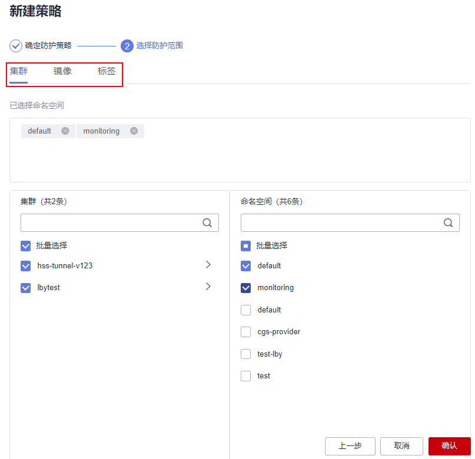

# 配置容器集群防护策略

您可以根据自身业务情况，配置容器集群防护策略，例如配置触发告警的风险（基线、漏洞、恶意文件）等级、容器集群防护范围、镜像白名单以及告警事件发生后HSS执行的防护动作等。

## 新建防护策略

1.  [登录管理控制台](https://console.huaweicloud.com/?locale=zh-cn)。
2.  在页面左上角选择“区域“，单击，选择“安全与合规 \> 主机安全服务”，进入主机安全平台界面。

    **图 1**  进入主机安全  
    

1.  在左侧导航栏，选择“主动防御  \>  容器集群防护“，进入“容器集群防护“界面。
2.  选择“防护策略“页签，单击“新建策略“。
3.  在新建策略弹窗中，配置策略参数。
    1.  确定防护策略，相关参数说明请参见[表 配置容器集群防护策略参数说明](#table8502947145112)。

        **表 1**  配置容器集群防护策略参数说明

        
        <table><thead align="left"><tr id="row175039479517"><th class="cellrowborder" valign="top" width="20.66%" id="mcps1.2.3.1.1">
参数名称

        </th>
        <th class="cellrowborder" valign="top" width="79.34%" id="mcps1.2.3.1.2">
参数说明

        </th>
        </tr>
        </thead>
        <tbody><tr id="row185036472514"><td class="cellrowborder" valign="top" width="20.66%" headers="mcps1.2.3.1.1 ">
策略模板

        </td>
        <td class="cellrowborder" valign="top" width="79.34%" headers="mcps1.2.3.1.2 ">
选择策略默认模板。

        </td>
        </tr>
        <tr id="row5503154725110"><td class="cellrowborder" valign="top" width="20.66%" headers="mcps1.2.3.1.1 ">
策略名称

        </td>
        <td class="cellrowborder" valign="top" width="79.34%" headers="mcps1.2.3.1.2 ">
策略名称，需自定义。

        </td>
        </tr>
        <tr id="row20503114725116"><td class="cellrowborder" valign="top" width="20.66%" headers="mcps1.2.3.1.1 ">
策略描述

        </td>
        <td class="cellrowborder" valign="top" width="79.34%" headers="mcps1.2.3.1.2 ">
自定义策略用途等，作策略区分。

        </td>
        </tr>
        <tr id="row10503047165111"><td class="cellrowborder" valign="top" width="20.66%" headers="mcps1.2.3.1.1 ">
拦截未扫描镜像

        </td>
        <td class="cellrowborder" valign="top" width="79.34%" headers="mcps1.2.3.1.2 ">
是否拦截未使用HSS的容器镜像安全扫描功能扫描过的镜像。

        <ul id="ul118021592570"><li>：关闭</li><li>：开启</li></ul>
        </td>
        </tr>
        <tr id="row112619279523"><td class="cellrowborder" valign="top" width="20.66%" headers="mcps1.2.3.1.1 ">
告警策略

        </td>
        <td class="cellrowborder" valign="top" width="79.34%" headers="mcps1.2.3.1.2 ">
选择告警策略类型。

        <ul id="ul66459382320"><li>基线</li><li>漏洞</li><li>恶意脚本</li></ul>
        </td>
        </tr>
        <tr id="row61451403523"><td class="cellrowborder" valign="top" width="20.66%" headers="mcps1.2.3.1.1 ">
风险等级

        </td>
        <td class="cellrowborder" valign="top" width="79.34%" headers="mcps1.2.3.1.2 ">
选择触发告警的风险等级。

        <ul id="ul1587564410015"><li>高危</li><li>中危</li><li>低危</li></ul>
        </td>
        </tr>
        <tr id="row15666195018527"><td class="cellrowborder" valign="top" width="20.66%" headers="mcps1.2.3.1.1 ">
基线项目

        </td>
        <td class="cellrowborder" valign="top" width="79.34%" headers="mcps1.2.3.1.2 ">
选择高危基线风险项，如果启动的镜像中包含这些高危基线风险项，HSS会立即执行防护动作。

        </td>
        </tr>
        <tr id="row7378381822"><td class="cellrowborder" valign="top" width="20.66%" headers="mcps1.2.3.1.1 ">
漏洞项目

        </td>
        <td class="cellrowborder" valign="top" width="79.34%" headers="mcps1.2.3.1.2 ">
选择高危漏洞，如果启动的镜像中包含这些高危漏洞，HSS会立即执行防护动作。

        </td>
        </tr>
        <tr id="row12843194812315"><td class="cellrowborder" valign="top" width="20.66%" headers="mcps1.2.3.1.1 ">
恶意样本

        </td>
        <td class="cellrowborder" valign="top" width="79.34%" headers="mcps1.2.3.1.2 ">
选择高危恶意样本，如果启动的镜像中包含这些高危恶意样本，HSS会立即执行防护动作。

        </td>
        </tr>
        <tr id="row1443925715525"><td class="cellrowborder" valign="top" width="20.66%" headers="mcps1.2.3.1.1 ">
防护动作

        </td>
        <td class="cellrowborder" valign="top" width="79.34%" headers="mcps1.2.3.1.2 ">
选择当HSS发现集群中存在基线、漏洞或恶意脚本风险的镜像启动时的防护动作。

        <ul id="ul5199527955"><li>告警：在“容器集群防护 &gt; 防护事件”页面生成一个防护动作为“告警”的事件。</li><li>阻断：阻断风险镜像运行，并在“容器集群防护 &gt; 防护事件”页面生成一个防护动作为“阻断”的事件。</li><li>放行：在“容器集群防护 &gt; 防护事件”页面生成一个防护动作为“放行”的事件。</li></ul>
        </td>
        </tr>
        <tr id="row77983475313"><td class="cellrowborder" valign="top" width="20.66%" headers="mcps1.2.3.1.1 ">
加白名单

        </td>
        <td class="cellrowborder" valign="top" width="79.34%" headers="mcps1.2.3.1.2 ">
填写需要加入白名单的镜像名称。填写格式为“镜像名称:镜像版本”，镜像名称只能包含数字、字母、下划线、中划线、点；多个镜像名称以换行符进行区分。

        
填写示例如下：

        <ul id="ul6745316283"><li>单个镜像
image:1.0

        </li><li>多个镜像
image1:1.0

        
image2:1.0

        </li></ul>
        
 须知： 

加入白名单的镜像启动时，HSS将不会进行安全检测，请谨慎操作！

        

        </td>
        </tr>
        </tbody>
        </table>

    2.  单击“下一步“。
    3.  选择防护范围。

        选择集群、镜像和标签的防护范围。

        **图 2**  选择防护范围  
        

4.  单击“确认“，完成策略创建。

    您可以在防护策略列表中查看新建的防护策略。

## 编辑或删除集群防护策略

1.  进入“容器集群防护  \>  防护策略“页签。
2.  在防护策略所在行的操作列，单击需要执行操作。

    -   编辑：修改防护策略信息。
    -   删除：删除不需要的防护策略。

    > **须知：** 
    >删除策略后，策略关联的容器集群将停止防护，请谨慎操作！

3.  单击“确认“，完成编辑或删除。

