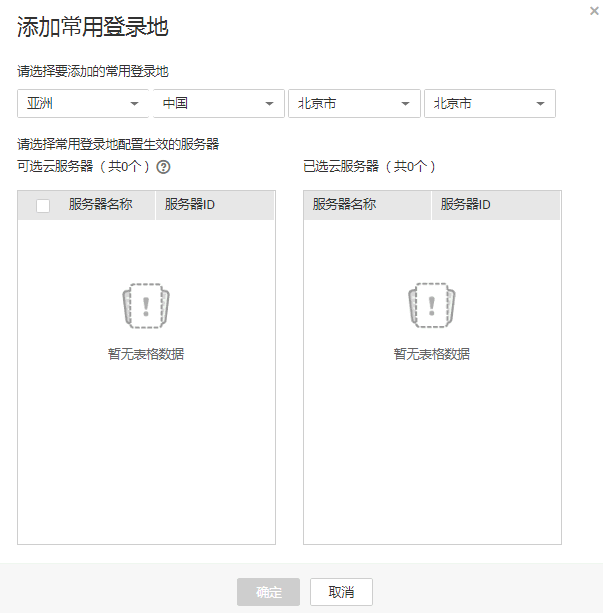

# 配置常用登录地

该任务指导用户配置常用登录地。在常用地登录时，系统不会报异地登录风险。

## 前提条件

已获取管理控制台的登录帐号与密码。

## 操作步骤

1.  登录管理控制台。
2.  在页面上方，单击“服务列表“，选择“安全  \>  企业主机安全“。
3.  在左侧导航树中，选择“安装与配置“，进入安装Agent界面。
4.  选择“安全配置“页签，在“常用登录地“页面，单击“添加常用地登录“。
5.  在弹出的对话框中，通过下拉框选择要添加的常用登录地，[图1](#fig51647623113113)以“北京市“为例。

    **图 1**  选择常用登录地  
    

6.  在左侧“可选云服务器“列表框中选中需要添加该常用登录地的弹性云服务器，将该弹性云服务器移动到“已选云服务器“列表框。
7.  单击“确定“，完成一个常用登录地的配置。

    > **说明：**   
    >-   如果需要编辑已配置的常用登录地，在目标常用登录地所在行的“操作“列，单击“编辑“。  
    >-   如果需要删除已配置的常用登录地，在目标常用登录地所在行的“操作“列，单击“删除“。  

